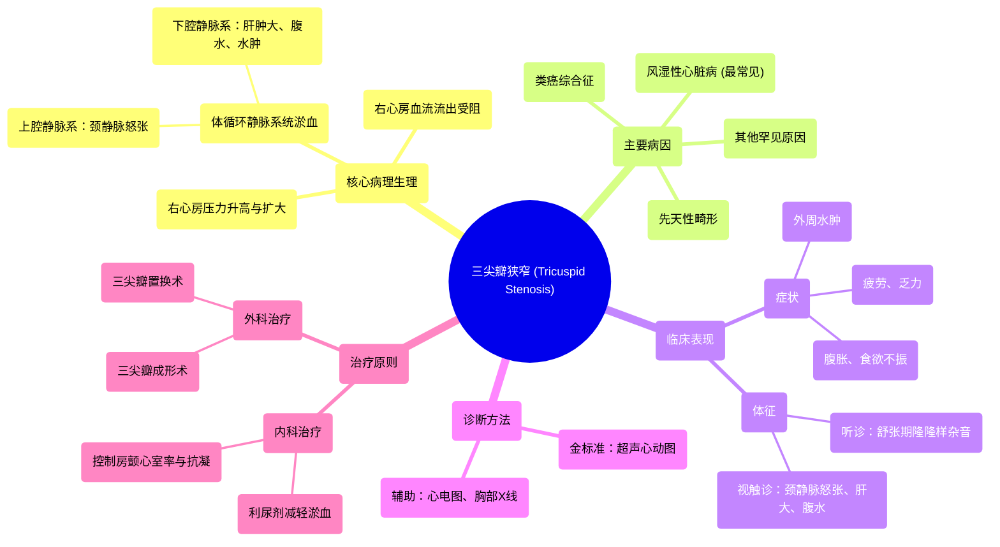

# 48 Tricuspid Stenosis (TS) - Valvular Heart Disease (VHD) - Tricuspid valve stenosis - Cardiology

  <video controls preload="metadata" playsinline>
    <source src="https://helly.s3.bitiful.net/心血管学科/%E4%B8%93%E8%BE%91%2018%EF%BC%9A%E5%BF%83%E5%86%85%E7%A7%91%E7%BB%88%E6%9E%81%E7%99%BE%E7%A7%91%E8%BE%9E%E5%85%B8%20%28The%20Cardiology%20Encyclopedia%29/48%20Tricuspid%20Stenosis%20%28TS%29%20-%20Valvular%20Heart%20Disease%20%28VHD%29%20-%20Tricuspid%20valve%20stenosis%20-%20Cardiology.mp4" type="video/mp4">
    
您的浏览器不支持播放，请升级。

  </video>

::: tip ⚡️ 核心考点 (30s速读)
*   **核心考点**：三尖瓣狭窄是一种罕见的瓣膜病，导致右心房血液流入右心室受阻，引起右心房压力升高和体循环静脉系统淤血。
*   **临床意义**：典型表现为颈静脉怒张、肝肿大、腹水和外周水肿。听诊可闻及舒张期杂音。最常见病因为风湿性心脏病，常与其他瓣膜病变合并存在。
:::

## 🧠 深度精讲

*   **概念1：三尖瓣狭窄的定义与病理生理**
    三尖瓣狭窄是指三尖瓣在心室舒张期开放受限，导致右心房血液流入右心室受阻。这会引起一系列血流动力学改变：
    1.  **右心房压力升高**：血液在右心房内积聚，导致右心房扩大和压力增高。
    2.  **体循环静脉淤血**：升高的右心房压力逆向传递至上、下腔静脉及其属支。
        *   **向上**：导致颈内静脉压力升高，表现为**颈静脉怒张**和**颈静脉压升高**。
        *   **向下**：导致下腔静脉及肝静脉压力升高，引起**肝脏淤血、肝肿大**，长期可导致心源性肝硬化。进一步可导致胃肠道淤血、腹水和外周水肿。

*   **概念2：病因与临床表现**
    1.  **主要病因**：**风湿性心脏病**是最常见原因，但单纯性三尖瓣狭窄罕见，多与二尖瓣或主动脉瓣病变同时存在。其他罕见病因包括类癌综合征、心内膜弹力纤维增生症、先天性畸形等。
    2.  **症状**：由于体循环静脉淤血，患者常主诉**疲劳、乏力**（心输出量减少）、**腹部胀满感**（肝肿大、腹水）、**食欲不振**以及**外周水肿**。
    3.  **体征**：
        *   **听诊**：于胸骨左缘第4、5肋间可闻及**舒张期隆隆样杂音**，吸气时增强（**Carvallo‘s征**）。
        *   **视诊与触诊**：可见颈静脉怒张、肝颈静脉回流征阳性、可触及肿大的肝脏、腹水及下肢凹陷性水肿。

*   **概念3：诊断与治疗**
    1.  **诊断**：
        *   **超声心动图**：是确诊和评估严重程度的金标准，可显示瓣膜增厚、活动受限、瓣口面积减小及跨瓣压差。
        *   **心电图**：可能显示右心房扩大（P波高尖，即“肺型P波”）。
        *   **胸部X线**：可见右心房影增大，上腔静脉增宽。
    2.  **治疗**：
        *   **内科治疗**：主要针对心力衰竭症状，使用利尿剂减轻水肿和腹水。对于房颤患者，需控制心室率并抗凝。
        *   **外科治疗**：对于有严重症状且药物控制不佳的患者，需行**三尖瓣手术**，包括**瓣膜成形术**或**瓣膜置换术**。手术时机通常取决于合并的其他瓣膜病变的处理。

## 📚 双语术语表 (Terminology)
| 英文术语 | 中文翻译 | 定义/解释 |
| :--- | :--- | :--- |
| Tricuspid Stenosis (TS) | 三尖瓣狭窄 | 三尖瓣开放受限，阻碍右心房血液在舒张期流入右心室。 |
| Valvular Heart Disease (VHD) | 心脏瓣膜病 | 心脏一个或多个瓣膜的结构或功能异常。 |
| Diastolic Murmur | 舒张期杂音 | 发生在心室舒张期的心脏杂音，三尖瓣狭窄杂音属于此类。 |
| Jugular Venous Distention (JVD) | 颈静脉怒张 | 由于右心压力增高导致的颈部静脉明显充盈。 |
| Hepatomegaly | 肝肿大 | 肝脏体积增大，在三尖瓣狭窄中常由肝脏淤血引起。 |
| Rheumatic Heart Disease | 风湿性心脏病 | 风湿热后遗留的心脏瓣膜损害，是获得性三尖瓣狭窄的主因。 |
| Echocardiography | 超声心动图 | 利用超声波检查心脏结构和功能的影像学方法，是诊断瓣膜病的首选。 |
| Valve Replacement | 瓣膜置换术 | 用人工瓣膜或生物瓣膜替换病变瓣膜的外科手术。 |

## 🗺️ 知识图谱

