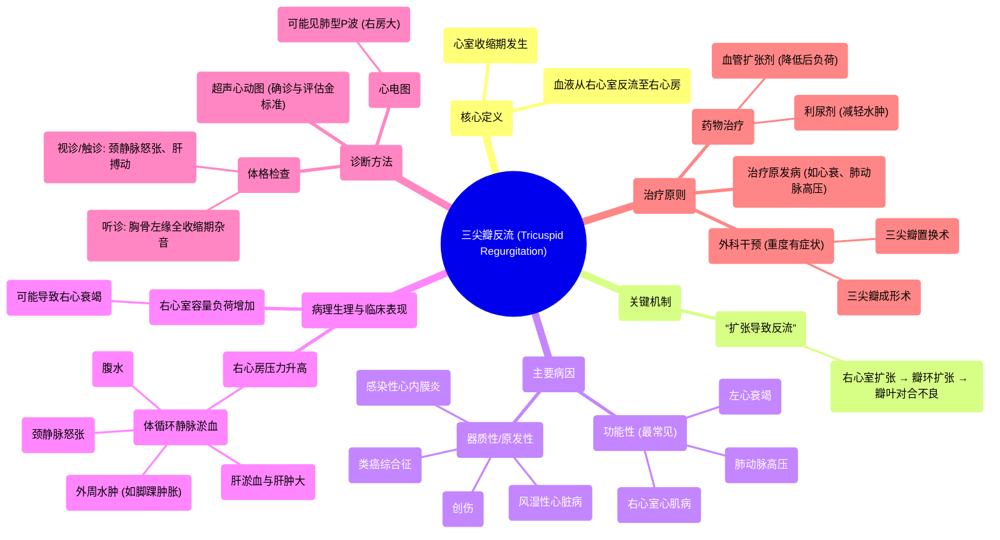

# 49 Tricuspid Regurgitation (TR) - Valvular Heart Disease (VHD) - Tricuspid Valve Insufficiency - Cardio

  <video controls preload="metadata" playsinline>
    <source src="https://helly.s3.bitiful.net/心血管学科/%E4%B8%93%E8%BE%91%2018%EF%BC%9A%E5%BF%83%E5%86%85%E7%A7%91%E7%BB%88%E6%9E%81%E7%99%BE%E7%A7%91%E8%BE%9E%E5%85%B8%20%28The%20Cardiology%20Encyclopedia%29/49%20Tricuspid%20Regurgitation%20%28TR%29%20-%20Valvular%20Heart%20Disease%20%28VHD%29%20-%20Tricuspid%20Valve%20Insufficiency%20-%20Cardio.mp4" type="video/mp4">
    
您的浏览器不支持播放，请升级。

  </video>

::: tip ⚡️ 核心考点 (30s速读)
*   **核心考点**：三尖瓣反流（TR）指右心室收缩时，三尖瓣关闭不全，导致血液从右心室反流回右心房。核心机制是“扩张导致反流”，即右心室或瓣环扩张引起关闭不全。
*   **临床意义**：导致右心房压力升高，引起体循环静脉系统淤血，典型表现为颈静脉怒张、肝淤血/肿大、外周水肿（如脚踝肿胀）。是右心衰竭的重要表现。
:::

## 🧠 深度精讲
*   **概念1：三尖瓣反流的病理生理**：三尖瓣的正常功能是保证血液从右心房单向流入右心室。当发生反流时，心室收缩期血液会逆向流入右心房。这导致右心房容量和压力负荷增加，进而引起上、下腔静脉压力升高，最终表现为体循环静脉系统淤血的系列症状和体征。
*   **概念2：病因与“扩张导致反流”**：三尖瓣反流最常见的病因是**功能性反流**，即瓣膜本身结构正常，但由于右心室扩张（例如继发于左心衰竭、肺动脉高压、右心室心肌病等）导致三尖瓣瓣环被牵拉扩大，从而使瓣叶对合不良，无法完全关闭。其他病因包括原发性瓣膜病变，如感染性心内膜炎、风湿性心脏病、类癌综合征、创伤等。
*   **概念3：临床表现与诊断**：
    *   **症状**：早期可无症状。随着病情进展，可出现疲劳、乏力（心输出量减少）、腹胀、食欲不振（肝淤血）、以及外周水肿（如下肢、脚踝肿胀）。
    *   **体征**：最重要的体征是**颈静脉怒张**和**搏动性肝肿大**。听诊可在胸骨左缘第4、5肋间闻及全收缩期吹风样杂音，吸气时增强（Carvallo征）。
    *   **诊断**：**超声心动图**是确诊和评估反流严重程度的金标准。心电图可能提示右心房肥大（肺型P波）或右心室肥厚。
*   **概念4：治疗原则**：治疗主要针对**病因和降低右心室后负荷**。轻度反流且无症状者通常无需特殊治疗。对于继发于左心衰竭或肺动脉高压的功能性反流，应积极治疗原发病（如利尿、扩血管、降低肺动脉压）。对于重度原发性反流或症状严重的功能性反流，可考虑外科手术（三尖瓣成形术或置换术）。

## 📚 双语术语表 (Terminology)
| 英文术语 | 中文翻译 | 定义/解释 |
| :--- | :--- | :--- |
| Tricuspid Regurgitation (TR) | 三尖瓣反流 | 右心室收缩时，三尖瓣关闭不全，血液从右心室反流回右心房。 |
| Valvular Heart Disease (VHD) | 心脏瓣膜病 | 心脏瓣膜（如二尖瓣、主动脉瓣、三尖瓣、肺动脉瓣）发生结构或功能异常的一类疾病。 |
| Tricuspid Valve Insufficiency/Incompetence | 三尖瓣关闭不全 | 与“三尖瓣反流”同义，指瓣膜无法完全闭合。 |
| Annulus | 瓣环 | 心脏瓣膜附着于心脏纤维骨架上的环形结构，瓣叶的开合基础。 |
| Functional TR | 功能性三尖瓣反流 | 最常见类型，瓣膜本身正常，因右心室或瓣环扩张导致的继发性反流。 |
| Jugular Venous Distension (JVD) | 颈静脉怒张 | 由于右心房压力升高导致颈内静脉充盈扩张，是右心衰竭的重要体征。 |
| Hepatomegaly | 肝肿大 | 肝脏体积增大，在三尖瓣反流中常由肝静脉淤血引起。 |
| P Pulmonale | 肺型P波 | 心电图表现，指II、III、aVF导联出现高尖的P波（>2.5mm），提示右心房肥大。 |
| Carvallo‘s Sign | 卡瓦洛征 | 三尖瓣反流杂音在吸气时增强的特征，有助于与二尖瓣反流杂音鉴别。 |

## 🗺️ 知识图谱

