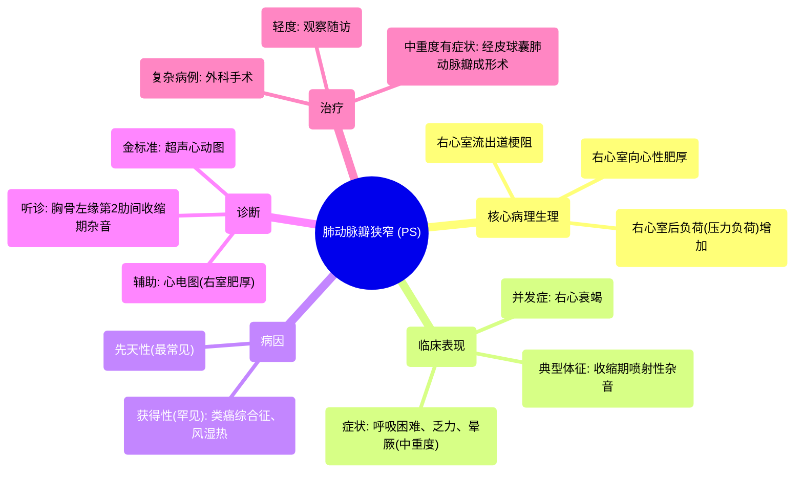

# 50 Pulmonic Stenosis (PS) - Pulmonic Valve Stenosis - Valvular Heart Disease (VHD) - Cardiology

  <video controls preload="metadata" playsinline>
    <source src="https://helly.s3.bitiful.net/心血管学科/%E4%B8%93%E8%BE%91%2018%EF%BC%9A%E5%BF%83%E5%86%85%E7%A7%91%E7%BB%88%E6%9E%81%E7%99%BE%E7%A7%91%E8%BE%9E%E5%85%B8%20%28The%20Cardiology%20Encyclopedia%29/50%20Pulmonic%20Stenosis%20%28PS%29%20-%20Pulmonic%20Valve%20Stenosis%20-%20Valvular%20Heart%20Disease%20%28VHD%29%20-%20Cardiology.mp4" type="video/mp4">
    
您的浏览器不支持播放，请升级。

  </video>

::: tip ⚡️ 核心考点 (30s速读)
*   **核心考点**：肺动脉瓣狭窄是一种右心室流出道梗阻性疾病，导致右心室后负荷（压力负荷）增加，进而引发右心室向心性肥厚。
*   **临床意义**：典型表现为收缩期杂音，严重时可导致右心衰竭、晕厥，甚至猝死。是常见的先天性心脏病之一。
:::

## 🧠 深度精讲
*   **概念1：肺动脉瓣狭窄的定义与病理生理**
    肺动脉瓣狭窄是指肺动脉瓣口开放受限，导致右心室射血受阻。这本质上是一种**压力负荷过重**（后负荷增加）。为了克服增高的流出道阻力，右心室必须加强收缩，长期代偿的结果是右心室壁增厚，即发生**向心性肥厚**。这种肥厚的心室收缩功能尚可，但舒张功能受损。

*   **概念2：心脏杂音的特征**
    由于肺动脉瓣在心室收缩期开放，因此肺动脉瓣狭窄产生的杂音是**收缩期杂音**。其听诊位置通常在胸骨左缘第2肋间（肺动脉瓣听诊区）。杂音的性质多为粗糙的喷射性杂音。

*   **概念3：病因与临床表现**
    **病因**：绝大多数（约90%）为**先天性**，可单独存在或合并其他心脏畸形（如法洛四联症）。获得性原因罕见，如类癌综合征、风湿热等。
    **症状**：轻度狭窄通常无症状。中重度狭窄可出现活动后**呼吸困难、乏力、胸痛、头晕或晕厥**（因心输出量不足）。严重者可出现右心衰竭体征，如颈静脉怒张、肝大、外周水肿。

*   **概念4：诊断与治疗**
    **诊断**：心脏听诊发现特征性收缩期杂音是首要线索。确诊依靠**超声心动图**，可直接观察瓣膜形态、测量跨瓣压差、评估右心室肥厚程度。心电图可显示右心室肥厚。
    **治疗**：轻度狭窄无需治疗，定期随访。中重度有症状的狭窄，首选**经皮球囊肺动脉瓣成形术**，创伤小，效果佳。若瓣膜发育不良或合并其他畸形，则可能需要外科手术。

## 📚 双语术语表 (Terminology)
| 英文术语 | 中文翻译 | 定义/解释 |
| :--- | :--- | :--- |
| Pulmonic Stenosis (PS) | 肺动脉瓣狭窄 | 肺动脉瓣口狭窄，阻碍右心室向肺动脉射血。 |
| Valvular Heart Disease (VHD) | 心脏瓣膜病 | 心脏瓣膜结构或功能异常的一类疾病。 |
| Stenosis | 狭窄 | 瓣膜开口变窄，导致血流通过困难。 |
| Regurgitation / Insufficiency | 反流 / 关闭不全 | 瓣膜关闭不全，导致血液逆流。 |
| Systolic murmur | 收缩期杂音 | 发生在心脏收缩期（心室射血期）的异常心音。 |
| Afterload / Pressure overload | 后负荷 / 压力负荷 | 心室收缩射血时需要克服的阻力。在PS中，指右心室射血时遇到的肺动脉瓣阻力。 |
| Concentric hypertrophy | 向心性肥厚 | 心肌细胞增粗导致心室壁增厚，心腔不扩大或缩小，是对压力负荷的代偿。 |
| Eccentric hypertrophy | 离心性肥厚 | 心肌细胞变长导致心腔扩大，心室壁相对变薄，是对容量负荷的代偿。 |
| Cyanotic / Acyanotic congenital heart disease | 紫绀型 / 非紫绀型先天性心脏病 | 根据是否存在右向左分流导致动脉血氧饱和度下降（紫绀）进行的分类。PS通常属于非紫绀型。 |
| Balloon valvuloplasty | 球囊瓣膜成形术 | 一种介入治疗，通过导管送入球囊扩张狭窄的瓣膜。 |

## 🗺️ 知识图谱

