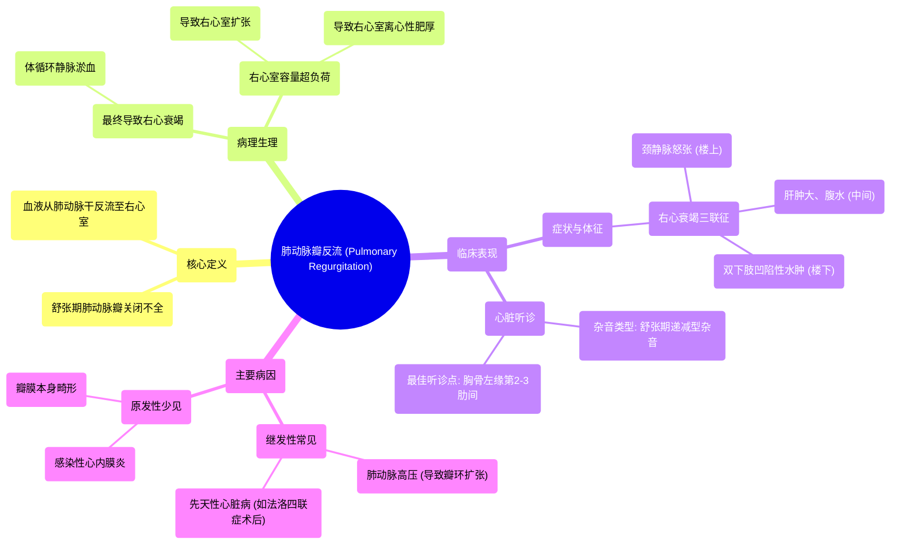

# 51 Pulmonary Regurgitation (PR) - Pulmonic Insufficiency - Valvular Heart Disease (VHD) - Cardiology

  <video controls preload="metadata" playsinline>
    <source src="https://helly.s3.bitiful.net/心血管学科/%E4%B8%93%E8%BE%91%2018%EF%BC%9A%E5%BF%83%E5%86%85%E7%A7%91%E7%BB%88%E6%9E%81%E7%99%BE%E7%A7%91%E8%BE%9E%E5%85%B8%20%28The%20Cardiology%20Encyclopedia%29/51%20Pulmonary%20Regurgitation%20%28PR%29%20-%20Pulmonic%20Insufficiency%20-%20Valvular%20Heart%20Disease%20%28VHD%29%20-%20Cardiology.mp4" type="video/mp4">
    
您的浏览器不支持播放，请升级。

  </video>

::: tip ⚡️ 核心考点 (30s速读)
*   **核心考点**：肺动脉瓣反流是肺动脉瓣在舒张期关闭不全，导致血液从肺动脉干反流回右心室，引起右心室容量超负荷。
*   **临床意义**：表现为右心衰竭体征（颈静脉怒张、肝肿大、腹水、双下肢水肿），听诊为胸骨左缘第二肋间的舒张期递减型杂音。
:::

## 🧠 深度精讲
*   **概念1：定义与病理生理**
    肺动脉瓣反流，也称为肺动脉瓣关闭不全，是指肺动脉瓣在心室舒张期无法完全关闭。正常情况下，舒张期肺动脉瓣关闭，防止血液从肺动脉干倒流回右心室。当瓣膜关闭不全时，血液在舒张期反流，导致右心室接收来自右心房（前向血流）和肺动脉（反向血流）的双重血液，造成右心室容量超负荷。长期容量超负荷会引起右心室扩张和离心性肥厚，最终导致右心衰竭，出现体循环淤血的系列表现。

*   **概念2：临床表现与听诊**
    患者的症状和体征主要源于右心衰竭和体循环静脉高压。典型体征包括：颈静脉怒张（“楼上”肿胀）、肝肿大、腹水（“中间”肿胀）以及双下肢凹陷性水肿（“楼下”肿胀）。心脏听诊是诊断的关键：杂音为**舒张期递减型杂音**，最佳听诊部位在**胸骨左缘第2-3肋间**（即肺动脉瓣听诊区）。此杂音性质与主动脉瓣反流相似，但位置不同。

*   **概念3：病因与关联**
    视频中提到，肺动脉瓣反流常作为其他疾病的继发表现。原发性（瓣膜本身病变）相对少见。更常见的原因是各种导致**肺动脉高压**的疾病（如左心疾病、肺部疾病、慢性肺栓塞等），肺动脉高压使肺动脉根部扩张，继而“撑开”肺动脉瓣环，导致功能性关闭不全。此外，它也可见于某些先天性心脏病（如法洛四联症术后）或感染性心内膜炎损伤瓣膜后。

## 📚 双语术语表 (Terminology)
| 英文术语 | 中文翻译 | 定义/解释 |
| :--- | :--- | :--- |
| Pulmonary Regurgitation (PR) / Pulmonic Insufficiency | 肺动脉瓣反流 / 肺动脉瓣关闭不全 | 肺动脉瓣在舒张期关闭不全，血液从肺动脉干反流至右心室。 |
| Diastolic Murmur | 舒张期杂音 | 发生在心脏舒张期（心室充盈期）的异常心音。 |
| Volume Overload | 容量超负荷 | 心脏腔室因血液流入量过多而承受的过度负荷。 |
| Eccentric Hypertrophy | 离心性肥厚 | 心脏肌肉因容量负荷增加而发生的腔室扩大伴室壁增厚。 |
| Right-sided Heart Failure | 右心衰竭 | 右心室泵血功能下降，导致体循环静脉系统血液淤积。 |
| Jugular Venous Distension (JVD) | 颈静脉怒张 | 右心压力增高时，颈部静脉异常充盈和搏动的体征。 |
| Diastolic Decrescendo Murmur | 舒张期递减型杂音 | 杂音在舒张早期最响，随后强度逐渐减弱。 |

## 🗺️ 知识图谱

