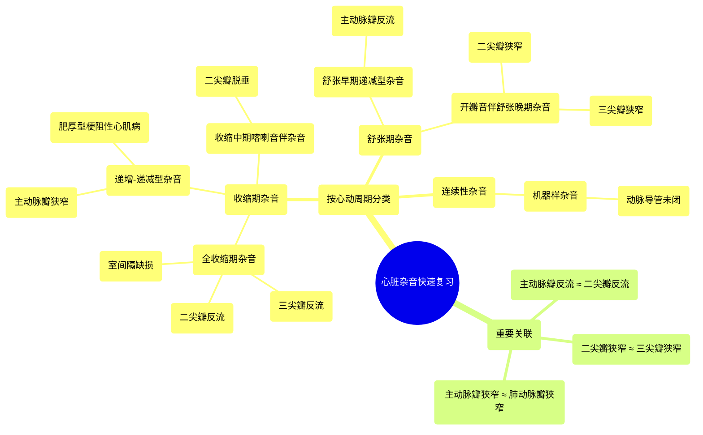

# 52 Heart Murmurs - Quick Review - Stenosis, Regurgitaion, AS, AR, MS, MR, PS, PR, MVP, TS, TR

  <video controls preload="metadata" playsinline>
    <source src="https://helly.s3.bitiful.net/心血管学科/%E4%B8%93%E8%BE%91%2018%EF%BC%9A%E5%BF%83%E5%86%85%E7%A7%91%E7%BB%88%E6%9E%81%E7%99%BE%E7%A7%91%E8%BE%9E%E5%85%B8%20%28The%20Cardiology%20Encyclopedia%29/52%20Heart%20Murmurs%20-%20Quick%20Review%20-%20Stenosis%2C%20Regurgitaion%2C%20AS%2C%20AR%2C%20MS%2C%20MR%2C%20PS%2C%20PR%2C%20MVP%2C%20TS%2C%20TR.mp4" type="video/mp4">
    
您的浏览器不支持播放，请升级。

  </video>

::: tip ⚡️ 核心考点 (30s速读)
*   **核心考点**：心脏杂音按心动周期分为收缩期、舒张期和连续性杂音。其听诊特征（如时相、形态、音调）是鉴别不同心脏瓣膜病的关键。
*   **临床意义**：通过杂音的特征性模式，可以快速推断潜在的瓣膜病变（如狭窄、反流）或结构性心脏病（如室间隔缺损、动脉导管未闭），是心血管体格检查的核心技能。
:::

## 🧠 深度精讲

*   **心脏杂音的分类**：根据杂音在心动周期中出现的时间，主要分为三类：
    *   **收缩期杂音**：发生在第一心音（S1）与第二心音（S2）之间，即心室收缩期。
    *   **舒张期杂音**：发生在第二心音（S2）与下一个第一心音（S1）之间，即心室舒张期。
    *   **连续性杂音**：从收缩期开始，持续不间断地贯穿S2进入舒张期。

*   **收缩期杂音详解**：
    *   **全收缩期杂音**：杂音强度均匀，占据整个收缩期。典型代表包括**二尖瓣反流**、**三尖瓣反流**和**室间隔缺损**。虽然听诊区域不同，但声音形态相似。
    *   **递增-递减型杂音**：杂音强度先增强后减弱，呈菱形。是**主动脉瓣狭窄**的典型特征，也见于**肥厚型梗阻性心肌病**。
    *   **收缩中期喀喇音伴杂音**：在收缩中期可闻及一个高调的“喀喇”声，随后可能出现一个收缩晚期的递增型杂音。这是**二尖瓣脱垂**的特征性表现。

*   **舒张期杂音详解**：
    *   **舒张早期递减型杂音**：杂音紧接S2后出现，音调高，呈吹风样，强度逐渐减弱。这是**主动脉瓣反流**的典型杂音。
    *   **开瓣音伴舒张晚期隆隆样杂音**：在S2后可闻及一个高调、清脆的**开瓣音**，随后是一个低调、雷鸣样的舒张晚期杂音。这是**二尖瓣狭窄**的经典表现。“隆隆样”形容其极低的音调。

*   **连续性杂音详解**：
    *   **机器样杂音**：杂音从收缩期持续至舒张期，在S2处最响亮，听起来像机器轰鸣声。这是**动脉导管未闭**的特征性杂音。

*   **重要关联与鉴别**：
    *   听诊上，**主动脉瓣反流**的杂音可能与**二尖瓣反流**的杂音有相似之处（均可能为吹风样），需结合听诊部位和其他体征鉴别。
    *   **二尖瓣狭窄**的杂音模式与**三尖瓣狭窄**相似。
    *   **主动脉瓣狭窄**的杂音模式与**肺动脉瓣狭窄**相似。

## 📚 双语术语表 (Terminology)
| 英文术语 | 中文翻译 | 定义/解释 |
| :--- | :--- | :--- |
| Heart murmur | 心脏杂音 | 心脏收缩或舒张期间血液湍流产生的心音以外的异常声音。 |
| Systole | 收缩期 | 心室收缩，将血液泵入动脉的时期。 |
| Diastole | 舒张期 | 心室放松并充盈血液的时期。 |
| S1 | 第一心音 | 标志心室收缩开始，主要由房室瓣（二尖瓣、三尖瓣）关闭产生。 |
| S2 | 第二心音 | 标志心室舒张开始，主要由半月瓣（主动脉瓣、肺动脉瓣）关闭产生。 |
| Aortic Stenosis (AS) | 主动脉瓣狭窄 | 主动脉瓣开放受限，导致左心室射血受阻。典型杂音为收缩期递增-递减型。 |
| Aortic Regurgitation (AR) | 主动脉瓣反流 | 主动脉瓣关闭不全，舒张期血液从主动脉反流回左心室。典型杂音为舒张早期高调吹风样递减型。 |
| Mitral Stenosis (MS) | 二尖瓣狭窄 | 二尖瓣开放受限，导致左心房血液流入左心室受阻。典型表现为开瓣音后跟随舒张晚期隆隆样杂音。 |
| Mitral Regurgitation (MR) | 二尖瓣反流 | 二尖瓣关闭不全，收缩期血液从左心室反流回左心房。典型杂音为全收缩期吹风样杂音。 |
| Mitral Valve Prolapse (MVP) | 二尖瓣脱垂 | 二尖瓣瓣叶在收缩期脱入左心房，常伴有收缩中期喀喇音及可能出现的收缩晚期杂音。 |
| Tricuspid Stenosis (TS) | 三尖瓣狭窄 | 三尖瓣开放受限。杂音模式与二尖瓣狭窄相似。 |
| Tricuspid Regurgitation (TR) | 三尖瓣反流 | 三尖瓣关闭不全。杂音模式与二尖瓣反流相似（全收缩期）。 |
| Pulmonic Stenosis (PS) | 肺动脉瓣狭窄 | 肺动脉瓣开放受限。杂音模式与主动脉瓣狭窄相似（收缩期递增-递减型）。 |
| Ventricular Septal Defect (VSD) | 室间隔缺损 | 左右心室之间的间隔存在缺损。典型杂音为全收缩期杂音。 |
| Patent Ductus Arteriosus (PDA) | 动脉导管未闭 | 胎儿期连接肺动脉和主动脉的血管在出生后未闭合。典型杂音为连续性机器样杂音，在S2处最响。 |
| Opening Snap (OS) | 开瓣音 | 舒张早期一个高调、清脆的额外心音，常见于二尖瓣狭窄，因僵硬瓣膜突然开放受限而产生。 |
| Crescendo-decrescendo murmur | 递增-递减型杂音 | 杂音强度先增强后减弱，形状像菱形。 |
| Decrescendo murmur | 递减型杂音 | 杂音强度从一开始就逐渐减弱。 |
| Rumbling murmur | 隆隆样杂音 | 一种音调非常低的杂音，形容如雷鸣，典型见于二尖瓣狭窄。 |
| Continuous murmur | 连续性杂音 | 杂音从收缩期开始，持续贯穿S2进入舒张期，不间断。 |

## 🗺️ 知识图谱

