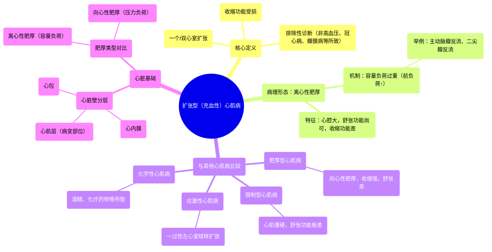

# 53 Dilated (Congestive) Cardiomyopathy (Systolic Dysfunction) - Causes, Symptoms, Diagnosis, Treatment

  <video controls preload="metadata" playsinline>
    <source src="https://helly.s3.bitiful.net/心血管学科/%E4%B8%93%E8%BE%91%2018%EF%BC%9A%E5%BF%83%E5%86%85%E7%A7%91%E7%BB%88%E6%9E%81%E7%99%BE%E7%A7%91%E8%BE%9E%E5%85%B8%20%28The%20Cardiology%20Encyclopedia%29/53%20Dilated%20%28Congestive%29%20Cardiomyopathy%20%28Systolic%20Dysfunction%29%20-%20Causes%2C%20Symptoms%2C%20Diagnosis%2C%20Treatment.mp4" type="video/mp4">
    
您的浏览器不支持播放，请升级。

  </video>

::: tip ⚡️ 核心考点 (30s速读)
*   **核心考点**：扩张型心肌病是一种以“一个或多个心室扩张”和“收缩功能受损”为特征的心肌病。其核心病理生理是“离心性肥厚”，导致心脏“舒张功能尚可，但收缩功能极差”。
*   **临床意义**：患者症状与“充血性心力衰竭”相似。诊断需排除高血压、冠心病、瓣膜病等其他原因。治疗需针对心力衰竭和病因。
:::

## 🧠 深度精讲

*   **概念1：扩张型心肌病的定义与核心特征**
    扩张型心肌病是一种原发性心肌疾病，其诊断标准包括：1）一个或两个心室出现“扩张”；2）心室“收缩功能受损”。关键在于，这些改变“并非完全”由高血压、冠状动脉粥样硬化、瓣膜病或先天性心脏病等其他明确的结构性心脏病所引起。简单来说，就是心肌本身出了问题，导致心脏变大变弱。

*   **概念2：离心性肥厚 vs. 向心性肥厚**
    这是理解扩张型心肌病形态学的关键。
    *   **离心性肥厚**：心脏“向外”生长，心腔显著扩大，心室壁可能相对变薄或不成比例地增厚。这是扩张型心肌病的典型改变，由“容量负荷过重”（前负荷增加）引起，例如主动脉瓣反流、二尖瓣反流。
    *   **向心性肥厚**：心脏“向内”生长，心室壁增厚，但心腔大小正常或缩小。这是由“压力负荷过重”（后负荷增加）引起，例如主动脉瓣狭窄、系统性高血压。

*   **概念3：心肌病的分类与比较**
    视频中梳理了主要的心肌病类型，通过比较可以加深对扩张型心肌病的理解：
    *   **扩张型心肌病**：心脏扩张，**舒张功能尚可，收缩功能差**。
    *   **肥厚型心肌病**：心室壁（尤其是室间隔）异常增厚，**收缩功能强，舒张功能差**（因心腔充盈受限）。
    *   **限制型心肌病**：心肌僵硬，**舒张功能极差**（充盈严重受限），收缩功能早期可能正常。
    *   **应激性心肌病**：一过性左心室心尖部球样扩张，形似章鱼罐，常由强烈情绪或躯体应激诱发。
    *   **化学性心肌病**：由酒精、可卡因、某些化疗药物（如阿霉素）等毒性物质引起。

*   **概念4：心脏的基本结构与病变定位**
    心脏壁由内向外分为三层：心内膜、心肌层（心肌）、心包。扩张型心肌病的病变核心位于“心肌层”，因此属于“心肌病”。理解这个结构有助于定位疾病。

## 📚 双语术语表 (Terminology)
| 英文术语 | 中文翻译 | 定义/解释 |
| :--- | :--- | :--- |
| Dilated Cardiomyopathy (DCM) | 扩张型心肌病 | 以心室扩张和收缩功能障碍为特征的心肌病。 |
| Congestive Cardiomyopathy | 充血性心肌病 | 扩张型心肌病的别称，强调其常导致充血性心力衰竭的症状。 |
| Eccentric Hypertrophy | 离心性肥厚 | 心脏向外扩张性生长，心腔扩大，与容量负荷过重相关。 |
| Concentric Hypertrophy | 向心性肥厚 | 心脏向心性增厚，心腔不变或缩小，与压力负荷过重相关。 |
| Systolic Dysfunction | 收缩功能障碍 | 心脏收缩泵血能力下降。 |
| Diastolic Dysfunction | 舒张功能障碍 | 心脏舒张期充盈能力下降。 |
| Preload | 前负荷 | 心脏收缩前（舒张末期）心室所承受的负荷，主要取决于回心血量。 |
| Afterload | 后负荷 | 心脏收缩射血时需克服的阻力，如主动脉血压。 |
| Volume Overload | 容量负荷过重 | 回心血量过多导致前负荷增加。 |
| Pressure Overload | 压力负荷过重 | 射血阻力过大导致后负荷增加。 |
| Myocardium | 心肌层 | 心脏壁的中间肌肉层。 |
| Endocardium | 心内膜 | 心脏壁的内层。 |
| Pericardium | 心包 | 包裹心脏的最外层纤维浆膜囊。 |
| Takotsubo Cardiomyopathy | 应激性心肌病 | 又称“心碎综合征”，由应激诱发的一过性左心室功能障碍。 |

## 🗺️ 知识图谱

