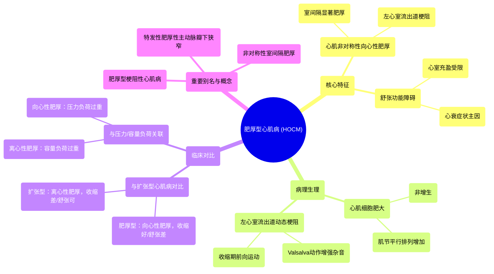

# 54 Hypertrophic Cardiomyopathy (HOCM) - Sudden Cardiac Death - Cardiology Series

  <video controls preload="metadata" playsinline>
    <source src="https://helly.s3.bitiful.net/心血管学科/%E4%B8%93%E8%BE%91%2018%EF%BC%9A%E5%BF%83%E5%86%85%E7%A7%91%E7%BB%88%E6%9E%81%E7%99%BE%E7%A7%91%E8%BE%9E%E5%85%B8%20%28The%20Cardiology%20Encyclopedia%29/54%20Hypertrophic%20Cardiomyopathy%20%28HOCM%29%20-%20Sudden%20Cardiac%20Death%20-%20Cardiology%20Series.mp4" type="video/mp4">
    
您的浏览器不支持播放，请升级。

  </video>

::: tip ⚡️ 核心考点 (30s速读)
*   **核心考点**：肥厚型心肌病（HCM）是一种以**左心室心肌非对称性、向心性肥厚**为特征的遗传性心肌病，常导致**左心室流出道梗阻**，是**青年人心源性猝死**的常见原因。
*   **临床意义**：患者收缩功能通常正常甚至增强，但存在**严重舒张功能障碍**。典型体征为**胸骨左缘收缩期喷射性杂音**，Valsalva动作（用力呼气后屏气）可使其增强。
:::

## 🧠 深度精讲

*   **概念1：肥厚型心肌病的定义与别名**
    肥厚型心肌病是一种原发于心肌的疾病，其特征是心肌细胞**肥大**（细胞体积增大，而非数量增多），导致心室壁，尤其是**室间隔**，出现**非对称性肥厚**。这种肥厚常造成**左心室流出道梗阻**，因此也被称为**肥厚型梗阻性心肌病**。由于其狭窄部位位于主动脉瓣下方，故旧称**特发性肥厚性主动脉瓣下狭窄**。

*   **概念2：病理生理核心——舒张功能障碍与流出道梗阻**
    1.  **舒张功能障碍**：肥厚的心肌僵硬，顺应性下降，导致心室在舒张期充盈困难。这是患者出现呼吸困难、乏力等心衰症状的主要原因，尽管其收缩功能（射血分数）可能正常。
    2.  **左心室流出道梗阻**：肥厚的室间隔在收缩期凸向左心室流出道，加之二尖瓣前叶因 Venturi 效应被吸引向室间隔（收缩期前向运动，SAM 现象），共同造成流出道动态性梗阻。梗阻程度可随前、后负荷变化而改变。

*   **概念3：与扩张型心肌病的对比**
    *   **肥厚型心肌病**：**向心性肥厚**。肌节**平行排列**增加，心室壁增厚，心腔变小。病因多为**压力负荷过重**（如高血压、主动脉瓣狭窄）或遗传。心功能特点：**收缩功能好，舒张功能差**。听诊可闻及**第四心音**。
    *   **扩张型心肌病**：**离心性肥厚**。肌节**串联排列**增加，心腔显著扩大，心室壁相对变薄。病因多为**容量负荷过重**（如瓣膜反流）或毒素（酒精、化疗药）。心功能特点：**收缩功能差，舒张功能尚可**。听诊可闻及**第三心音**。

*   **概念4：解剖基础——左心室的分区**
    左心室可分为两部分：
    1.  **粗糙的流入道**：心内膜面有肉柱和乳头肌，负责接收来自左心房的血液。
    2.  **平滑的流出道**：心内膜面光滑，为纤维组织构成，是血液射入主动脉的通道。肥厚型心肌病的梗阻即发生在此区域。

## 📚 双语术语表 (Terminology)
| 英文术语 | 中文翻译 | 定义/解释 |
| :--- | :--- | :--- |
| Hypertrophic Cardiomyopathy (HCM/HOCM) | 肥厚型心肌病（梗阻性） | 以心室非对称性肥厚，常伴左心室流出道梗阻为特征的心肌病。 |
| Asymmetrical Septal Hypertrophy (ASH) | 非对称性室间隔肥厚 | 肥厚型心肌病的典型表现，室间隔肥厚程度远大于左心室游离壁。 |
| Left Ventricular Outflow Tract Obstruction (LVOTO) | 左心室流出道梗阻 | 肥厚心肌导致左心室向主动脉射血的通道变窄。 |
| Idiopathic Hypertrophic Subaortic Stenosis (IHSS) | 特发性肥厚性主动脉瓣下狭窄 | 肥厚型心肌病的旧称，强调狭窄部位在主动脉瓣下方。 |
| Concentric Hypertrophy | 向心性肥厚 | 心肌细胞肥大导致心室壁增厚，心腔变小或正常。 |
| Eccentric Hypertrophy | 离心性肥厚 | 心肌细胞肥大导致心腔扩大，心室壁相对变薄。 |
| Diastolic Dysfunction | 舒张功能障碍 | 心室在舒张期松弛和充盈能力受损。 |
| Systolic Dysfunction | 收缩功能障碍 | 心室在收缩期射血能力受损。 |
| Sarcomere | 肌节 | 心肌细胞的基本收缩单位。 |
| Preload | 前负荷 | 心脏舒张末期心室内的血容量（容量负荷）。 |
| Afterload | 后负荷 | 心脏收缩射血时需要克服的动脉压力（压力负荷）。 |
| S4 Gallop | 第四心音奔马律 | 与心房收缩、血液冲入僵硬心室相关的心音，见于心室肥厚。 |
| S3 Gallop | 第三心音奔马律 | 与心室快速充盈相关的心音，见于心室扩张和心衰。 |

## 🗺️ 知识图谱

