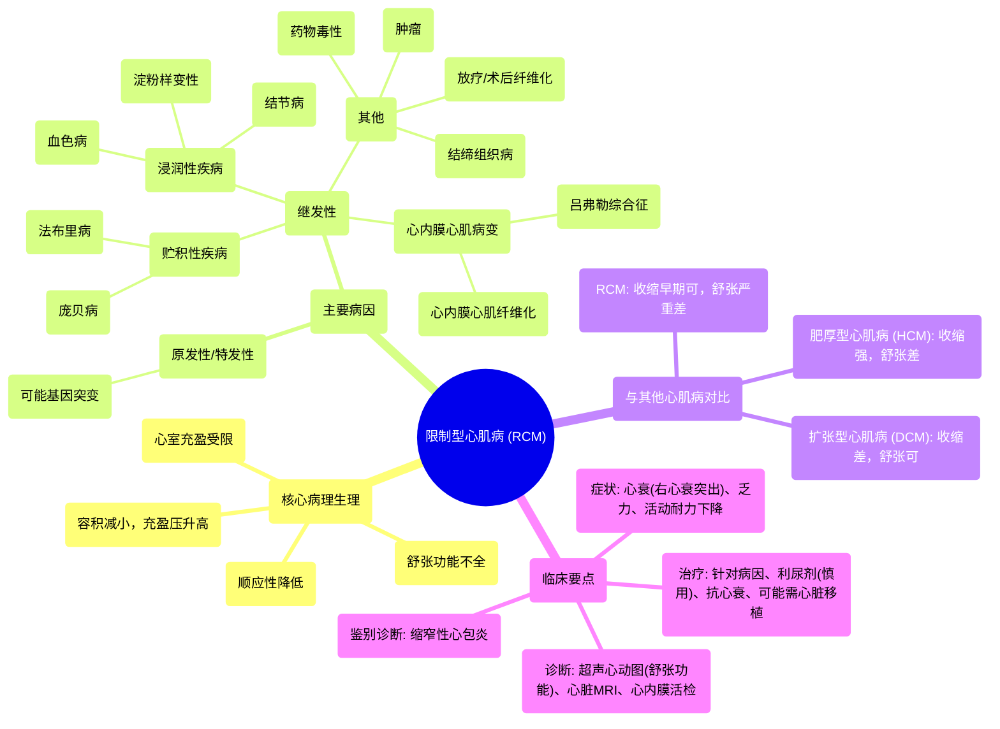

# 55 Restrictive Cardiomyopathy - Causes, Symptoms, Diagnosis & Treatment - Cardiology Series

  <video controls preload="metadata" playsinline>
    <source src="https://helly.s3.bitiful.net/心血管学科/%E4%B8%93%E8%BE%91%2018%EF%BC%9A%E5%BF%83%E5%86%85%E7%A7%91%E7%BB%88%E6%9E%81%E7%99%BE%E7%A7%91%E8%BE%9E%E5%85%B8%20%28The%20Cardiology%20Encyclopedia%29/55%20Restrictive%20Cardiomyopathy%20-%20Causes%2C%20Symptoms%2C%20Diagnosis%20%26%20Treatment%20-%20Cardiology%20Series.mp4" type="video/mp4">
    
您的浏览器不支持播放，请升级。

  </video>

::: tip ⚡️ 核心考点 (30s速读)
*   **核心考点**：限制型心肌病 (RCM) 的核心病理生理是**心室充盈受限**，导致**舒张功能不全**。其特点是**心室容积减小**，但**充盈压升高**。
*   **临床意义**：需与缩窄性心包炎鉴别，两者均可导致舒张期充盈受限。RCM的治疗主要针对病因，预后通常较差。
:::

## 🧠 深度精讲

*   **概念1：什么是限制型心肌病？**
    限制型心肌病是一种以**心室壁僵硬、顺应性降低**为特征的心肌病。心脏在舒张期无法正常充盈（舒张功能不全），导致进入心脏的血液量（前负荷/舒张末期容积）减少，进而导致泵出的血液量（心输出量）也减少。关键点在于：**容积减少，但为了克服僵硬心肌的阻力，充盈压力反而升高**。

*   **概念2：病因与分类**
    1.  **原发性/特发性**：病因不明，可能与编码心肌肌钙蛋白I等蛋白的基因突变有关。
    2.  **继发性**：由其他疾病导致心肌或心内膜病变。
        *   **浸润性疾病**：淀粉样变性（最常见）、结节病、血色病（铁过载）。
        *   **贮积性疾病**：糖原贮积病（如庞贝病）、溶酶体贮积病（如法布里病）。
        *   **心内膜心肌病变**：心内膜心肌纤维化、嗜酸性粒细胞增多综合征（如吕弗勒心内膜炎）。
        *   **其他**：肿瘤（原发或转移）、放疗或心脏手术后纤维化、结缔组织病（如系统性硬化症）、某些药物（如阿霉素、白消安、麦角生物碱）毒性。

*   **概念3：与其他心肌病的对比**
    *   **扩张型心肌病 (DCM)**：心室腔扩大，收缩功能差（收缩期泵血无力），但舒张功能相对正常。
    *   **肥厚型心肌病 (HCM)**：心室肌异常肥厚，收缩功能强，但舒张功能差（充盈受限）。
    *   **限制型心肌病 (RCM)**：心室腔大小正常或缩小，收缩功能早期正常，晚期下降，**核心是舒张功能严重受损**。

*   **概念4：与限制性肺病的类比**
    两者都涉及“限制”概念，即器官无法正常扩张充盈。
    *   **限制性肺病**：肺顺应性下降，导致所有肺容积和容量减少。
    *   **限制型心肌病**：心脏顺应性下降，导致心室充盈容积减少，但充盈压升高。

## 📚 双语术语表 (Terminology)
| 英文术语 | 中文翻译 | 定义/解释 |
| :--- | :--- | :--- |
| Restrictive Cardiomyopathy (RCM) | 限制型心肌病 | 以心室舒张充盈受限、顺应性降低为特征的心肌病。 |
| Diastolic Dysfunction | 舒张功能不全 | 心脏在舒张期放松和充盈能力受损。 |
| Compliance | 顺应性 | 单位压力变化引起的容积变化（ΔV/ΔP）。顺应性降低意味着器官僵硬。 |
| Preload | 前负荷 | 心脏舒张末期心室内的血容量（舒张末期容积），是心脏的“输入”。 |
| End-Diastolic Volume (EDV) | 舒张末期容积 | 心室在舒张末期充盈结束时的血容量。 |
| Sarcoidosis | 结节病 | 一种多系统肉芽肿性疾病，可浸润心肌导致RCM。 |
| Amyloidosis | 淀粉样变性 | 异常蛋白（淀粉样物质）在组织沉积，心脏淀粉样变是RCM常见原因。 |
| Hemochromatosis | 血色病 | 铁过载疾病，铁沉积于心肌导致功能障碍。 |
| Endomyocardial Fibroelastosis | 心内膜心肌纤维弹性组织增生症 | 心内膜和心肌层纤维和弹性组织增生，导致心室僵硬。 |
| Loeffler Syndrome | 吕弗勒综合征 | 嗜酸性粒细胞增多引起的心内膜心肌炎和纤维化，可导致RCM。 |

## 🗺️ 知识图谱

