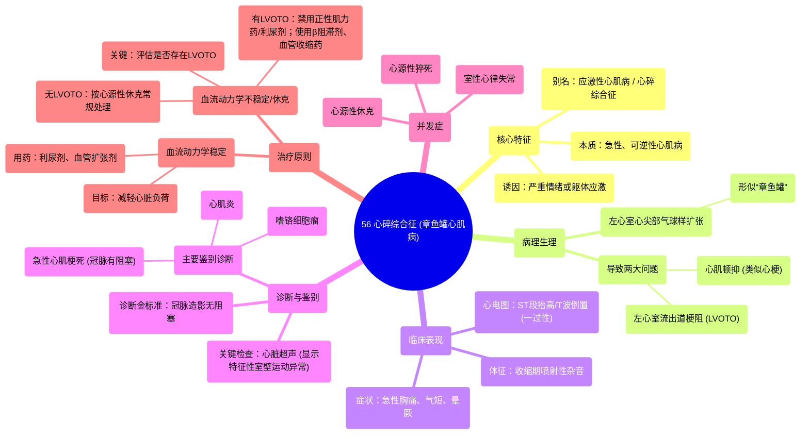

# 56 Broken Heart Syndrome (Takotsubo cardiomyopathy) Cardiology Series

  <video controls preload="metadata" playsinline>
    <source src="https://helly.s3.bitiful.net/心血管学科/%E4%B8%93%E8%BE%91%2018%EF%BC%9A%E5%BF%83%E5%86%85%E7%A7%91%E7%BB%88%E6%9E%81%E7%99%BE%E7%A7%91%E8%BE%9E%E5%85%B8%20%28The%20Cardiology%20Encyclopedia%29/56%20Broken%20Heart%20Syndrome%20%28Takotsubo%20cardiomyopathy%29%20Cardiology%20Series.mp4" type="video/mp4">
    
您的浏览器不支持播放，请升级。

  </video>

::: tip ⚡️ 核心考点 (30s速读)
*   **核心考点**：应激性心肌病（心碎综合征/章鱼罐心肌病）是一种由严重情绪或躯体应激触发的、可逆的急性心肌病，其临床表现酷似急性心肌梗死，但冠状动脉造影无阻塞性病变。
*   **临床意义**：需与急性冠脉综合征、心肌炎等鉴别。虽然多为可逆，但可并发严重左心室流出道梗阻、室性心律失常、心源性休克甚至猝死，需根据血流动力学状态进行个体化治疗。
:::

## 🧠 深度精讲

*   **概念与命名**：应激性心肌病，又称心碎综合征或章鱼罐心肌病。其命名源于急性期左心室心尖部呈气球样扩张，而基底部相对狭窄，形似日本渔民用于捕捉章鱼的罐子（章鱼罐）。它可由极度的负面情绪（如噩耗）或正面情绪（如惊喜）诱发，后者有时被称为“快乐心脏综合征”。
*   **病理生理与临床表现**：核心病理改变是左心室心尖部的可逆性运动障碍。这导致两个关键后果：1) **心肌顿抑**：产生类似心梗的胸痛、气短、心电图ST-T改变；2) **左心室流出道梗阻**：由于心腔形态改变，流出道变窄，可产生收缩期喷射性杂音（类似肥厚型梗阻性心肌病），并可能导致晕厥或心源性休克。
*   **诊断与鉴别诊断**：诊断基于“临床表现类似心梗，但冠脉无阻塞”这一矛盾点。**诊断金标准是冠状动脉造影显示无阻塞性病变**，同时心脏超声显示特征性的心尖球样扩张伴室壁运动异常（通常在一至数周内恢复）。**必须重点排除**：1) **急性心肌梗死**（冠脉有阻塞，心肌坏死不可逆）；2) **心肌炎**（心肌细胞炎症）；3) **嗜铬细胞瘤**（儿茶酚胺风暴可诱发类似表现）。
*   **治疗原则**：治疗取决于患者血流动力学状态。
    *   **血流动力学稳定**：主要目标是减轻心脏负荷，可使用利尿剂（降低前负荷）和血管扩张剂如硝酸酯类（降低前后负荷）。
    *   **血流动力学不稳定/心源性休克**：需紧急评估是否存在**左心室流出道梗阻**。
        *   **若无梗阻**：按心源性休克常规处理，可能需要正性肌力药或机械循环支持。
        *   **若存在梗阻**：**禁用正性肌力药和利尿剂**（可能加重梗阻），应使用**β受体阻滞剂**减慢心率、减弱收缩力以减轻梗阻，并考虑使用**血管收缩药（如去甲肾上腺素）** 提高血压、支撑心脏。

## 📚 双语术语表 (Terminology)
| 英文术语 | 中文翻译 | 定义/解释 |
| :--- | :--- | :--- |
| Takotsubo cardiomyopathy | 章鱼罐心肌病 / 应激性心肌病 | 一种由应激诱发、以左心室心尖部球样扩张为特征的急性可逆性心肌病。 |
| Broken heart syndrome | 心碎综合征 | 应激性心肌病的俗称，强调其常由剧烈情绪打击诱发。 |
| Left ventricular outflow tract (LVOT) obstruction | 左心室流出道梗阻 | 因左心室形态改变导致血液流出道狭窄，可引发杂音、晕厥和休克。 |
| Wall motion abnormality | 室壁运动异常 | 心脏超声显示的局部心肌收缩运动减弱、消失或矛盾运动，在此病中呈一过性。 |
| Cardiogenic shock | 心源性休克 | 由于心脏泵功能严重受损导致的组织灌注不足状态。 |
| Hemodynamically stable/unstable | 血流动力学稳定/不稳定 | 描述患者循环状态是否平稳，是决定治疗方案的关键。 |
| Preload & Afterload | 前负荷 & 后负荷 | 前负荷指心脏舒张末期容积（容量负荷）；后负荷指心脏收缩射血时需要克服的阻力（压力负荷）。 |

## 🗺️ 知识图谱

