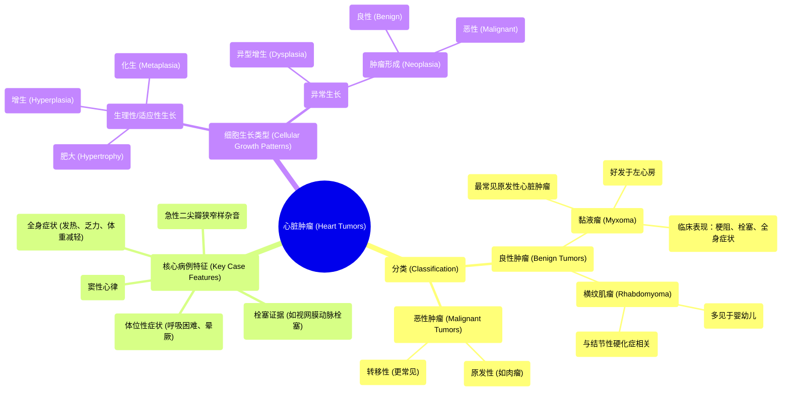

# 57 Heart Tumors - Myxoma, Rhabdomyoma, Leiomyosarcoma - Cardiology Playlist

  <video controls preload="metadata" playsinline>
    <source src="https://helly.s3.bitiful.net/心血管学科/%E4%B8%93%E8%BE%91%2018%EF%BC%9A%E5%BF%83%E5%86%85%E7%A7%91%E7%BB%88%E6%9E%81%E7%99%BE%E7%A7%91%E8%BE%9E%E5%85%B8%20%28The%20Cardiology%20Encyclopedia%29/57%20Heart%20Tumors%20-%20Myxoma%2C%20Rhabdomyoma%2C%20Leiomyosarcoma%20-%20Cardiology%20Playlist.mp4" type="video/mp4">
    
您的浏览器不支持播放，请升级。

  </video>

::: tip ⚡️ 核心考点 (30s速读)
*   **核心考点**：心脏肿瘤的典型临床表现（如体位性症状、杂音变化）是诊断的关键线索，尤其是左心房黏液瘤。
*   **临床意义**：心脏肿瘤虽罕见，但可模拟瓣膜病（如二尖瓣狭窄）、心衰或栓塞性疾病，需通过超声心动图等影像学检查进行鉴别。
:::

## 🧠 深度精讲

*   **病例分析**：视频开篇的病例描述了一位49岁女性，表现为急性发作的严重二尖瓣狭窄（MS）杂音、窦性心律、体位性呼吸困难/晕厥、全身症状（发热、乏力、体重减轻）以及眼底检查发现视网膜血管内移动的白色斑块（提示栓塞）。这些特征高度提示**左心房黏液瘤**。肿瘤可随体位改变阻塞二尖瓣口（产生杂音和体位性症状），瘤体碎片或表面血栓脱落可导致全身性栓塞（如视网膜动脉栓塞）。
*   **肿瘤命名与分类**：
    *   肿瘤（Neoplasia）指细胞异常、不受控的增殖，形成与正常组织不协调的肿块，且在初始刺激停止后仍持续生长。
    *   根据行为学分为**良性肿瘤**（如黏液瘤、横纹肌瘤）和**恶性肿瘤**（即癌症，如平滑肌肉瘤、横纹肌肉瘤）。
    *   术语上，通常以“-oma”结尾表示肿瘤（但需注意特例，如视频中幽默提到的“Oklahoma”俄克拉荷马州不是肿瘤）。
*   **心脏肿瘤概述**：心脏肿瘤可起源于心脏各层结构（心内膜、心肌、心包）或结缔组织、肌肉组织。原发性心脏肿瘤罕见，其中最常见的良性肿瘤是**黏液瘤**，最常见的原发性恶性肿瘤是**肉瘤**。
*   **细胞生长类型**：理解肿瘤发生需区分几种细胞生长模式：
    *   **肥大**：细胞体积增大。
    *   **增生**：细胞数量增多。
    *   **化生**：一种已分化的组织类型转变为同类别内的另一种组织类型（如一种上皮变为另一种上皮）。
    *   **异型增生**：细胞生长和形态出现异常，可能进展为肿瘤。
    *   **肿瘤形成**：即形成肿瘤，分为良性和恶性。

## 📚 双语术语表 (Terminology)
| 英文术语 | 中文翻译 | 定义/解释 |
| :--- | :--- | :--- |
| Myxoma | 黏液瘤 | 最常见的心脏原发性良性肿瘤，多发生于左心房，常带蒂，可引起瓣膜梗阻和栓塞。 |
| Rhabdomyoma | 横纹肌瘤 | 一种良性心脏肿瘤，常见于婴幼儿，常与结节性硬化症相关。 |
| Leiomyosarcoma | 平滑肌肉瘤 | 一种起源于平滑肌的恶性肿瘤，可发生于心脏（罕见）。 |
| Neoplastic diseases | 肿瘤性疾病 | 泛指所有肿瘤类疾病。 |
| Benign tumor | 良性肿瘤 | 生长局限、不侵犯周围组织、不转移的肿瘤。 |
| Malignant tumor | 恶性肿瘤 | 即癌症，具有侵袭性、可转移的肿瘤。 |
| Metastasize | 转移 | 肿瘤细胞从原发部位扩散到身体其他部位。 |
| Endocardium | 心内膜 | 心脏内壁衬里，包括瓣膜。 |
| Myocardium | 心肌层 | 由心肌细胞构成的心脏中层，负责收缩。 |
| Pericardium | 心包 | 包裹心脏的双层囊状结构。 |
| Hypertrophy | 肥大 | 细胞体积增大导致组织或器官体积增加。 |
| Hyperplasia | 增生 | 细胞数量增多导致组织或器官体积增加。 |
| Metaplasia | 化生 | 一种分化成熟的组织类型被同一种类别的另一种分化成熟的组织类型所取代。 |
| Dysplasia | 异型增生 | 细胞生长和结构异常，但尚未达到癌变的程度，是一种癌前病变。 |
| Neoplasia | 肿瘤形成 | 细胞异常增殖形成新生物（肿瘤）的过程。 |

## 🗺️ 知识图谱

