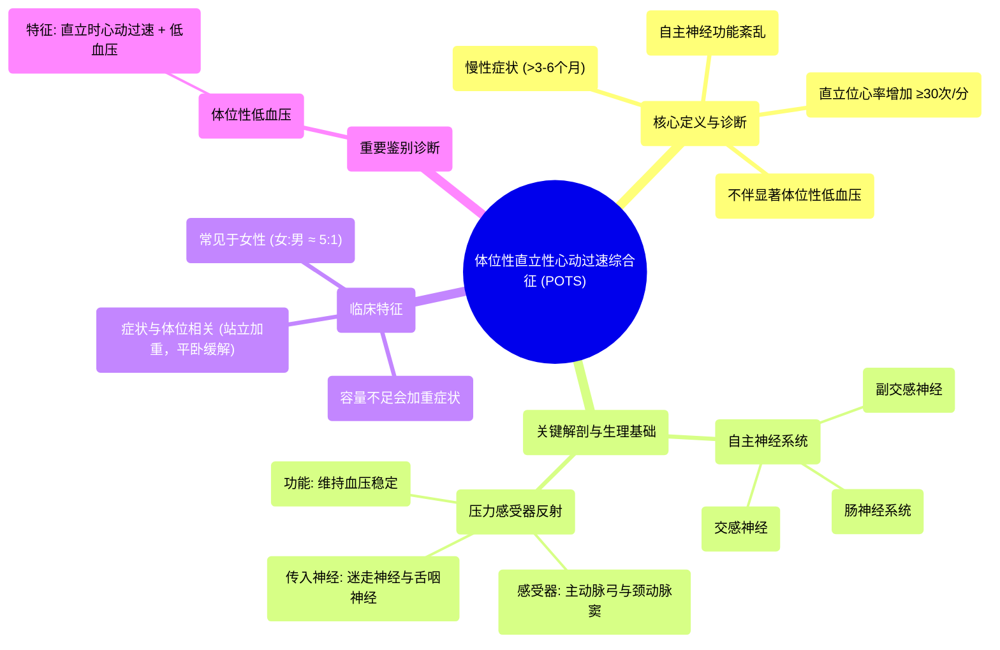

# 58 Postural Orthostatic Tachycardia Syndrome (POTS) - Causes, Symptoms, Diagnosis, Treatment-Cardiology

  <video controls preload="metadata" playsinline>
    <source src="https://helly.s3.bitiful.net/心血管学科/%E4%B8%93%E8%BE%91%2018%EF%BC%9A%E5%BF%83%E5%86%85%E7%A7%91%E7%BB%88%E6%9E%81%E7%99%BE%E7%A7%91%E8%BE%9E%E5%85%B8%20%28The%20Cardiology%20Encyclopedia%29/58%20Postural%20Orthostatic%20Tachycardia%20Syndrome%20%28POTS%29%20-%20Causes%2C%20Symptoms%2C%20Diagnosis%2C%20Treatment-Cardiology.mp4" type="video/mp4">
    
您的浏览器不支持播放，请升级。

  </video>

::: tip ⚡️ 核心考点 (30s速读)
*   **核心考点**：体位性直立性心动过速综合征是一种自主神经功能紊乱，核心特征是**从卧位转为直立位时，心率异常增加（≥30次/分）且不伴有显著低血压**。
*   **临床意义**：需与体位性低血压鉴别，后者同时有心率增快和血压下降。POTS症状与体位相关，平卧可缓解，容量不足会加重症状。
:::

## 🧠 深度精讲
*   **概念1：体位性直立性心动过速综合征的定义与诊断标准**
    *   POTS是一种自主神经功能失调。诊断需满足：**慢性症状持续超过3-6个月**；从卧位转为直立位时，心率增加**≥30次/分**（或心率绝对值≥120次/分）；且**不伴有显著的体位性低血压**。例如，卧位心率60次/分，站立后心率需≥90次/分。

*   **概念2：自主神经系统与压力感受器反射**
    *   自主神经系统负责不受意识控制的内脏功能，包括交感神经（兴奋）、副交感神经（抑制）和肠神经系统。
    *   **压力感受器反射**是关键的自主神经反射。主动脉弓和颈动脉窦内的**牵张感受器**（压力感受器）感知血压变化。当血压下降（如站立时），感受器传入信号减少，中枢神经系统通过增加交感神经输出、减少副交感神经输出来**增快心率、收缩血管**以维持血压稳定。POTS患者的这一反射通路可能存在功能异常。

*   **概念3：POTS的临床特征与鉴别**
    *   **症状**：与体位相关，站立时出现心悸、头晕、乏力等，平卧后缓解。
    *   **加重因素**：**容量不足**（盐和水同时丢失）会显著加重症状，单纯脱水（仅失水）影响相对较小。
    *   **鉴别诊断**：主要需与**体位性低血压**区分。两者站立时均有心动过速，但体位性低血压伴有明显的血压下降，而POTS患者血压下降不明显。

*   **概念4：相关解剖与神经支配**
    *   **主动脉弓压力感受器**：由**迷走神经**（第10对脑神经）支配。
    *   **颈动脉窦压力感受器**：由**舌咽神经**（第9对脑神经）支配。
    *   这些感受器信号传入延髓，整合后调节自主神经输出，是维持心血管稳定的关键结构。

## 📚 双语术语表 (Terminology)
| 英文术语 | 中文翻译 | 定义/解释 |
| :--- | :--- | :--- |
| Postural Orthostatic Tachycardia Syndrome (POTS) | 体位性直立性心动过速综合征 | 一种自主神经功能紊乱，特征为直立时心率异常显著增加而不伴显著低血压。 |
| Autonomic Nervous System | 自主神经系统 | 神经系统中控制非随意功能（如心率、血压、消化）的部分，包括交感、副交感和肠神经系统。 |
| Baroreceptor Reflex | 压力感受器反射 | 一种通过感知血管壁牵张（血压）变化来反射性调节心率和血管张力，以维持血压稳定的自主神经反射。 |
| Orthostatic Hypotension | 体位性低血压 | 从卧位转为直立位时，出现血压显著下降（通常收缩压下降≥20 mmHg或舒张压下降≥10 mmHg）。 |
| Volume Depletion | 容量不足 | 体内盐分和水分的共同丢失。 |
| Dehydration | 脱水 | 特指体内水分的单独丢失。 |
| Vagus Nerve (Cranial Nerve X) | 迷走神经（第10对脑神经） | 支配主动脉弓压力感受器，是副交感神经系统的主要组成部分。 |
| Glossopharyngeal Nerve (Cranial Nerve IX) | 舌咽神经（第9对脑神经） | 支配颈动脉窦压力感受器。 |
| Carotid Sinus | 颈动脉窦 | 位于颈总动脉分叉处的膨大区域，内含压力感受器。 |

## 🗺️ 知识图谱

