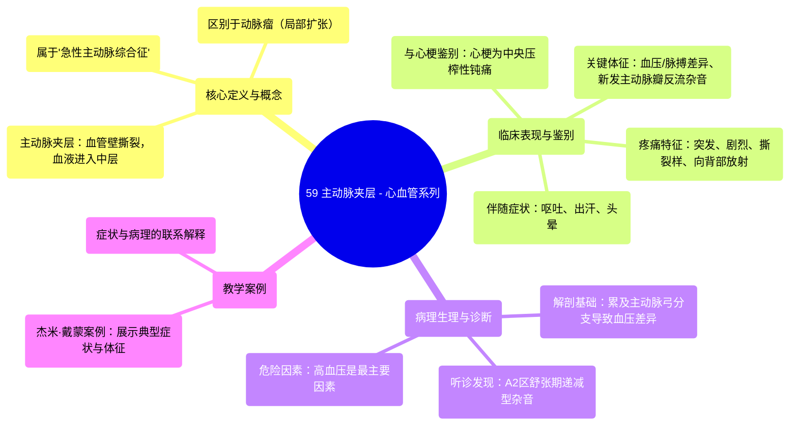

# 59 Aortic Dissection - Dissecting Aortic Aneurysm - Cardiology Series

  <video controls preload="metadata" playsinline>
    <source src="https://helly.s3.bitiful.net/心血管学科/%E4%B8%93%E8%BE%91%2018%EF%BC%9A%E5%BF%83%E5%86%85%E7%A7%91%E7%BB%88%E6%9E%81%E7%99%BE%E7%A7%91%E8%BE%9E%E5%85%B8%20%28The%20Cardiology%20Encyclopedia%29/59%20Aortic%20Dissection%20-%20Dissecting%20Aortic%20Aneurysm%20-%20Cardiology%20Series.mp4" type="video/mp4">
    
您的浏览器不支持播放，请升级。

  </video>

::: tip ⚡️ 核心考点 (30s速读)
*   **核心考点**：主动脉夹层是一种危及生命的急症，表现为突发的、剧烈的、撕裂样胸痛，常向背部放射。其诊断关键在于识别“血压/脉搏差异”和“新发主动脉瓣反流杂音”等体征。
*   **临床意义**：需与急性心肌梗死鉴别。心源性胸痛多为胸部中央的压榨性钝痛，而主动脉夹层疼痛更尖锐、撕裂样，且可伴有神经系统症状（如头晕）和血压不对称。
:::

## 🧠 深度精讲
*   **概念1：主动脉夹层与动脉瘤**：视频澄清了“主动脉夹层动脉瘤”是旧称，现规范称为“主动脉夹层”。它与动脉瘤（血管的局部扩张）不同，是血管壁内膜撕裂，血液进入血管壁中层形成假腔。
*   **概念2：疼痛特点与鉴别**：视频强调了心源性胸痛（如心梗）与主动脉夹层胸痛的区别。心梗疼痛常为胸部中央的压榨性钝痛（“像有大象坐在胸口”），患者无法精确定位。主动脉夹层疼痛则为突发的、剧烈的、撕裂样或刀割样疼痛，位于胸骨后，常放射至肩胛间区。
*   **概念3：关键体征——血压/脉搏差异**：这是主动脉夹层的特征性体征。由于夹层累及主动脉弓的分支血管（如头臂干、左锁骨下动脉）程度不同，可导致双上肢或上下肢之间的血压和脉搏强弱不一致。例如，右臂血压正常或升高，而左臂血压显著降低。
*   **概念4：关键体征——新发主动脉瓣反流杂音**：当夹层累及主动脉根部，导致主动脉瓣环扩张或瓣叶受累时，可产生急性主动脉瓣关闭不全。听诊可在胸骨左缘第3肋间（A2区）闻及新出现的舒张期递减型杂音，并在患者呼气末屏气时增强。
*   **概念5：病理生理与临床表现联系**：视频通过杰米·戴蒙的案例，生动解释了症状与病理的联系。剧烈胸痛和背痛源于血管壁的撕裂；呕吐、出汗是剧烈疼痛和应激反应；头晕可能源于夹层影响脑血流灌注，或作为其高危因素——严重高血压本身的表现。

## 📚 双语术语表 (Terminology)
| 英文术语 | 中文翻译 | 定义/解释 |
| :--- | :--- | :--- |
| Aortic Dissection | 主动脉夹层 | 主动脉壁内膜撕裂，血液进入中层，将血管壁分离成真腔和假腔。 |
| Dissecting Aortic Aneurysm | 主动脉夹层动脉瘤 | 主动脉夹层的旧称，现已规范称为“主动脉夹层”。 |
| Aneurysm | 动脉瘤 | 动脉血管的局部异常扩张。 |
| Acute Aortic Syndrome | 急性主动脉综合征 | 一组包括主动脉夹层、壁内血肿和穿透性动脉粥样硬化性溃疡的危急重症。 |
| Pulse/Blood Pressure Differential | 脉搏/血压差异 | 主动脉夹层特征性体征，指身体不同部位（如双上肢）的脉搏强度或血压值存在明显差异。 |
| Diastolic Decrescendo Murmur | 舒张期递减型杂音 | 主动脉瓣关闭不全的典型杂音，于舒张早期出现，音调逐渐减弱。 |
| A2 Area | A2区 | 心脏听诊区，位于胸骨左缘第3肋间，是听诊主动脉瓣关闭不全杂音的最佳位置。 |
| Hypertension | 高血压 | 主动脉夹层最重要的危险因素之一。 |
| Libman-Sacks Endocarditis | 利布曼-萨克斯心内膜炎 | 系统性红斑狼疮患者出现的一种无菌性、赘生物性心内膜炎，通常累及二尖瓣。 |

## 🗺️ 知识图谱

