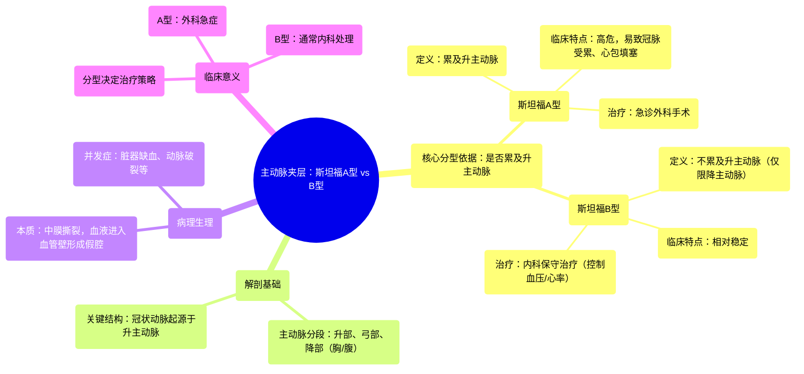

# 60 Aortic Dissection - Stanford Type A vs Stanford Type B - Cardiology Series

  <video controls preload="metadata" playsinline>
    <source src="https://helly.s3.bitiful.net/心血管学科/%E4%B8%93%E8%BE%91%2018%EF%BC%9A%E5%BF%83%E5%86%85%E7%A7%91%E7%BB%88%E6%9E%81%E7%99%BE%E7%A7%91%E8%BE%9E%E5%85%B8%20%28The%20Cardiology%20Encyclopedia%29/60%20Aortic%20Dissection%20-%20Stanford%20Type%20A%20vs%20Stanford%20Type%20B%20-%20Cardiology%20Series.mp4" type="video/mp4">
    
您的浏览器不支持播放，请升级。

  </video>

::: tip ⚡️ 核心考点 (30s速读)
*   **核心考点**：斯坦福分型是主动脉夹层最关键的临床分型，其核心依据是**是否累及升主动脉**。累及升主动脉为**A型**，不累及则为**B型**。
*   **临床意义**：分型直接决定治疗方案。**A型是外科急症**，需紧急手术；**B型通常以内科保守治疗为主**，控制危险因素。
:::

## 🧠 深度精讲

*   **主动脉解剖回顾**：主动脉从左心室发出，依次分为**升主动脉**、**主动脉弓**和**降主动脉**。降主动脉又分为胸主动脉和腹主动脉。冠状动脉起源于升主动脉根部。
*   **主动脉夹层本质**：是主动脉壁中层（**中膜**）的撕裂，导致血液从真腔进入血管壁，形成假腔，并可能沿血管壁剥离。
*   **斯坦福分型详解**：
    *   **斯坦福A型**：夹层**累及升主动脉**（无论破口位置、是否累及弓部或降部）。因其极易影响冠状动脉开口，导致心肌缺血/梗死、心包填塞等致命并发症，故属于**外科急症**，需立即手术修复。
    *   **斯坦福B型**：夹层**仅累及左锁骨下动脉开口以远的降主动脉**（不累及升主动脉）。由于不直接威胁冠状动脉和心脏，通常首选**内科治疗**，核心是严格控制血压、心率以稳定夹层，必要时行介入治疗。
*   **记忆要点**：分型的关键在于**升主动脉**。累及= A型 = 紧急手术；不累及= B型 = 药物控制。这种分型简洁、临床导向性强。

## 📚 双语术语表 (Terminology)
| 英文术语 | 中文翻译 | 定义/解释 |
| :--- | :--- | :--- |
| Aortic Dissection | 主动脉夹层 | 主动脉壁中层撕裂，血液进入血管壁形成剥离性血肿。 |
| Stanford Classification | 斯坦福分型 | 基于是否累及升主动脉的主动脉夹层临床分型系统。 |
| Ascending Aorta | 升主动脉 | 主动脉起始部分，从左心室发出，冠状动脉由此发出。 |
| Descending Aorta | 降主动脉 | 主动脉弓之后的部分，分为胸主动脉和腹主动脉。 |
| Media | 中膜 | 血管壁的中层，主动脉夹层发生于此层。 |
| Lumen | 管腔 | 血管内部让血液流通的空腔。 |
| Coronary Artery | 冠状动脉 | 为心肌供血的动脉，起源于升主动脉根部。 |
| Ischemia | 缺血 | 组织血液供应不足。 |
| Infarction | 梗死 | 因持续缺血导致的组织坏死。 |
| Emergency Surgery | 急诊手术 | 针对斯坦福A型夹层的标准治疗方案。 |
| Medical Management | 内科治疗/药物保守治疗 | 针对斯坦福B型夹层的主要治疗方式，包括控制血压、心率等。 |

## 🗺️ 知识图谱

