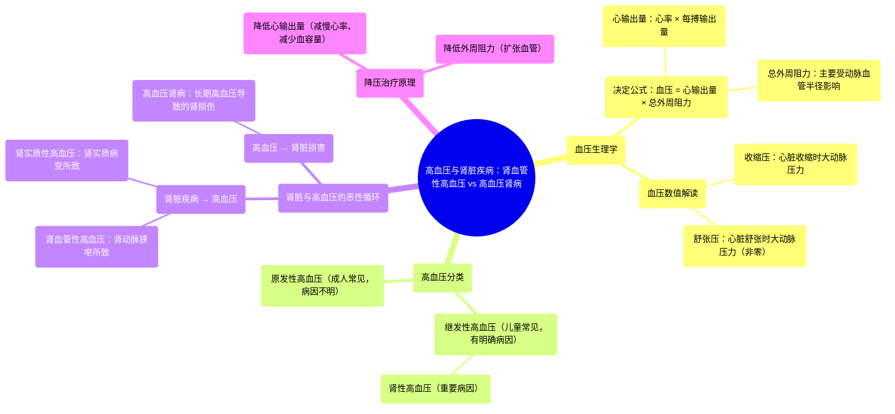

# 61 Hypertension & Kidney Disease Renovascular Hypertension vs Hypertensive Nephropathy

  <video controls preload="metadata" playsinline>
    <source src="https://helly.s3.bitiful.net/心血管学科/%E4%B8%93%E8%BE%91%2018%EF%BC%9A%E5%BF%83%E5%86%85%E7%A7%91%E7%BB%88%E6%9E%81%E7%99%BE%E7%A7%91%E8%BE%9E%E5%85%B8%20%28The%20Cardiology%20Encyclopedia%29/61%20Hypertension%20%26%20Kidney%20Disease%20Renovascular%20Hypertension%20vs%20Hypertensive%20Nephropathy.mp4" type="video/mp4">
    
您的浏览器不支持播放，请升级。

  </video>

::: tip ⚡️ 核心考点 (30s速读)
*   **核心考点**：高血压与肾脏疾病互为因果，形成恶性循环。需重点区分**肾血管性高血压**（肾脏动脉狭窄导致的高血压）与**高血压肾病**（长期高血压损害肾脏）。
*   **临床意义**：成人高血压多为原发性（病因不明），而儿童高血压多为继发性（有明确病因，如肾脏疾病）。理解血压公式（血压 = 心输出量 × 总外周阻力）是理解降压治疗机制的基础。
:::

## 🧠 深度精讲

*   **血压的生理基础**：体循环动脉血压（我们常说的血压）由**心输出量**和**总外周阻力**共同决定。心输出量取决于心率与每搏输出量（心脏“多快”与“多强”）。总外周阻力主要受动脉血管半径影响：血管收缩（半径变小）则阻力增大，血压升高；血管舒张（半径变大）则阻力减小，血压下降。
*   **血压数值的解读**：我们测量的**收缩压**（如120mmHg）对应心脏收缩时大动脉内的压力。**舒张压**（如80mmHg）对应心脏舒张时大动脉内的压力，它并非为零，是因为大动脉的弹性回缩维持了血管内的基础压力。左心室内的舒张压则接近零。
*   **高血压与肾脏的相互作用**：
    *   **肾脏疾病导致高血压（肾性高血压）**：这是**继发性高血压**的常见原因。例如，肾动脉狭窄（**肾血管性高血压**）或肾实质本身病变（**肾实质性高血压**）会激活肾素-血管紧张素-醛固酮系统（RAAS），导致血管收缩和水钠潴留，从而升高血压。
    *   **高血压损害肾脏（高血压肾病）**：长期不受控制的**原发性高血压**会损伤肾脏的小动脉和肾小球，导致肾功能逐渐下降，这被称为**高血压肾病**。
*   **降压治疗思路**：基于血压公式，降压可通过：1) **降低心输出量**（如使用β受体阻滞剂减慢心率，或使用利尿剂减少血容量以降低每搏输出量）；2) **降低外周阻力**（如使用血管扩张剂）。

## 📚 双语术语表 (Terminology)
| 英文术语 | 中文翻译 | 定义/解释 |
| :--- | :--- | :--- |
| Hypertension | 高血压 | 体循环动脉血压持续升高的病理状态。 |
| Hypertensive Nephropathy | 高血压肾病 | 长期原发性高血压导致的肾脏损害。 |
| Renovascular Hypertension | 肾血管性高血压 | 由于肾动脉主干或其主要分支狭窄导致的高血压。 |
| Renal Parenchymal Hypertension | 肾实质性高血压 | 由肾实质疾病（如肾小球肾炎、多囊肾）引起的高血压。 |
| Primary Hypertension | 原发性高血压 | 病因未明的高血压，占成人高血压的大多数。 |
| Secondary Hypertension | 继发性高血压 | 由某些明确疾病（如肾脏病、内分泌疾病）引起的高血压。 |
| Cardiac Output (CO) | 心输出量 | 每分钟一侧心室射出的血液总量，等于心率×每搏输出量。 |
| Total Peripheral Resistance (TPR) | 总外周阻力 | 体循环中所有小动脉对血流产生的阻力总和。 |
| Systolic Blood Pressure | 收缩压 | 心脏收缩时，血液对动脉壁产生的最高压力。 |
| Diastolic Blood Pressure | 舒张压 | 心脏舒张时，血液对动脉壁产生的最低压力。 |
| Afterload | 后负荷 | 心室开始收缩射血时所面临的阻力，可近似理解为动脉血压。 |

## 🗺️ 知识图谱

