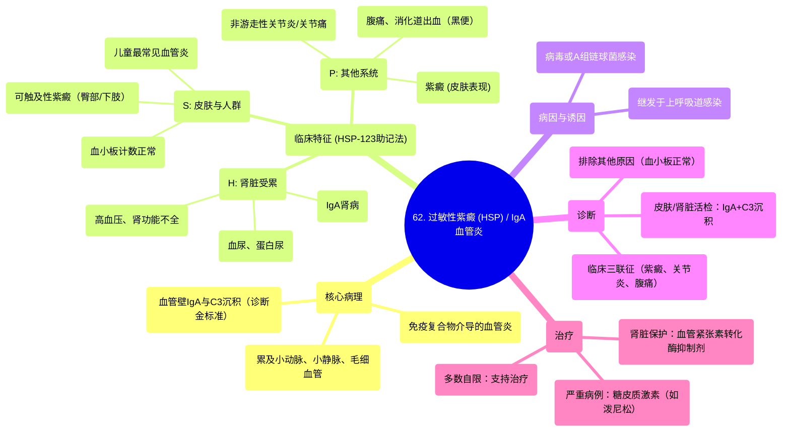

# 62 Henoch-Schönlein Purpura (HSP) - with a Mnemonic - IgA Vasculitis (IgA Disease) -Vascular Pathology

  <video controls preload="metadata" playsinline>
    <source src="https://helly.s3.bitiful.net/心血管学科/%E4%B8%93%E8%BE%91%2018%EF%BC%9A%E5%BF%83%E5%86%85%E7%A7%91%E7%BB%88%E6%9E%81%E7%99%BE%E7%A7%91%E8%BE%9E%E5%85%B8%20%28The%20Cardiology%20Encyclopedia%29/62%20Henoch-Sch%C3%B6nlein%20Purpura%20%28HSP%29%20-%20with%20a%20Mnemonic%20-%20IgA%20Vasculitis%20%28IgA%20Disease%29%20-Vascular%20Pathology.mp4" type="video/mp4">
    
您的浏览器不支持播放，请升级。

  </video>

::: tip ⚡️ 核心考点 (30s速读)
*   **核心考点**：过敏性紫癜（HSP）是一种主要影响儿童的、由IgA免疫复合物沉积引起的系统性小血管炎。诊断金标准是皮肤或肾脏活检发现血管壁IgA和C3沉积。
*   **临床意义**：典型表现为“HSP”三联征：可触及性紫癜（皮肤）、关节炎/关节痛（关节）、腹痛/消化道出血（胃肠道）。常继发于上呼吸道感染，多数自限，严重时需使用糖皮质激素。
:::

## 🧠 深度精讲

*   **概念1：疾病本质与病理**
    过敏性紫癜（Henoch-Schönlein Purpura, HSP）本质上是一种**免疫复合物介导的血管炎**。其核心病理机制是**IgA抗体（通常为IgA1亚型）与抗原形成免疫复合物**，沉积于小血管壁（小动脉、小静脉、毛细血管），激活补体（特别是C3），引发炎症反应，导致血管损伤和通透性增加。因此，它也被称为**IgA血管炎**。皮肤活检发现血管壁IgA和C3沉积是诊断的金标准。

*   **概念2：临床表现与助记法 (HSP-123)**
    视频中提供了一个绝佳的助记法 **“HSP-123”** 来记忆核心特征：
    *   **H**：代表 **血尿 (Hematuria)** 和 **高血压 (Hypertension)**。这是由于IgA免疫复合物沉积于肾脏血管，导致**IgA肾病**，引起血尿、蛋白尿，严重时可致肾功能不全（血尿素氮、肌酐升高）。
    *   **S**：代表 **儿童 (Small child)** 和 **皮疹 (Skin rash)**。HSP是**儿童最常见的血管炎**。皮疹为**可触及性紫癜**，好发于臀部及下肢，呈对称分布，按压不褪色。关键点是：**血小板计数正常**，紫癜源于血管炎，而非血小板减少。
    *   **P**：代表 **紫癜 (Purpura)** 和 **关节痛/关节炎 (Polyarthralgia/Arthritis)**。关节炎通常为非游走性、一过性，主要影响大关节（如膝、踝）。
    *   **123**：代表受累的血管类型：**小动脉 (Arterioles)、小静脉 (Venules)、毛细血管 (Capillaries)**。

*   **概念3：其他关键特征与治疗**
    *   **诱因**：常发生于**上呼吸道感染**（病毒性或A组链球菌感染）之后。
    *   **胃肠道表现**：常见腹痛、恶心、呕吐，严重者可出现消化道出血（黑便或粪便隐血试验阳性）。黑便提示上消化道出血，血液经胃酸作用形成正铁血红素而颜色变深。
    *   **治疗**：
        1.  **支持治疗**：大多数病例为自限性，只需休息、补液等支持治疗。
        2.  **糖皮质激素**：用于严重病例，如剧烈腹痛、严重关节炎、肾脏受累（尤其是肾病综合征或快速进展性肾炎）。常用**泼尼松**，其作用是抑制异常的免疫反应和IgA抗体产生。
        3.  **血管紧张素转化酶抑制剂**：对于有蛋白尿的肾脏受累患者，可使用ACEI（如卡托普利）来保护肾功能、降低蛋白尿。此原则也适用于糖尿病肾病和硬皮病肾危象。

## 📚 双语术语表 (Terminology)
| 英文术语 | 中文翻译 | 定义/解释 |
| :--- | :--- | :--- |
| Henoch-Schönlein Purpura (HSP) | 过敏性紫癜 | 一种由IgA免疫复合物沉积引起的系统性小血管炎，常见于儿童。 |
| IgA Vasculitis | IgA血管炎 | 过敏性紫癜的另一个名称，强调其病理本质。 |
| Palpable Purpura | 可触及性紫癜 | 皮肤上高出皮面、可触及的紫色皮疹，由血管炎导致血液外渗引起。 |
| IgA Nephropathy (Berger‘s Disease) | IgA肾病（贝格尔病） | 以肾小球系膜区IgA沉积为特征的肾小球肾炎，是HSP肾脏受累的表现。 |
| Vasculitis | 血管炎 | 血管壁的炎症性疾病。 |
| C3 Nephritic Factor | C3肾炎因子 | 在某些肾小球肾炎（包括部分HSP/IgA肾病）中，激活补体旁路途径，导致C3沉积的自身抗体。 |
| Self-limiting | 自限性 | 疾病在发展到一定程度后能自动停止，并逐渐恢复痊愈。 |
| Steroids (e.g., Prednisone) | 糖皮质激素（如：泼尼松） | 一类具有强大抗炎和免疫抑制作用的药物，用于治疗严重的HSP。 |
| ACE Inhibitors | 血管紧张素转化酶抑制剂 | 一类降压药，可通过降低肾小球内压来减少蛋白尿、延缓肾功能恶化，用于HSP等疾病引起的肾损伤。 |
| Melena | 黑便 | 上消化道出血时，血液经肠道消化后形成的黑色、柏油样粪便。 |
| Non-migratory Arthritis | 非游走性关节炎 | 关节炎固定于少数几个关节，不从一个关节游走到另一个关节。 |

## 🗺️ 知识图谱

