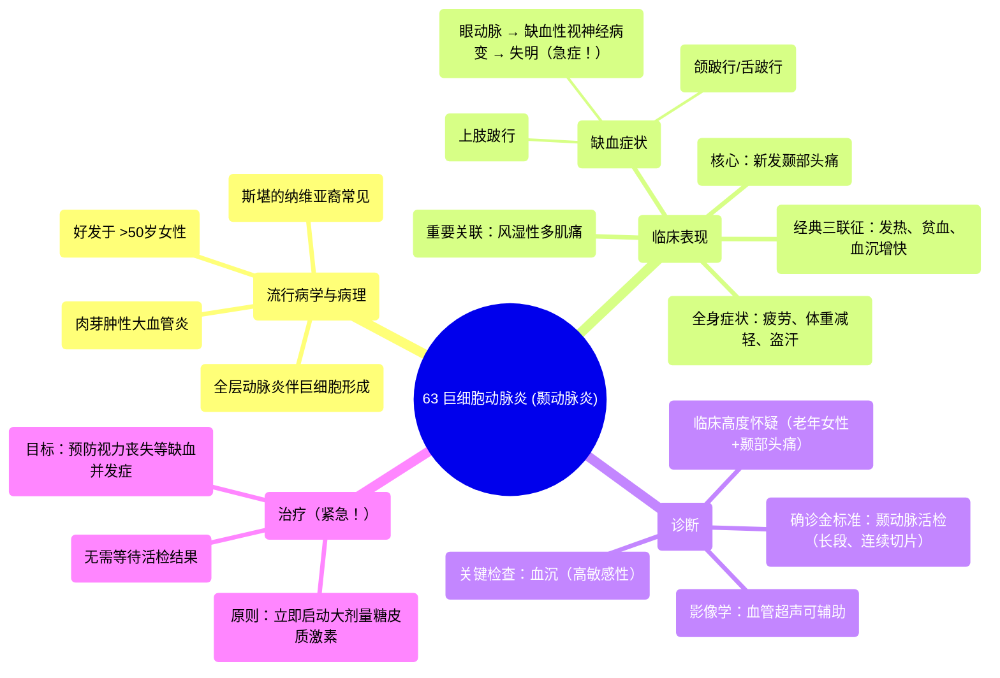

# 63 Giant cell arteritis (Temporal arteritis)

  <video controls preload="metadata" playsinline>
    <source src="https://helly.s3.bitiful.net/心血管学科/%E4%B8%93%E8%BE%91%2018%EF%BC%9A%E5%BF%83%E5%86%85%E7%A7%91%E7%BB%88%E6%9E%81%E7%99%BE%E7%A7%91%E8%BE%9E%E5%85%B8%20%28The%20Cardiology%20Encyclopedia%29/63%20Giant%20cell%20arteritis%20%28Temporal%20arteritis%29.mp4" type="video/mp4">
    
您的浏览器不支持播放，请升级。

  </video>

::: tip ⚡️ 核心考点 (30s速读)
*   **核心考点**：巨细胞动脉炎（颞动脉炎）是一种好发于50岁以上女性的肉芽肿性大血管炎，典型表现为颞部头痛、血沉显著增快，并与风湿性多肌痛高度相关。
*   **临床意义**：本病是**眼科急症**，眼动脉受累可致永久性失明。一旦临床高度怀疑，**必须立即启动糖皮质激素治疗**，无需等待活检结果。
:::

## 🧠 深度精讲

*   **概念1：疾病本质与流行病学**
    巨细胞动脉炎是一种主要累及**中等及大动脉**的**肉芽肿性、全层动脉炎**。其病理特征是动脉壁内出现由单核细胞融合形成的**巨细胞**。本病几乎只发生于**50岁以上**人群，**女性多于男性**，在**斯堪的纳维亚裔**人群中较为常见，在非裔美国人中罕见。

*   **概念2：临床表现与“红旗”警报**
    1.  **经典三联征**：**发热、贫血（正细胞正色素性）、血沉显著增快**，见于老年女性。
    2.  **核心症状**：**新发的、持续的颞部（太阳穴）头痛**，常伴有头皮触痛、颞动脉增厚/结节/搏动减弱或消失。
    3.  **缺血性表现**：
        *   **眼动脉受累**：导致**前部缺血性视神经病变**，是本病最严重的并发症，可致**突发性、不可逆性失明**。
        *   **颌跛行**：咀嚼时下颌疼痛或疲劳。
        *   **舌跛行**：说话时舌痛。
        *   **上肢跛行**：由锁骨下动脉狭窄引起。
    4.  **全身症状**：疲劳、不适、体重减轻、盗汗、关节痛。
    5.  **重要关联**：约50%患者合并**风湿性多肌痛**，表现为颈、肩、背、臀部近端肌肉的晨僵和疼痛。

*   **概念3：诊断与紧急处理流程**
    1.  **初步诊断**：对于**老年女性出现新发颞部头痛**，应首先考虑巨细胞动脉炎，直至被证明是其他疾病。
    2.  **关键实验室检查**：**红细胞沉降率**是**高度敏感**的筛查工具，具有很高的阴性预测价值。血沉正常可基本排除活动性疾病。此外，碱性磷酸酶可能升高。
    3.  **确诊金标准**：**颞动脉活检**。因病变呈“跳跃性”分布，需取材**3-5厘米长**的动脉段并进行连续切片以提高检出率。
    4.  **治疗原则（紧急！）**：**一旦临床怀疑且血沉升高，必须立即开始大剂量糖皮质激素治疗（如泼尼松）**，以预防失明。治疗不应为等待活检结果而延迟。治疗反应（症状和血沉的快速改善）本身也具有诊断支持意义。

## 📚 双语术语表 (Terminology)
| 英文术语 | 中文翻译 | 定义/解释 |
| :--- | :--- | :--- |
| Giant cell arteritis (GCA) | 巨细胞动脉炎 | 一种累及大中动脉的肉芽肿性血管炎，特征为动脉壁内存在巨细胞。 |
| Temporal arteritis | 颞动脉炎 | 巨细胞动脉炎的旧称，因常累及颞浅动脉而得名。 |
| Polymyalgia rheumatica (PMR) | 风湿性多肌痛 | 一种临床综合征，特征为颈、肩、髋带肌的疼痛和晨僵，与巨细胞动脉炎密切相关。 |
| Erythrocyte Sedimentation Rate (ESR) | 红细胞沉降率 | 炎症的非特异性指标，在巨细胞动脉炎诊断和监测中至关重要。 |
| Ischemic optic neuropathy | 缺血性视神经病变 | 因眼动脉炎症导致视神经供血不足而引起的视力丧失，是GCA的急症。 |
| Jaw claudication | 颌跛行 | 咀嚼时出现的下颌疼痛或疲劳感，是GCA的特征性症状。 |
| Panarteritis | 全动脉炎 | 指炎症累及动脉壁的全层（内膜、中膜、外膜）。 |
| STAT | 立即 | 医学术语，表示需要立即执行或给予。 |

## 🗺️ 知识图谱

