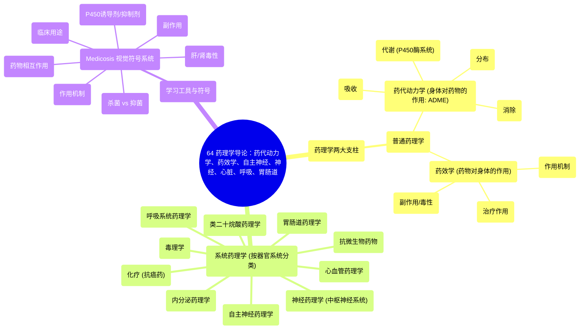

# 64 Pharmacology Intro - Pharmacokinetics, Pharmacodynamics, Autonomic, Neuro, Cardiac, Respiratory, GI

  <video controls preload="metadata" playsinline>
    <source src="https://helly.s3.bitiful.net/心血管学科/%E4%B8%93%E8%BE%91%2018%EF%BC%9A%E5%BF%83%E5%86%85%E7%A7%91%E7%BB%88%E6%9E%81%E7%99%BE%E7%A7%91%E8%BE%9E%E5%85%B8%20%28The%20Cardiology%20Encyclopedia%29/64%20Pharmacology%20Intro%20-%20Pharmacokinetics%2C%20Pharmacodynamics%2C%20Autonomic%2C%20Neuro%2C%20Cardiac%2C%20Respiratory%2C%20GI.mp4" type="video/mp4">
    
您的浏览器不支持播放，请升级。

  </video>

::: tip ⚡️ 核心考点 (30s速读)
*   **核心考点**：药理学分为**普通药理学**（药代动力学与药效学）和**系统药理学**（针对各器官系统）。药代动力学（ADME）研究**身体对药物的作用**；药效学研究**药物对身体的作用**。
*   **临床意义**：理解药代动力学（如吸收、代谢）是预测药物起效时间、作用强度和持续时间的基础。掌握药效学是理解药物如何产生治疗作用和副作用的关键，是安全、有效用药的核心。
:::

## 🧠 深度精讲

*   **药理学导论**：本视频是药理学系列的开篇，旨在建立整体框架。药理学不仅是记忆药物列表，更是理解药物如何在体内“旅行”（药代动力学）以及如何与身体“对话”（药效学）的科学。掌握这些基础原理，是深入学习各系统药理学的关键。
*   **普通药理学**：这是药理学的基础支柱，包含两个核心部分：
    *   **药代动力学 (Pharmacokinetics, PK)**：可以理解为 **“药物在体内的命运”** 。它描述药物从进入体内到被清除的全过程，遵循 **“ADME”** 模型：
        *   **吸收 (Absorption)**：药物如何进入体循环（如口服、静脉注射）。
        *   **分布 (Distribution)**：药物如何随血液到达身体各部位（如脑、脂肪组织）。
        *   **代谢 (Metabolism)**：药物主要在肝脏被如何转化（常通过P450酶系统），代谢产物可能活性更强、更弱或无活性。
        *   **消除 (Elimination)**：药物及其代谢产物如何被排出体外（主要通过肾脏或胆汁）。
    *   **药效学 (Pharmacodynamics, PD)**：可以理解为 **“药物产生的效应”** 。它研究药物与身体靶点（如受体、酶）结合后引发的生物化学和生理学变化，从而解释药物的**治疗作用**和**副作用/毒性**。
*   **系统药理学**：在普通药理学基础上，将药物知识按人体系统进行组织学习，更具临床针对性。本视频预告了后续将深入学习的各大系统：
    *   **自主神经药理学**：研究影响交感与副交感神经系统的药物（如肾上腺素、阿托品）。
    *   **神经药理学 (CNS)**：研究作用于脑和脊髓的药物（如镇静催眠药、抗抑郁药、抗精神病药）。
    *   **心血管药理学**：研究治疗心脏和血管疾病的药物（如降压药、抗心绞痛药、抗心律失常药）。
    *   **呼吸系统药理学**：研究治疗哮喘等呼吸系统疾病的药物（如支气管扩张剂、糖皮质激素）。
    *   **胃肠道药理学**：研究治疗消化系统疾病的药物（如抗酸药、止吐药）。
    *   **内分泌药理学**：研究激素及相关药物（如胰岛素、甲状腺激素）。
    *   **化疗 (抗癌药理学)**：研究抗肿瘤药物。
    *   **毒理学**：研究药物的过量中毒及解毒。
    *   **类二十烷酸药理学**：研究前列腺素、白三烯等局部激素及其相关药物。
    *   **抗微生物药物**：一个总称，包括抗菌药、抗病毒药、抗真菌药和抗寄生虫药。
*   **Medicosis 符号系统**：讲师引入了一套视觉符号来高效表示药物的关键属性，这是高效学习和记忆的实用工具。例如，齿轮代表“作用机制”，悲伤的肝脏代表“肝毒性”，两个药丸相加代表“药物相互作用”等。掌握这些符号有助于快速抓住药物卡片的核心信息。

## 📚 双语术语表 (Terminology)
| 英文术语 | 中文翻译 | 定义/解释 |
| :--- | :--- | :--- |
| Pharmacology | 药理学 | 研究药物与生物体（含人体）相互作用规律的科学。 |
| Pharmacokinetics (PK) | 药代动力学 | 研究机体对药物的作用，即药物在体内的吸收、分布、代谢和排泄（ADME）过程。 |
| Pharmacodynamics (PD) | 药效学 | 研究药物对机体的作用，即药物如何产生药理效应（治疗作用和副作用）。 |
| ADME | ADME模型 | 药代动力学过程的四个关键步骤：吸收、分布、代谢、消除。 |
| Autonomic Pharmacology | 自主神经药理学 | 研究影响自主神经系统（交感和副交感神经）功能的药物。 |
| Neuropharmacology (CNS) | 神经药理学（中枢） | 研究作用于中枢神经系统（脑和脊髓）的药物。 |
| General Pharmacology | 普通药理学 | 药理学的基础部分，涵盖药代动力学和药效学。 |
| Systemic Pharmacology | 系统药理学 | 按人体器官系统分类的药理学知识，如心血管、呼吸系统药理学等。 |
| P450 System | P450酶系统 | 肝脏中一组重要的代谢酶（细胞色素P450），负责代谢许多药物。 |
| Inducer/Inhibitor | 诱导剂/抑制剂 | 能增强（诱导）或减弱（抑制）P450酶活性的药物，从而影响其他合用药物的代谢速度。 |
| Bactericidal | 杀菌剂 | 能直接杀死细菌的药物。 |
| Bacteriostatic | 抑菌剂 | 能抑制细菌生长繁殖，但不直接杀死细菌的药物。 |
| Myelosuppression | 骨髓抑制 | 药物对骨髓造血功能的抑制作用，可能导致白细胞、红细胞、血小板减少。 |
| Hepatotoxic/Nephrotoxic | 肝毒性/肾毒性 | 指药物对肝脏或肾脏具有损害作用。 |
| Ototoxic | 耳毒性 | 指药物可能损害听觉或前庭功能。 |

## 🗺️ 知识图谱

