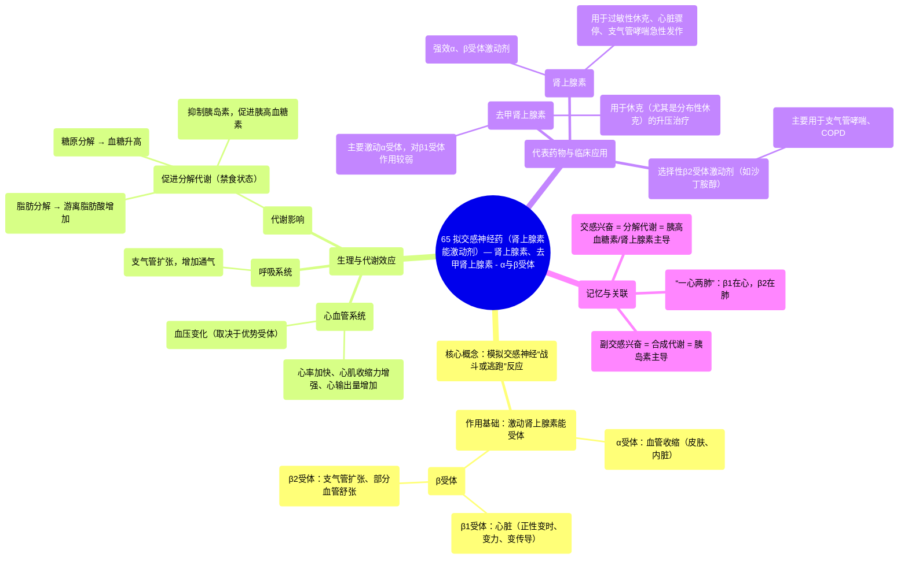

# 65 Sympathomimetics (Adrenergic Agonists)—Epinephrine, Norepinephrine - Alpha & Beta Receptors

  <video controls preload="metadata" playsinline>
    <source src="https://helly.s3.bitiful.net/心血管学科/%E4%B8%93%E8%BE%91%2018%EF%BC%9A%E5%BF%83%E5%86%85%E7%A7%91%E7%BB%88%E6%9E%81%E7%99%BE%E7%A7%91%E8%BE%9E%E5%85%B8%20%28The%20Cardiology%20Encyclopedia%29/65%20Sympathomimetics%20%28Adrenergic%20Agonists%29%E2%80%94Epinephrine%2C%20Norepinephrine%20-%20Alpha%20%26%20Beta%20Receptors.mp4" type="video/mp4">
    
您的浏览器不支持播放，请升级。

  </video>

::: tip ⚡️ 核心考点 (30s速读)
*   **核心考点**：拟交感神经药（肾上腺素能激动剂）模拟交感神经系统“战斗或逃跑”反应，通过激动α和β受体发挥作用。理解不同受体亚型（如β1在心，β2在肺）的分布与功能是掌握其药理作用的关键。
*   **临床意义**：这类药物用于急救（如肾上腺素抢救过敏性休克、心脏骤停）、升压（如去甲肾上腺素）、平喘（如β2激动剂）等。其作用与机体代谢状态（合成代谢 vs. 分解代谢）紧密相关。
:::

## 🧠 深度精讲

*   **概念1：拟交感神经药与肾上腺素能系统**
    拟交感神经药是一类能够模拟交感神经系统作用的药物。由于交感神经的节后纤维主要释放去甲肾上腺素，作用于肾上腺素能受体，因此这类药物也被称为**肾上腺素能受体激动剂**。理解它们，首先要回顾自主神经系统：交感神经负责“战斗或逃跑”，副交感神经负责“休息与消化”。交感神经兴奋时，会激动α和β受体，产生一系列生理效应。

*   **概念2：α与β受体的核心功能区分**
    肾上腺素能受体主要分为α和β两大类，其下还有亚型（如β1、β2）。
    *   **β1受体**：主要分布于心脏。激动时产生**正性变时、变力、变传导**作用（心率加快、心肌收缩力增强、传导加快），是“战斗或逃跑”时提升心输出量的核心。
    *   **β2受体**：主要分布于支气管平滑肌、血管（如骨骼肌血管）等。激动时引起**支气管扩张**（利于呼吸）和部分血管**舒张**。记忆口诀：**“一心两肺”**（β1心，β2肺）。
    *   **α受体**：主要分布于皮肤、黏膜及内脏的血管平滑肌。激动时引起血管**收缩**，导致血压升高，同时减少这些非关键部位的血流，以保证心、脑、骨骼肌的血液供应。

*   **概念3：交感兴奋与机体代谢状态**
    交感神经系统兴奋（或被拟交感药模拟）对应机体的**分解代谢（禁食）状态**，与胰岛素主导的合成代谢（进食）状态相对。此时，身体会：
    1.  促进**糖原分解**和**糖异生**，升高血糖。
    2.  促进**脂肪分解**，释放游离脂肪酸供能。
    3.  **抑制胰岛素分泌**，**促进胰高血糖素分泌**，共同维持高血糖状态，为“逃跑”提供即时能量。

## 📚 双语术语表 (Terminology)
| 英文术语 | 中文翻译 | 定义/解释 |
| :--- | :--- | :--- |
| Sympathomimetics | 拟交感神经药 | 模拟交感神经系统作用的药物。 |
| Adrenergic Agonists | 肾上腺素能激动剂 | 激动肾上腺素能受体（α、β受体）的药物，与拟交感神经药含义相近。 |
| Norepinephrine (Noradrenaline) | 去甲肾上腺素 | 交感神经节后纤维释放的主要神经递质。 |
| Epinephrine (Adrenaline) | 肾上腺素 | 肾上腺髓质分泌的激素，是强大的拟交感神经药。 |
| Alpha (α) Receptors | α受体 | 肾上腺素能受体的一种，激动主要引起血管收缩等效应。 |
| Beta (β) Receptors | β受体 | 肾上腺素能受体的一种，分为β1、β2等亚型，激动产生心脏兴奋、支气管扩张等效应。 |
| Fight or Flight Response | 战斗或逃跑反应 | 交感神经系统激活后机体产生的应激反应。 |
| Rest and Digest | 休息与消化 | 副交感神经系统激活时的生理状态。 |
| Thoracolumbar Outflow | 胸腰段传出 | 交感神经系统的起源部位（脊髓胸段和腰段）。 |
| Craniosacral Outflow | 颅骶段传出 | 副交感神经系统的起源部位（脑干和脊髓骶段）。 |
| Anabolic State | 合成代谢状态 | 以胰岛素为主导的“进食状态”，用于构建和储存能量。 |
| Catabolic State | 分解代谢状态 | 以胰高血糖素、肾上腺素为主导的“禁食/应激状态”，用于分解储备、释放能量。 |

## 🗺️ 知识图谱

