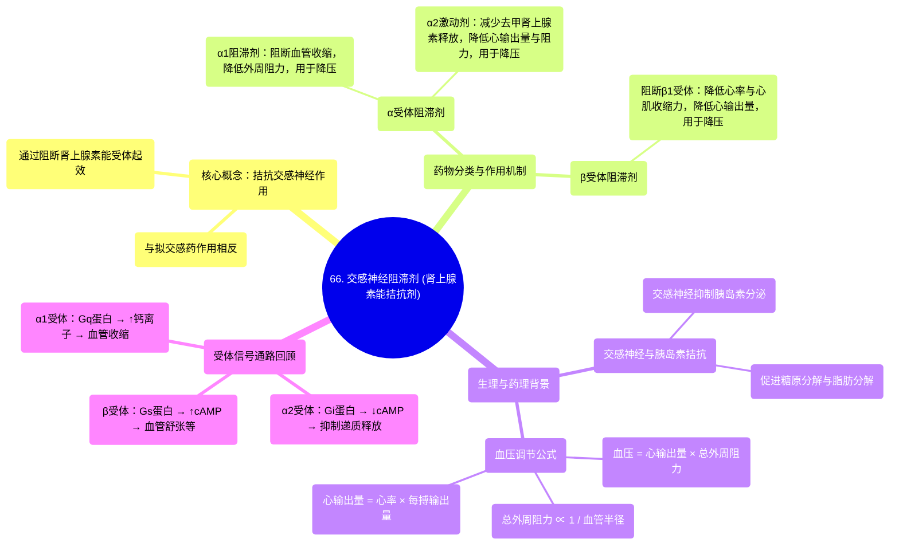

# 66 Sympatholytics (Adrenergic Antagonists) — Alpha blockers, Beta blockers, Calcium channel blockers

  <video controls preload="metadata" playsinline>
    <source src="https://helly.s3.bitiful.net/心血管学科/%E4%B8%93%E8%BE%91%2018%EF%BC%9A%E5%BF%83%E5%86%85%E7%A7%91%E7%BB%88%E6%9E%81%E7%99%BE%E7%A7%91%E8%BE%9E%E5%85%B8%20%28The%20Cardiology%20Encyclopedia%29/66%20Sympatholytics%20%28Adrenergic%20Antagonists%29%20%E2%80%94%20Alpha%20blockers%2C%20Beta%20blockers%2C%20Calcium%20channel%20blockers.mp4" type="video/mp4">
    
您的浏览器不支持播放，请升级。

  </video>

::: tip ⚡️ 核心考点 (30s速读)
*   **核心考点**：交感神经阻滞剂（肾上腺素能拮抗剂）通过阻断α或β受体，降低交感神经兴奋性，从而降低血压。其作用机制与交感神经激动剂完全相反。
*   **临床意义**：α1受体阻滞剂、β受体阻滞剂和α2受体激动剂均可用于治疗高血压，但作用靶点和机制不同。
:::

## 🧠 深度精讲

*   **交感神经阻滞剂概述**：本视频讨论的是交感神经阻滞剂，即拮抗交感神经系统作用的药物。它们是上一讲“拟交感神经药（肾上腺素能激动剂）”的完全对立面。这类药物通过阻断肾上腺素能受体（α受体和β受体）发挥作用，因此也称为肾上腺素能拮抗剂或肾上腺素能阻滞剂。
*   **交感神经与胰岛素的对立关系**：理解交感神经阻滞剂的一个关键背景是交感神经系统与胰岛素的对立关系。交感神经兴奋（释放去甲肾上腺素/肾上腺素）会抑制胰岛素分泌，并促进糖原分解（糖原分解）和脂肪分解，这些都是“抗胰岛素”的效应。因此，使用交感神经阻滞剂会解除这种抑制，可能导致胰岛素分泌增加。
*   **受体机制回顾**：
    *   **α1受体**：与Gq蛋白偶联，激活后导致细胞内钙离子增加，引起血管平滑肌收缩，血压升高。
    *   **β受体（β1, β2, β3）**：与Gs蛋白偶联，激活后增加细胞内环磷酸腺苷（cAMP），引起血管舒张、心率加快等效应。
    *   **α2受体**：主要位于突触前膜，与Gi蛋白偶联，激活后会抑制去甲肾上腺素的进一步释放，起到“负反馈”调节作用，因此α2受体激动剂具有抗交感神经效果。
*   **降压药物的作用靶点**：血压（BP）= 心输出量（CO）x 总外周阻力（TPR）。心输出量取决于心率和每搏输出量，总外周阻力与血管半径成反比。
    1.  **α2受体激动剂**：激活突触前α2受体，减少去甲肾上腺素释放，从而降低心率和血管收缩力（降低CO和TPR），达到降压目的。
    2.  **α1受体阻滞剂**：阻断血管平滑肌上的α1受体，阻止血管收缩，使血管舒张（半径增大，TPR下降），从而降低血压。
    3.  **β受体阻滞剂**：阻断心脏的β1受体，降低心率和心肌收缩力（降低CO），从而降低血压。

## 📚 双语术语表 (Terminology)
| 英文术语 | 中文翻译 | 定义/解释 |
| :--- | :--- | :--- |
| Sympatholytics | 交感神经阻滞剂 | 拮抗交感神经系统作用的药物。 |
| Adrenergic Antagonists | 肾上腺素能拮抗剂 | 通过阻断肾上腺素能受体（α、β受体）起作用的药物。 |
| Alpha blockers | α受体阻滞剂 | 特异性阻断α肾上腺素能受体的药物。 |
| Beta blockers | β受体阻滞剂 | 特异性阻断β肾上腺素能受体的药物。 |
| Norepinephrine / Noradrenaline | 去甲肾上腺素 | 交感神经节后纤维释放的主要神经递质。 |
| Glycogenolysis | 糖原分解 | 将糖原分解为葡萄糖的过程，受交感神经促进。 |
| Lipolysis | 脂肪分解 | 将甘油三酯分解为游离脂肪酸的过程，受交感神经促进。 |
| Gq protein | Gq蛋白 | 一种G蛋白，激活后升高细胞内钙离子浓度。 |
| Gs protein | Gs蛋白 | 一种G蛋白，激活后增加细胞内环磷酸腺苷（cAMP）水平。 |
| Gi protein | Gi蛋白 | 一种G蛋白，激活后抑制腺苷酸环化酶，降低cAMP水平。 |
| Cyclic AMP (cAMP) | 环磷酸腺苷 | 细胞内重要的第二信使，β受体激活后其水平升高。 |
| Cardiac Output (CO) | 心输出量 | 每分钟心脏泵出的血液总量，等于心率乘以每搏输出量。 |
| Total Peripheral Resistance (TPR) | 总外周阻力 | 体循环血管对血流的阻力，主要受小动脉半径影响。 |

## 🗺️ 知识图谱

