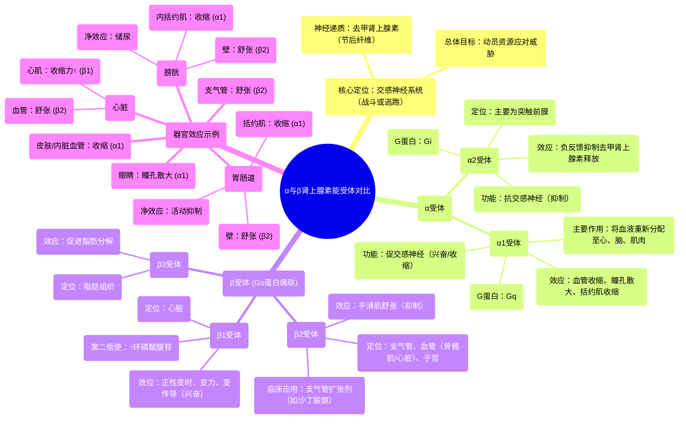

# 67 Alpha vs. Beta Adrenergic Receptors - Autonomic Nervous System - Physiology and Pharmacology

  <video controls preload="metadata" playsinline>
    <source src="https://helly.s3.bitiful.net/心血管学科/%E4%B8%93%E8%BE%91%2018%EF%BC%9A%E5%BF%83%E5%86%85%E7%A7%91%E7%BB%88%E6%9E%81%E7%99%BE%E7%A7%91%E8%BE%9E%E5%85%B8%20%28The%20Cardiology%20Encyclopedia%29/67%20Alpha%20vs.%20Beta%20Adrenergic%20Receptors%20-%20Autonomic%20Nervous%20System%20-%20Physiology%20and%20Pharmacology.mp4" type="video/mp4">
    
您的浏览器不支持播放，请升级。

  </video>

::: tip ⚡️ 核心考点 (30s速读)
*   **核心考点**：肾上腺素能受体（α与β）是交感神经系统（“战斗或逃跑”反应）的关键效应器。α1受体主要介导兴奋性/收缩效应（如血管收缩），而β受体（β1, β2, β3）主要介导抑制性/舒张效应（如支气管扩张），但β1受体对心脏是兴奋性的。
*   **临床意义**：理解α与β受体的功能差异是临床应用肾上腺素能药物（如升压药、支气管扩张剂、降压药）的药理学基础。例如，β2受体激动剂用于治疗哮喘，α1受体阻滞剂用于治疗高血压。
:::

## 🧠 深度精讲

*   **概念1：肾上腺素能受体的分类与功能**
    肾上腺素能受体是交感神经节后纤维释放的去甲肾上腺素（以及肾上腺髓质释放的肾上腺素）作用的靶点。它们主要分为两大类：α受体和β受体，各自有不同的亚型和功能。
    *   **α受体**：
        *   **α1受体**：位于突触后膜，是“促交感神经”的。它通过Gq蛋白偶联，增加细胞内钙离子浓度，从而引起平滑肌**收缩**（如血管收缩、瞳孔开大肌收缩、膀胱括约肌收缩）。这是典型的交感兴奋效应。
        *   **α2受体**：主要位于突触前膜（也可在突触后），是“抗交感神经”的。它通过Gi蛋白偶联，抑制腺苷酸环化酶，减少环磷酸腺苷生成，从而**负反馈抑制**去甲肾上腺素的进一步释放，起到“刹车”作用。
    *   **β受体**：
        *   主要与Gs蛋白偶联，激活腺苷酸环化酶，增加细胞内环磷酸腺苷水平。
        *   **β1受体**：主要位于心脏。环磷酸腺苷增加会**增强心脏特性**（正性变时、变力、变传导作用），是兴奋性效应。
        *   **β2受体**：主要位于支气管、血管（骨骼肌、心脏）和子宫等处的平滑肌。环磷酸腺苷增加导致平滑肌**舒张**（支气管扩张、血管舒张），是抑制性效应。也参与代谢过程（如糖原分解、脂肪分解）。
        *   **β3受体**：主要存在于脂肪组织，促进脂肪分解。

*   **概念2：交感神经反应的器官特异性效应**
    交感神经激活的总体目标是动员身体资源以应对压力（如“逃离老虎”）。这导致了不同器官的差异化反应：
    *   **心脏与骨骼肌**：血管**舒张**（β2受体介导），以增加血流和氧气供应。
    *   **皮肤、内脏（胃肠道、肾脏）**：血管**收缩**（α1受体介导），将血液重新分配至心、脑和肌肉。
    *   **支气管**：**扩张**（β2受体介导），增加通气。
    *   **胃肠道与膀胱**：**壁舒张**（β2受体介导）而**括约肌收缩**（α1受体介导），整体功能被“关闭”，以节省能量和避免分心。
    *   **眼睛**：瞳孔开大肌收缩（α1受体介导）导致**瞳孔散大**，以增加进光量。
    *   **代谢**：促进糖原分解、脂肪分解（β2、β3受体介导），升高血糖和游离脂肪酸，为细胞提供能量。

*   **概念3：信号转导通路与功能关联**
    受体的功能与其偶联的G蛋白类型直接相关，这解释了为什么不同受体产生收缩或舒张效应：
    *   **Gq蛋白通路 (α1, M1, M3, M5)**：激活磷脂酶C，产生三磷酸肌醇和二酰甘油，导致细胞内钙库释放钙离子。**钙离子是平滑肌收缩的关键信使**，因此这些受体介导收缩。
    *   **Gs蛋白通路 (所有β受体)**：激活腺苷酸环化酶，增加环磷酸腺苷。环磷酸腺苷激活蛋白激酶A，后者磷酸化靶蛋白，通常导致平滑肌**舒张**（但增强心肌收缩力）。
    *   **Gi蛋白通路 (α2, M2, M4)**：抑制腺苷酸环化酶，降低环磷酸腺苷水平，产生抑制性效应（如减少神经递质释放、减慢心率）。

## 📚 双语术语表 (Terminology)
| 英文术语 | 中文翻译 | 定义/解释 |
| :--- | :--- | :--- |
| Adrenergic Receptors | 肾上腺素能受体 | 能与去甲肾上腺素和肾上腺素结合的受体，介导交感神经系统效应。 |
| Sympathetic Nervous System | 交感神经系统 | 自主神经系统的一部分，负责“战斗或逃跑”反应，动员身体应对压力。 |
| Norepinephrine (NE) | 去甲肾上腺素 | 交感神经节后纤维释放的主要神经递质，也由肾上腺髓质分泌。 |
| Epinephrine (Adrenaline) | 肾上腺素 | 主要由肾上腺髓质分泌的激素，作用与去甲肾上腺素类似但更广泛。 |
| Alpha-1 (α1) Receptor | α1受体 | 促交感神经的突触后受体，Gq偶联，介导血管收缩、瞳孔散大等兴奋/收缩效应。 |
| Alpha-2 (α2) Receptor | α2受体 | 抗交感神经的突触前（为主）受体，Gi偶联，负反馈抑制去甲肾上腺素释放。 |
| Beta-1 (β1) Receptor | β1受体 | 主要位于心脏的β受体，Gs偶联，增强心肌收缩力、心率和传导速度。 |
| Beta-2 (β2) Receptor | β2受体 | 主要位于支气管、血管平滑肌的β受体，Gs偶联，介导平滑肌舒张（支气管扩张、血管舒张）。 |
| G-protein Coupled Receptor (GPCR) | G蛋白偶联受体 | 一大类膜受体，通过异源三聚体G蛋白传递信号。肾上腺素能受体均属此类。 |
| Cyclic AMP (cAMP) | 环磷酸腺苷 | 一种重要的第二信使，由腺苷酸环化酶产生，被磷酸二酯酶降解。β受体激活可升高其水平。 |
| Fight-or-Flight Response | 战斗或逃跑反应 | 交感神经系统激活后产生的全身性生理反应，旨在应对急性威胁。 |
| Thoracolumbar Outflow | 胸腰段流出 | 描述交感神经节前神经元胞体位于脊髓胸段和腰段（T1-L2）的特征。 |

## 🗺️ 知识图谱

