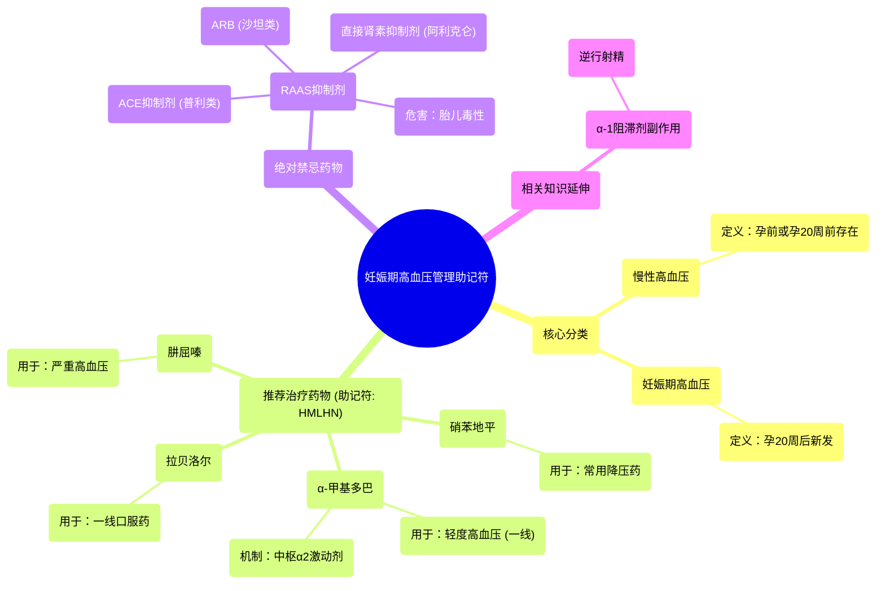

# 68 Hypertension in Pregnancy Mnemonic

  <video controls preload="metadata" playsinline>
    <source src="https://helly.s3.bitiful.net/心血管学科/%E4%B8%93%E8%BE%91%2018%EF%BC%9A%E5%BF%83%E5%86%85%E7%A7%91%E7%BB%88%E6%9E%81%E7%99%BE%E7%A7%91%E8%BE%9E%E5%85%B8%20%28The%20Cardiology%20Encyclopedia%29/68%20Hypertension%20in%20Pregnancy%20Mnemonic.mp4" type="video/mp4">
    
您的浏览器不支持播放，请升级。

  </video>

::: tip ⚡️ 核心考点 (30s速读)
*   **核心考点**：掌握妊娠期高血压的分类（慢性高血压 vs. 妊娠期高血压）及各自的定义、首选降压药物（助记符：**H**ypertensive **M**oms **L**ove **N**ifedipine, **H**ydralazine, **M**ethyldopa, **L**abetalol, **N**ifedipine）和绝对禁忌药物（ACEI/ARB/阿利克仑）。
*   **临床意义**：正确选择妊娠期降压药至关重要，既要有效控制血压，又要确保母胎安全。错误用药（如使用ACEI）可能导致胎儿畸形或死亡。
:::

## 🧠 深度精讲

*   **妊娠期高血压的分类**：这是理解后续治疗的基础。视频中强调，必须区分两种类型：
    *   **慢性高血压**：指在怀孕前就已存在的高血压，或在妊娠20周前首次被诊断并持续到产后12周以后。
    *   **妊娠期高血压**：指妊娠20周后新出现的高血压，不伴有蛋白尿等其他子痫前期特征，通常在产后12周内恢复正常。

*   **妊娠期高血压的药物治疗（助记符详解）**：助记符 **“H**ypertensive **M**oms **L**ove **N**ifedipine, **H**ydralazine, **M**ethyldopa, **L**abetalol, **N**ifedipine” 总结了常用药物。
    *   **肼屈嗪**：主要用于治疗**妊娠期严重高血压**，尤其是高血压急症，通过直接扩张小动脉降低血压。
    *   **α-甲基多巴**：是治疗**妊娠期轻度高血压**（无论是慢性还是妊娠期高血压）的**一线药物**和**金标准**。其作用机制是作为中枢性α2受体激动剂，抑制交感神经输出，从而降低血压。安全性高，长期随访数据充分。
    *   **拉贝洛尔**：兼有α1和β受体阻滞作用，也是妊娠期常用的一线口服降压药，起效较快。
    *   **硝苯地平**：属于二氢吡啶类钙通道阻滞剂，通过松弛血管平滑肌降低血压，在妊娠期使用也相对安全。

*   **妊娠期禁忌的降压药物**：**肾素-血管紧张素-醛固酮系统抑制剂**在妊娠期**绝对禁忌**。
    *   **包括**：血管紧张素转换酶抑制剂（ACEI，如“普利”类）、血管紧张素II受体阻滞剂（ARB，如“沙坦”类）以及直接肾素抑制剂（阿利克仑）。
    *   **原因**：这类药物可导致胎儿肾脏发育异常、羊水过少、胎儿生长受限、颅骨骨化缺陷，甚至胎儿死亡。

*   **α-1受体阻滞剂的副作用**：视频额外讲解了哌唑嗪、特拉唑嗪等多沙唑嗪等α-1受体阻滞剂的一个关键副作用——**逆行射精**。这是因为它们松弛了膀胱颈部的括约肌，导致精液在射精时反流入膀胱，而非经尿道射出。这是其影响下尿路功能的一个典型例子。

## 📚 双语术语表 (Terminology)
| 英文术语 | 中文翻译 | 定义/解释 |
| :--- | :--- | :--- |
| Chronic Hypertension | 慢性高血压 | 妊娠前或妊娠20周前已存在的高血压。 |
| Gestational Hypertension | 妊娠期高血压 | 妊娠20周后新发生的高血压，不伴蛋白尿。 |
| Sympatholytics | 交感神经阻滞剂 | 通过阻断交感神经系统来降低血压的药物。 |
| Alpha-methyldopa | α-甲基多巴 | 中枢性降压药，妊娠期轻度高血压的一线选择。 |
| Hydralazine | 肼屈嗪 | 直接血管扩张剂，用于妊娠期严重高血压或急症。 |
| Labetalol | 拉贝洛尔 | α和β受体阻滞剂，妊娠期常用口服降压药。 |
| Nifedipine | 硝苯地平 | 钙通道阻滞剂，用于妊娠期高血压治疗。 |
| ACE Inhibitors (ACEI) | 血管紧张素转换酶抑制剂 | 妊娠期禁忌，可能导致胎儿畸形。 |
| ARBs | 血管紧张素II受体阻滞剂 | 妊娠期禁忌，作用与ACEI类似。 |
| Retrograde Ejaculation | 逆行射精 | α-1受体阻滞剂的副作用，精液射入膀胱而非尿道。 |

## 🗺️ 知识图谱

