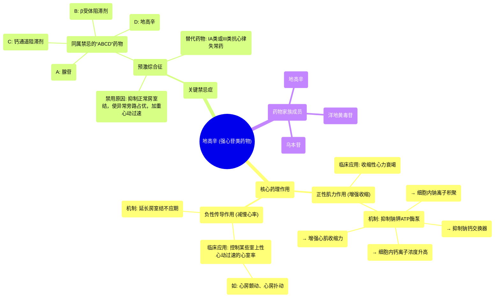

# 69 Digoxin Mnemonic - Cardiac Glycosides (Inotropes) - Cardiac Pharmacology - Cardiology

  <video controls preload="metadata" playsinline>
    <source src="https://helly.s3.bitiful.net/心血管学科/%E4%B8%93%E8%BE%91%2018%EF%BC%9A%E5%BF%83%E5%86%85%E7%A7%91%E7%BB%88%E6%9E%81%E7%99%BE%E7%A7%91%E8%BE%9E%E5%85%B8%20%28The%20Cardiology%20Encyclopedia%29/69%20Digoxin%20Mnemonic%20-%20Cardiac%20Glycosides%20%28Inotropes%29%20-%20Cardiac%20Pharmacology%20-%20Cardiology.mp4" type="video/mp4">
    
您的浏览器不支持播放，请升级。

  </video>

::: tip ⚡️ 核心考点 (30s速读)
*   **核心考点**：地高辛通过抑制心肌细胞膜上的钠钾ATP酶泵，增加细胞内钙离子浓度，从而增强心肌收缩力（正性肌力作用）；同时，它通过延长房室结不应期来减慢心率（负性传导作用）。
*   **临床意义**：用于治疗**收缩性心力衰竭**和**某些室上性心动过速**（如房颤、房扑），但在**预激综合征**中**绝对禁用**。
:::

## 🧠 深度精讲

*   **药物类别与成员**：地高辛属于**强心苷**类药物，也称为**洋地黄**类药物。该类药物主要有三个成员：地高辛、洋地黄毒苷和乌本苷。
*   **两大核心作用**：
    1.  **增强心肌收缩力（正性肌力作用）**：这是其治疗**收缩性心力衰竭**的基础。它不适用于舒张性心力衰竭。
    2.  **延缓房室结传导（负性传导作用）**：通过延长房室结的不应期来减慢心室率，用于控制**心房颤动、心房扑动、阵发性室上性心动过速**等快速性心律失常。
*   **关键禁忌症：预激综合征**：在预激综合征中，存在异常的房室旁路。使用地高辛（以及腺苷、β受体阻滞剂、钙通道阻滞剂）会**选择性抑制正常的房室结传导**，反而使冲动更易通过更快的异常旁路下传，**加重心动过速**，甚至诱发致命性心律失常。此时应选用**IA类或III类抗心律失常药**。
*   **作用机制详解**：
    *   地高辛抑制心肌细胞膜上的**钠钾ATP酶泵**（原发性主动转运）。
    *   这导致细胞内钠离子积聚。
    *   高浓度的细胞内钠离子抑制了**钠钙交换器**（继发性主动转运）的功能，使钙离子无法被有效泵出细胞。
    *   细胞内钙离子浓度升高，触发肌浆网释放更多钙离子（钙诱导的钙释放）。
    *   最终，胞浆内钙离子浓度大幅增加，增强心肌收缩力。
*   **对心室肌动作电位的影响**：地高辛会**降低0期去极化的斜率**（减少钠离子内流），从而减慢心室肌的传导速度。过度抑制传导可能增加折返性心律失常的风险。

## 📚 双语术语表 (Terminology)
| 英文术语 | 中文翻译 | 定义/解释 |
| :--- | :--- | :--- |
| Digoxin | 地高辛 | 最常用的强心苷类药物，用于增强心衰患者的心肌收缩力和控制某些快速性心律失常的心室率。 |
| Cardiac Glycosides / Digitalis | 强心苷 / 洋地黄 | 一类来源于植物的药物，通过抑制钠钾ATP酶发挥正性肌力作用。 |
| Inotrope | 正性肌力药 | 能增强心肌收缩力的药物。 |
| Congestive Heart Failure (CHF) | 充血性心力衰竭 | 心脏泵血功能下降，无法满足身体代谢需求的综合征。 |
| Systolic Failure | 收缩性心力衰竭 | 心力衰竭的一种类型，主要表现为心脏收缩无力，射血分数降低。地高辛适用于此型。 |
| Atrioventricular (AV) Node | 房室结 | 心脏传导系统的关键部分，地高辛可延长其不应期，减慢冲动传导。 |
| Supraventricular Tachycardia (SVT) | 室上性心动过速 | 起源于心房或房室结的快速性心律失常。 |
| Wolff-Parkinson-White (WPW) Syndrome | 预激综合征 | 一种因存在异常房室旁路而导致的心律失常，地高辛在此症中禁用。 |
| Sodium-Potassium ATPase Pump | 钠钾ATP酶泵 | 细胞膜上的原发性主动转运蛋白，地高辛的作用靶点。 |
| Sodium-Calcium Exchanger (NCX) | 钠钙交换器 | 心肌细胞膜上的继发性主动转运蛋白，其功能依赖于钠钾泵建立的钠离子梯度。 |
| Calcium-Induced Calcium Release (CICR) | 钙诱导的钙释放 | 心肌兴奋-收缩耦联的关键步骤，少量胞外钙内流触发肌浆网释放大量钙离子。 |

## 🗺️ 知识图谱

