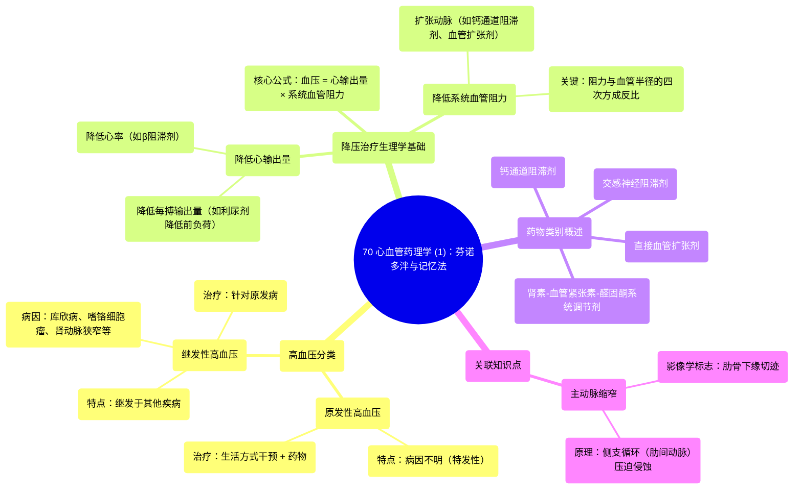

# 70 Cardiac Pharmaoclogy (1) Fenoldopam with a Mnemonic

  <video controls preload="metadata" playsinline>
    <source src="https://helly.s3.bitiful.net/心血管学科/%E4%B8%93%E8%BE%91%2018%EF%BC%9A%E5%BF%83%E5%86%85%E7%A7%91%E7%BB%88%E6%9E%81%E7%99%BE%E7%A7%91%E8%BE%9E%E5%85%B8%20%28The%20Cardiology%20Encyclopedia%29/70%20Cardiac%20Pharmaoclogy%20%281%29%20Fenoldopam%20with%20a%20Mnemonic.mp4" type="video/mp4">
    
您的浏览器不支持播放，请升级。

  </video>

::: tip ⚡️ 核心考点 (30s速读)
*   **核心考点**：理解高血压的分类（原发性与继发性）及其管理原则，掌握降压药物的核心作用机制——通过降低心输出量或系统血管阻力来降低血压。
*   **临床意义**：原发性高血压需综合生活方式干预和药物治疗；继发性高血压关键在于诊断并治疗原发病。所有降压药的作用靶点均可追溯至血压公式：血压 = 心输出量 × 系统血管阻力。
:::

## 🧠 深度精讲

*   **高血压的分类与管理逻辑**：
    *   **原发性高血压**：占大多数，病因不明（特发性）。治疗策略是直接“修理”升高的血压本身，而非针对病因。首先进行生活方式干预（如DASH饮食、减重、运动），无效时启动药物治疗。
    *   **继发性高血压**：较少见，由明确疾病（如库欣病、原发性醛固酮增多症、嗜铬细胞瘤、肾动脉狭窄、主动脉缩窄等）引起。治疗核心是**诊断并根除原发病**，血压常可随之恢复正常。例如，切除嗜铬细胞瘤即可解决高血压问题。

*   **降压药物的生理学基础**：
    所有降压药的作用都基于经典公式：**血压 (BP) = 心输出量 (CO) × 系统血管阻力 (SVR)**。
    1.  **降低心输出量 (CO)**：CO = 心率 (HR) × 每搏输出量 (SV)。可通过减慢心率（如β受体阻滞剂）或减少每搏输出量（如利尿剂通过降低血容量和前负荷）来实现。
    2.  **降低系统血管阻力 (SVR)**：这是更高效的途径。根据泊肃叶定律，血管阻力与血管半径的四次方成反比。因此，即使血管轻微扩张，也能显著降低阻力，从而强力降压。钙通道阻滞剂、直接血管扩张剂等均通过此途径起效。

*   **知识点延伸：主动脉缩窄与肋骨切迹**：
    视频中提到，主动脉缩窄在胸片上可见“肋骨切迹”。这是因为扩张的肋间动脉（作为侧支循环）长期搏动性压迫，侵蚀了**肋骨下缘**（神经血管束的正常走行位置）所致。这是一个将解剖学（神经血管束位置）、病理生理学（侧支循环形成）与影像学表现联系起来的经典例子。

## 📚 双语术语表 (Terminology)
| 英文术语 | 中文翻译 | 定义/解释 |
| :--- | :--- | :--- |
| Primary Hypertension | 原发性高血压 | 病因不明的高血压，占绝大多数病例。 |
| Secondary Hypertension | 继发性高血压 | 由其他明确疾病（如肾脏疾病、内分泌肿瘤等）导致的高血压。 |
| Idiopathic | 特发性 | 指疾病的原因未知或自发产生。 |
| Coarctation of the Aorta | 主动脉缩窄 | 一种先天性主动脉局部狭窄的疾病。 |
| Rib Notching | 肋骨切迹 | 在X光片上看到的肋骨下缘的凹陷性缺损，是主动脉缩窄的典型侧支循环征象。 |
| DASH Diet | DASH饮食 | 一种为控制高血压而设计的饮食模式，强调低盐、低饱和脂肪、高果蔬摄入。 |
| Systemic Vascular Resistance (SVR) | 系统血管阻力 | 血液在体循环动脉系统中流动所遇到的总阻力，是决定血压的关键因素之一。 |
| Cardiac Output (CO) | 心输出量 | 每分钟一侧心室泵出的血液总量，等于心率乘以每搏输出量。 |
| Afterload | 后负荷 | 心脏收缩射血时需要克服的动脉系统压力，大致等同于SVR。 |
| Preload | 前负荷 | 心脏舒张末期心室内的血容量（压力），影响心肌的初长度和收缩力。 |
| Sympatholytics | 交感神经阻滞剂 | 通过抑制交感神经系统活性来降低血压的药物。 |
| Vasodilators | 血管扩张剂 | 直接或间接使血管平滑肌松弛，导致血管扩张、阻力下降的药物。 |

## 🗺️ 知识图谱

