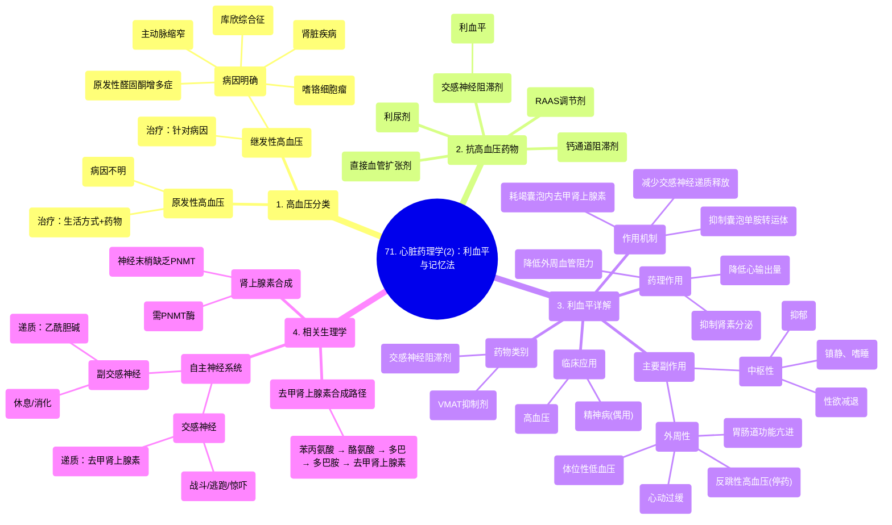

# 71 Cardiac Pharmacology (2) Reserpine with a Mnemonic

  <video controls preload="metadata" playsinline>
    <source src="https://helly.s3.bitiful.net/心血管学科/%E4%B8%93%E8%BE%91%2018%EF%BC%9A%E5%BF%83%E5%86%85%E7%A7%91%E7%BB%88%E6%9E%81%E7%99%BE%E7%A7%91%E8%BE%9E%E5%85%B8%20%28The%20Cardiology%20Encyclopedia%29/71%20Cardiac%20Pharmacology%20%282%29%20Reserpine%20with%20a%20Mnemonic.mp4" type="video/mp4">
    
您的浏览器不支持播放，请升级。

  </video>

::: tip ⚡️ 核心考点 (30s速读)
*   **核心考点**：利血平是一种囊泡单胺转运体抑制剂，通过耗竭神经末梢的去甲肾上腺素，抑制交感神经系统，从而降低血压。
*   **临床意义**：主要用于治疗高血压，偶用于精神病。其副作用源于交感抑制和副交感优势，包括镇静、抑郁、体位性低血压、心动过缓及胃肠道功能亢进。
:::

## 🧠 深度精讲

*   **概念1：高血压的分类与治疗原则**
    高血压分为**原发性高血压**（病因不明）和**继发性高血压**（病因明确，如库欣综合征、原发性醛固酮增多症、嗜铬细胞瘤、肾脏疾病、主动脉缩窄）。治疗继发性高血压的关键是**治疗原发病**。原发性高血压的治疗则包括生活方式干预和药物治疗。

*   **概念2：抗高血压药物的作用靶点**
    降压药通过降低心输出量、前负荷或后负荷来起效。主要类别包括：**交感神经阻滞剂**、**直接血管扩张剂**、**钙通道阻滞剂**、**肾素-血管紧张素-醛固酮系统调节剂**以及**利尿剂**。利血平属于交感神经阻滞剂。

*   **概念3：利血平的作用机制**
    利血平是**囊泡单胺转运体抑制剂**。VMAT负责将细胞质中的多巴胺转运进囊泡，在囊泡内多巴胺被转化为去甲肾上腺素。利血平抑制VMAT后，导致：
    1.  多巴胺无法进入囊泡。
    2.  囊泡内去甲肾上腺素合成减少。
    3.  神经冲动到来时，可供释放的去甲肾上腺素耗竭。
    最终结果是交感神经末梢释放的去甲肾上腺素减少，无法有效激动血管上的α-1受体（导致血管舒张）和心脏上的β-1受体（导致心率和收缩力下降），从而降低血压。

*   **概念4：利血平的药理效应与副作用**
    **降压效应**：通过抑制交感神经，降低外周血管阻力、心输出量，并间接抑制肾素分泌。
    **副作用**：源于交感抑制和副交感神经相对优势。
    *   **中枢性**：镇静、嗜睡、**抑郁**、性欲减退。
    *   **外周性**：
        *   抑制α-1受体：血管扩张，可能导致**体位性低血压**、反射性心动过速、逆行射精。
        *   抑制β-1受体：心率减慢、心肌收缩力减弱，突然停药可能引起**反跳性高血压**。
        *   副交感优势：增加胃肠道**蠕动**和**分泌**（分别由肠肌神经丛和黏膜下神经丛介导）。

*   **概念5：去甲肾上腺素的合成与释放**
    合成路径：苯丙氨酸 → 酪氨酸 → 多巴 → 多巴胺 → (在囊泡内)去甲肾上腺素。
    在肾上腺髓质，去甲肾上腺素可进一步经**苯乙醇胺N-甲基转移酶**催化生成肾上腺素，但神经末梢缺乏此酶，故只能释放去甲肾上腺素。
    释放过程：动作电位导致钙离子内流，触发囊泡与细胞膜融合，释放去甲肾上腺素。

## 📚 双语术语表 (Terminology)
| 英文术语 | 中文翻译 | 定义/解释 |
| :--- | :--- | :--- |
| VMAT (Vesicular Monoamine Transporter) | 囊泡单胺转运体 | 位于囊泡膜上的转运蛋白，负责将细胞质中的单胺类神经递质（如多巴胺）转运进囊泡。 |
| Reserpine | 利血平 | 一种VMAT抑制剂，通过耗竭去甲肾上腺素来降低血压。 |
| Sympatholytic | 交感神经阻滞剂 | 一类通过不同机制抑制交感神经系统活性的药物。 |
| Primary Hypertension | 原发性高血压 | 病因未明的高血压，占高血压患者的绝大多数。 |
| Secondary Hypertension | 继发性高血压 | 由其他疾病（如肾脏病、内分泌疾病）引起的高血压。 |
| Norepinephrine | 去甲肾上腺素 | 交感神经末梢释放的主要神经递质，激动α和β受体，产生升压、强心等效应。 |
| Phenylethanolamine N-methyltransferase (PNMT) | 苯乙醇胺N-甲基转移酶 | 将去甲肾上腺素甲基化为肾上腺素的酶，主要存在于肾上腺髓质。 |
| Myenteric Plexus | 肠肌神经丛 | 位于消化道纵行肌和环行肌之间的神经丛，主要控制胃肠**运动**。 |
| Submucosal Plexus | 黏膜下神经丛 | 位于消化道黏膜下层的神经丛，主要控制胃肠**分泌**和局部血流。 |
| Rebound Hypertension | 反跳性高血压 | 长期使用某些降压药（如β受体阻滞剂）后突然停药，导致血压急剧回升甚至超过原水平的现象。 |
| Postural Hypotension | 体位性低血压 | 从卧位或坐位突然站立时，血压显著下降，可能导致头晕、黑矇甚至晕厥。 |

## 🗺️ 知识图谱

