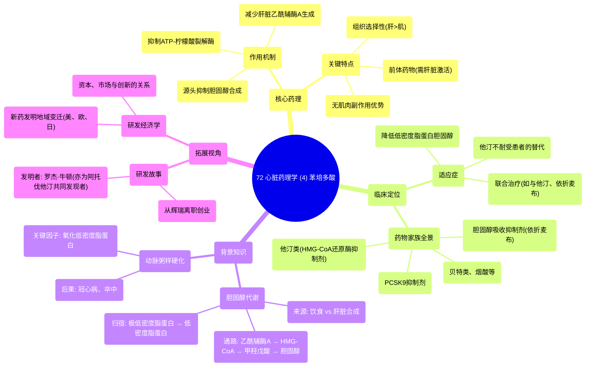

# 72 Cardiac Pharmacology (4) Bempedoic Acid

  <video controls preload="metadata" playsinline>
    <source src="https://helly.s3.bitiful.net/心血管学科/%E4%B8%93%E8%BE%91%2018%EF%BC%9A%E5%BF%83%E5%86%85%E7%A7%91%E7%BB%88%E6%9E%81%E7%99%BE%E7%A7%91%E8%BE%9E%E5%85%B8%20%28The%20Cardiology%20Encyclopedia%29/72%20Cardiac%20Pharmacology%20%284%29%20Bempedoic%20Acid.mp4" type="video/mp4">
    
您的浏览器不支持播放，请升级。

  </video>

::: tip ⚡️ 核心考点 (30s速读)
*   **核心考点**：苯培多酸是一种新型降脂药，通过抑制肝脏胆固醇合成的上游限速酶（ATP-柠檬酸裂解酶）来降低低密度脂蛋白胆固醇。其作用机制与他汀类药物（抑制HMG-CoA还原酶）不同，且不经肌肉代谢，可避免他汀相关的肌肉副作用。
*   **临床意义**：为对他汀类药物不耐受或需要联合治疗以进一步降低低密度脂蛋白胆固醇的患者提供了新的选择。于2020年2月获批，是降脂药物家族的重要补充。
:::

## 🧠 深度精讲

*   **概念1：胆固醇的来源与代谢通路**
    视频首先回顾了胆固醇的“来龙去脉”，这是理解所有降脂药（包括苯培多酸）作用靶点的基石。胆固醇主要有两个来源：一是外源性（膳食摄入，如视频中的“双层芝士汉堡”），经肠道吸收后通过淋巴和门脉系统进入肝脏；二是内源性，由肝脏自身合成。肝脏利用乙酰辅酶A为原料，经过一系列酶促反应（关键限速步骤是HMG-CoA还原酶）合成胆固醇。肝脏合成的胆固醇与甘油三酯等结合，形成极低密度脂蛋白释放入血，并最终代谢为低密度脂蛋白。而**氧化的低密度脂蛋白**是导致动脉粥样硬化斑块形成、进而引发心绞痛、心肌梗死或脑卒中的核心病理因素。

*   **概念2：苯培多酸的独特作用机制**
    苯培多酸的作用靶点位于胆固醇合成通路的更上游。它抑制的是**ATP-柠檬酸裂解酶**。这个酶负责将线粒体产生的柠檬酸转化为细胞质中的乙酰辅酶A，而乙酰辅酶A正是合成胆固醇的起始原料。因此，抑制此酶可以从源头减少肝脏胆固醇的合成。与他汀类药物（抑制HMG-CoA还原酶）相比，苯培多酸的作用环节更早。更重要的是，ATP-柠檬酸裂解酶在肝脏高表达，而在骨骼肌中活性很低；且苯培多酸本身是一种前体药物，需要肝脏特有的酶（超长链酰基辅酶A合成酶1）激活才能起效，而骨骼肌缺乏此酶。这种**组织选择性**是其**不引起肌肉相关副作用**的关键理论依据。

*   **概念3：降脂药物的全景图与定位**
    视频列举了主要的降脂药物家族：他汀类、贝特类、胆汁酸螯合剂（如考来烯胺）、烟酸、胆固醇吸收抑制剂（如依折麦布）、PCSK9抑制剂、鱼油/Omega-3脂肪酸，以及新成员苯培多酸。这强调了临床降脂治疗的“武器库”是丰富的，需要根据患者的具体情况（如血脂异常类型、基线水平、合并症、耐受性、经济因素等）进行个体化选择和联合应用。苯培多酸的问世，特别是对于他汀不耐受的患者群体，具有重要的填补空白意义。

*   **概念4：药物研发的经济学视角（拓展思考）**
    视频后半部分跳出纯医学内容，以苯培多酸的发明者罗杰·牛顿（也是阿托伐他汀的共同发现者）的故事为引，探讨了创新药物研发背后的经济学动力。作者指出，新药研发的重心（以新化学实体衡量）在近几十年向美国集中，这背后的驱动因素并非单纯的医学或科学问题，而是**经济学规律**在起作用，包括资本投入、研发环境、专利制度、市场规模和回报预期等。理解这一点，有助于我们更全面地看待医药创新生态。

## 📚 双语术语表 (Terminology)
| 英文术语 | 中文翻译 | 定义/解释 |
| :--- | :--- | :--- |
| Bempedoic Acid | 苯培多酸 | 一种新型口服降脂药，通过抑制ATP-柠檬酸裂解酶减少肝脏胆固醇合成。 |
| ATP-citrate lyase (ACL) | ATP-柠檬酸裂解酶 | 胆固醇合成通路中的关键酶，苯培多酸的作用靶点，负责催化柠檬酸生成乙酰辅酶A。 |
| HMG-CoA reductase | HMG-CoA还原酶 | 胆固醇合成通路中的经典限速酶，是他汀类药物的作用靶点。 |
| LDL (Low-Density Lipoprotein) | 低密度脂蛋白 | 俗称“坏胆固醇”，其氧化形式是动脉粥样硬化的主要致病因子。 |
| VLDL (Very Low-Density Lipoprotein) | 极低密度脂蛋白 | 主要由肝脏合成，是内源性甘油三酯的主要运输形式，可代谢转化为低密度脂蛋白。 |
| Oxidized LDL | 氧化低密度脂蛋白 | 经过氧化修饰的低密度脂蛋白，具有强致动脉粥样硬化作用。 |
| Statin | 他汀类药物 | 一类广泛使用的降脂药，通过竞争性抑制HMG-CoA还原酶发挥作用。 |
| PCSK9 inhibitor | PCSK9抑制剂 | 一类新型降脂药（多为单抗或小干扰RNA），通过抑制PCSK9增加肝细胞表面低密度脂蛋白受体数量，从而强力清除低密度脂蛋白。 |
| Ezetimibe | 依折麦布 | 胆固醇吸收抑制剂，作用于小肠刷状缘，抑制膳食和胆汁中胆固醇的吸收。 |
| Top-line revenue | 顶线收入 | 会计术语，指利润表中的第一行“营业收入”，代表公司的总销售额。 |
| Net income (Bottom-line) | 净利润（底线利润） | 会计术语，指公司在扣除所有成本、费用和税收后的最终利润。 |

## 🗺️ 知识图谱

