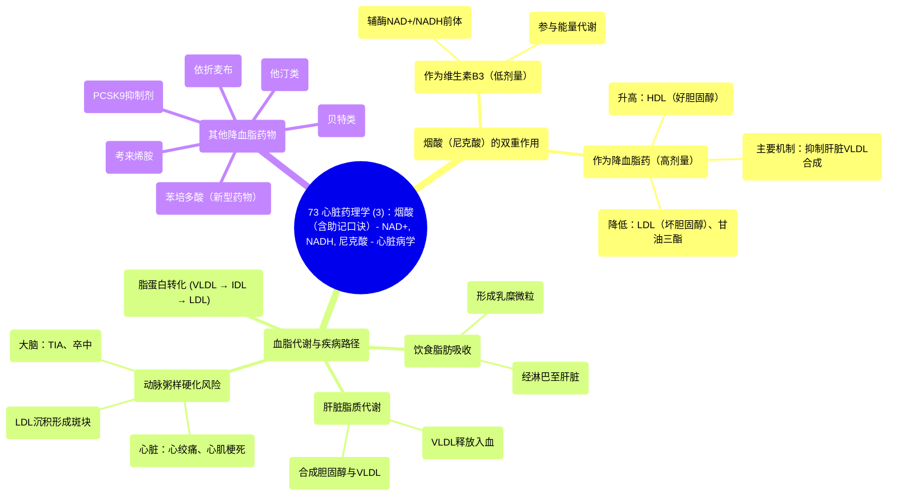

# 73 Cardiac Pharmacology (3) Niacin with a Mnemonic - NAD+, NADH, Nicotinic Acid - Cardiology

  <video controls preload="metadata" playsinline>
    <source src="https://helly.s3.bitiful.net/心血管学科/%E4%B8%93%E8%BE%91%2018%EF%BC%9A%E5%BF%83%E5%86%85%E7%A7%91%E7%BB%88%E6%9E%81%E7%99%BE%E7%A7%91%E8%BE%9E%E5%85%B8%20%28The%20Cardiology%20Encyclopedia%29/73%20Cardiac%20Pharmacology%20%283%29%20Niacin%20with%20a%20Mnemonic%20-%20NAD%2B%2C%20NADH%2C%20Nicotinic%20Acid%20-%20Cardiology.mp4" type="video/mp4">
    
您的浏览器不支持播放，请升级。

  </video>

::: tip ⚡️ 核心考点 (30s速读)
*   **核心考点**：烟酸（维生素B3）在低剂量时作为维生素，在高剂量时作为降血脂药物。其降脂机制主要是通过抑制肝脏合成极低密度脂蛋白，从而降低低密度脂蛋白和甘油三酯，并升高高密度脂蛋白。
*   **临床意义**：用于治疗高脂血症，以降低动脉粥样硬化、心肌梗死和卒中的风险。需注意区分其维生素作用与药理作用。
:::

## 🧠 深度精讲

*   **概念1：血脂代谢与动脉粥样硬化**
    饮食中的脂肪（如芝士汉堡中的脂肪）在肠道被吸收，包装成“乳糜微粒”，经淋巴系统进入门静脉循环，最终到达肝脏。肝脏利用这些脂质合成胆固醇，并以“极低密度脂蛋白”的形式分泌入血。VLDL在血液中经脂蛋白脂肪酶作用，逐步转化为“中间密度脂蛋白”和“低密度脂蛋白”。LDL（“有害的”胆固醇）水平过高时，会沉积在血管壁形成“动脉粥样硬化斑块”，导致血管狭窄，引发心脏的“心绞痛”、“心肌梗死”或大脑的“短暂性脑缺血发作”、“卒中”。

*   **概念2：烟酸的双重角色与作用机制**
    烟酸（尼克酸）具有两种独立功能：
    1.  **维生素B3**：在较低剂量下，作为辅酶NAD+和NADH的前体，参与细胞能量代谢等生化过程。
    2.  **降血脂药物**：在较高剂量下，发挥药理作用。其主要通过抑制肝脏合成和分泌VLDL，从而降低其代谢产物LDL和甘油三酯的水平。同时，它能升高“高密度脂蛋白”（“有益的”胆固醇）。

*   **概念3：降血脂药物概览**
    除了烟酸，其他主要降血脂药物包括：
    *   **他汀类**：抑制胆固醇合成。
    *   **贝特类**：主要降低甘油三酯。
    *   **考来烯胺**：胆汁酸结合树脂。
    *   **依折麦布**：抑制肠道胆固醇吸收。
    *   **PCSK9抑制剂**：新型强效降LDL药物。
    *   **苯培多酸**：近期获批的新药。

## 📚 双语术语表 (Terminology)
| 英文术语 | 中文翻译 | 定义/解释 |
| :--- | :--- | :--- |
| Niacin / Nicotinic Acid | 烟酸 / 尼克酸 | 维生素B3，高剂量时用作降血脂药。 |
| VLDL | 极低密度脂蛋白 | 肝脏合成的富含甘油三酯的脂蛋白，是LDL的前体。 |
| LDL | 低密度脂蛋白 | “坏”胆固醇，高水平是动脉粥样硬化的主要风险因素。 |
| HDL | 高密度脂蛋白 | “好”胆固醇，有助于将胆固醇从外周运回肝脏代谢。 |
| Atherosclerotic Plaque | 动脉粥样硬化斑块 | LDL等脂质在动脉血管壁沉积形成的斑块，可导致血管狭窄。 |
| Angina | 心绞痛 | 心肌暂时性缺血引起的胸痛。 |
| Myocardial Infarction | 心肌梗死 | 冠状动脉阻塞导致部分心肌坏死，即心脏病发作。 |
| TIA | 短暂性脑缺血发作 | 大脑暂时性缺血，俗称“小中风”。 |
| Stroke | 卒中 | 大脑持续性缺血或出血导致的神经功能缺损，即“中风”。 |
| Statins | 他汀类药物 | HMG-CoA还原酶抑制剂，一线降胆固醇药物。 |
| PCSK9 Inhibitors | PCSK9抑制剂 | 新型注射降脂药，通过增加LDL受体表达强力降低LDL-C。 |

## 🗺️ 知识图谱

