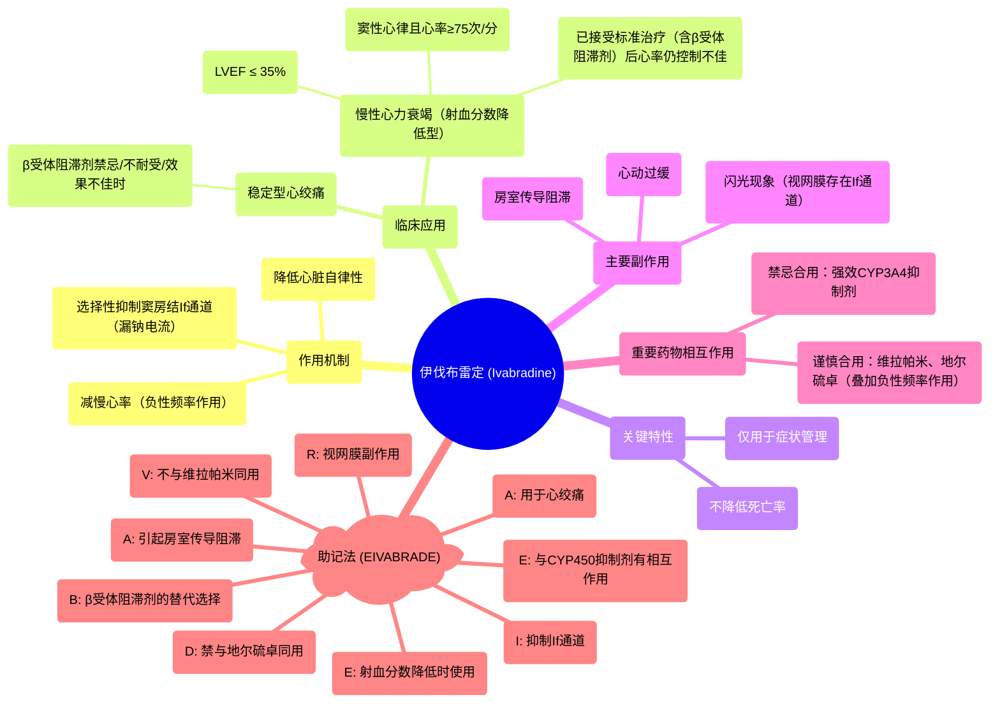

# 74 Cardiac Pharmacology (5) Ivabradine with Mnemonic

  <video controls preload="metadata" playsinline>
    <source src="https://helly.s3.bitiful.net/心血管学科/%E4%B8%93%E8%BE%91%2018%EF%BC%9A%E5%BF%83%E5%86%85%E7%A7%91%E7%BB%88%E6%9E%81%E7%99%BE%E7%A7%91%E8%BE%9E%E5%85%B8%20%28The%20Cardiology%20Encyclopedia%29/74%20Cardiac%20Pharmacology%20%285%29%20Ivabradine%20with%20Mnemonic.mp4" type="video/mp4">
    
您的浏览器不支持播放，请升级。

  </video>

::: tip ⚡️ 核心考点 (30s速读)
*   **核心考点**：伊伐布雷定是一种选择性抑制窦房结If通道（“漏钠电流”）的药物，通过降低心率发挥治疗作用，但不降低死亡率。
*   **临床意义**：主要用于**症状管理**，适用于**不能耐受或β受体阻滞剂效果不佳**的**稳定型心绞痛**或**射血分数降低的心力衰竭**患者。
:::

## 🧠 深度精讲

*   **作用机制**：伊伐布雷定的核心作用是选择性抑制心脏窦房结的If通道（又称“漏钠电流”或“funny current”）。这个通道是心脏内在自律性的基础，负责自动产生电冲动。抑制该通道会降低窦房结的自律性，从而**减慢心率**。它不影响心肌收缩力或血压。
*   **临床应用**：
    *   **稳定型心绞痛**：用于对β受体阻滞剂禁忌、不能耐受或效果不佳的患者。
    *   **慢性心力衰竭**：适用于窦性心律、心率≥75次/分、左心室射血分数≤35%的患者，在已接受标准治疗（包括β受体阻滞剂）后心率仍控制不佳时，可加用伊伐布雷定以进一步降低心率、减少心衰住院风险。
*   **重要特点**：
    *   **仅对症**：该药仅用于改善症状（如减少心绞痛发作、改善心衰症状），**不能降低心肌梗死或心力衰竭的死亡率**。
    *   **心率依赖性**：其疗效与降低心率的程度直接相关。
*   **副作用**：
    *   **心动过缓与房室传导阻滞**：是其药理作用的延伸。
    *   **闪光现象（光幻视）**：特征性副作用。因为视网膜中也存在If通道，药物抑制后可能导致患者视野中出现短暂的、增强的亮度感或色觉变化（如闪光、光圈）。
*   **药物相互作用**：
    *   **强效CYP3A4抑制剂**（如某些抗真菌药、大环内酯类抗生素、蛋白酶抑制剂）：禁止合用，因为它们会显著升高伊伐布雷定的血药浓度，增加严重心动过缓的风险。
    *   **其他负性频率药物**：与维拉帕米、地尔硫卓等钙通道阻滞剂合用时需谨慎，因会叠加减慢心率的作用。

## 📚 双语术语表 (Terminology)
| 英文术语 | 中文翻译 | 定义/解释 |
| :--- | :--- | :--- |
| Ivabradine | 伊伐布雷定 | 一种选择性窦房结If通道抑制剂，用于降低心率。 |
| Funny current (If) | 漏钠电流 (If通道) | 心脏窦房结细胞产生的一种由超极化激活的内向电流，是心脏自律性的电生理基础。 |
| Automaticity | 自律性 | 心肌细胞（尤其是窦房结细胞）在没有外界刺激条件下自动产生节律性兴奋的特性。 |
| SA node | 窦房结 | 心脏的正常起搏点，位于右心房上部。 |
| AV node | 房室结 | 位于心房与心室交界处，负责将心房冲动传导至心室，并具有延迟传导的作用。 |
| Stable Angina | 稳定型心绞痛 | 由心肌耗氧量增加（如劳累、情绪激动）诱发，休息或含服硝酸甘油后可缓解的胸痛。 |
| CHF (Congestive Heart Failure) | 充血性心力衰竭 | 心脏泵血功能下降，无法满足机体代谢需要的一种临床综合征。 |
| Left Ventricular Ejection Fraction (LVEF) | 左心室射血分数 | 衡量左心室每次收缩时泵出血液百分比的指标，是评估心功能的重要参数。 |
| Beta Blocker | β受体阻滞剂 | 一类通过阻断β肾上腺素能受体来减慢心率、降低心肌收缩力和血压的药物。 |
| Bradycardia | 心动过缓 | 心率低于正常范围（通常成人<60次/分）。 |
| AV Nodal Block | 房室结传导阻滞 | 心脏电冲动在从心房经房室结向心室传导过程中发生延迟或中断。 |
| Luminous Phenomenon (Phosphenes) | 闪光现象（光幻视） | 伊伐布雷定的特征性视觉副作用，患者主观感受到闪光、光圈或亮度变化。 |
| CYP450 Inhibitor | CYP450抑制剂 | 能够抑制细胞色素P450酶系活性的药物，会减慢经此酶代谢的药物的清除。 |
| Symptomatic Management | 症状管理 | 治疗旨在缓解疾病症状，而非改变其根本病理进程或改善预后。 |

## 🗺️ 知识图谱

