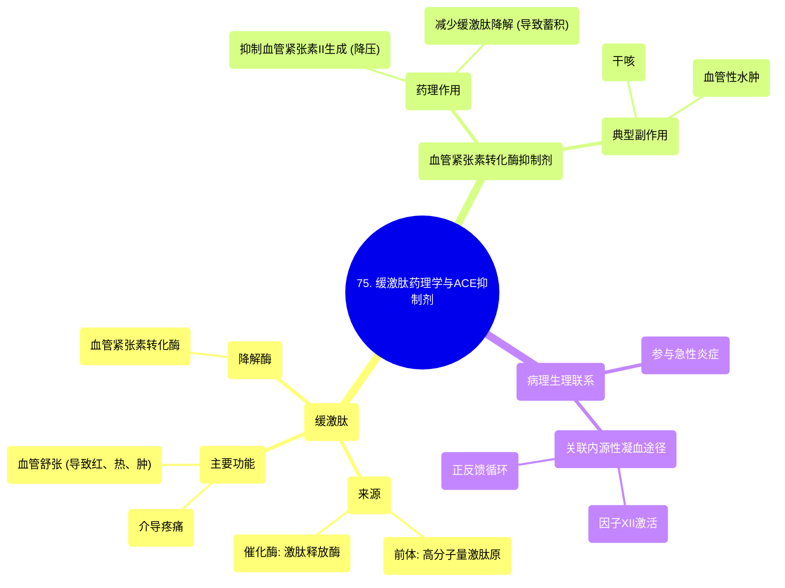

# 75 Bradykinin Pharmacology and ACE inhibitors - Immunology - Pathology

  <video controls preload="metadata" playsinline>
    <source src="https://helly.s3.bitiful.net/心血管学科/%E4%B8%93%E8%BE%91%2018%EF%BC%9A%E5%BF%83%E5%86%85%E7%A7%91%E7%BB%88%E6%9E%81%E7%99%BE%E7%A7%91%E8%BE%9E%E5%85%B8%20%28The%20Cardiology%20Encyclopedia%29/75%20Bradykinin%20Pharmacology%20and%20ACE%20inhibitors%20-%20Immunology%20-%20Pathology.mp4" type="video/mp4">
    
您的浏览器不支持播放，请升级。

  </video>

::: tip ⚡️ 核心考点 (30s速读)
*   **核心考点**：缓激肽是一种由高分子量激肽原生成的肽类炎症介质，具有**血管舒张**和**致痛**作用，是急性炎症反应的关键参与者。血管紧张素转化酶（ACE）可降解缓激肽，因此ACE抑制剂在降压的同时，会因缓激肽蓄积而引起**干咳**等副作用。
*   **临床意义**：理解缓激肽的生成与降解途径，是掌握ACE抑制剂（如卡托普利、依那普利）药理作用及典型副作用（干咳、血管性水肿）机制的基础。
:::

## 🧠 深度精讲

*   **缓激肽的来源与功能**：缓激肽来源于血浆蛋白**高分子量激肽原**，在**激肽释放酶**的作用下生成。它是一种重要的炎症介质，主要功能是**扩张血管**（导致红、热、肿）和**介导疼痛**。因此，它在急性炎症的病理生理过程中扮演核心角色。
*   **缓激肽与凝血系统的关联**：缓激肽的生成与内源性凝血途径的启动密切相关。当血管内皮损伤，暴露出内皮下胶原时，会激活凝血**因子XII**。活化的因子XII能将**前激肽释放酶**转化为**激肽释放酶**，后者进而催化高分子量激肽原生成缓激肽。这是一个正反馈循环，放大了炎症和凝血信号。
*   **ACE抑制剂的关键作用点**：血管紧张素转化酶（ACE）不仅负责将血管紧张素I转化为具有强效缩血管作用的血管紧张素II，还负责**降解缓激肽**。因此，当使用ACE抑制剂类药物时，会产生双重效应：一方面减少血管紧张素II的生成（降压），另一方面导致缓激肽在体内蓄积。
*   **ACE抑制剂副作用的机制**：缓激肽在呼吸道等部位蓄积，会刺激神经末梢，引起**干咳**。在极少数情况下，过量的缓激肽可能导致更严重的**血管性水肿**（如喉头水肿）。这是ACE抑制剂类药物最典型的不良反应。

## 📚 双语术语表 (Terminology)
| 英文术语 | 中文翻译 | 定义/解释 |
| :--- | :--- | :--- |
| Bradykinin | 缓激肽 | 一种由9个氨基酸组成的肽类物质，是强效的血管舒张剂和致痛物质，参与急性炎症反应。 |
| ACE inhibitors | 血管紧张素转化酶抑制剂 | 一类通过抑制ACE酶，减少血管紧张素II生成并增加缓激肽水平，从而降低血压的药物。 |
| High molecular weight kininogen (HMWK) | 高分子量激肽原 | 一种血浆α-球蛋白，是缓激肽的前体蛋白。 |
| Kallikrein | 激肽释放酶 | 一种蛋白酶，能将高分子量激肽原切割，释放出缓激肽。 |
| Acute inflammation | 急性炎症 | 机体对损伤或感染作出的快速、以中性粒细胞浸润为主的防御反应。 |
| Vasodilator | 血管舒张剂 | 能使血管平滑肌松弛，导致血管管径扩大的物质。 |
| Factor XII | 凝血因子XII | 内源性凝血途径的启动因子，其激活也与激肽系统的启动相关联。 |
| Dry cough | 干咳 | ACE抑制剂最常见的副作用，由缓激肽在呼吸道蓄积刺激所致。 |
| Angioedema | 血管性水肿 | 一种皮下或黏膜下组织的局限性水肿，是ACE抑制剂罕见但严重的副作用。 |

## 🗺️ 知识图谱

