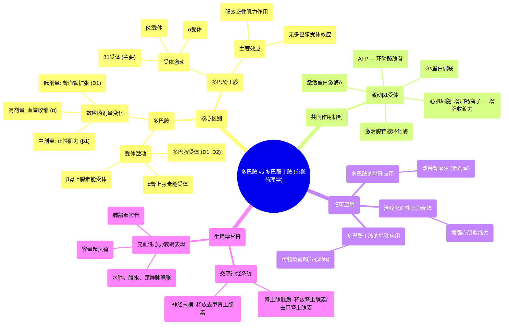

# 76 Dopamine & Dobutamine - with a Mnemonic - Cardiac Pharmacology (6)

  <video controls preload="metadata" playsinline>
    <source src="https://helly.s3.bitiful.net/心血管学科/%E4%B8%93%E8%BE%91%2018%EF%BC%9A%E5%BF%83%E5%86%85%E7%A7%91%E7%BB%88%E6%9E%81%E7%99%BE%E7%A7%91%E8%BE%9E%E5%85%B8%20%28The%20Cardiology%20Encyclopedia%29/76%20Dopamine%20%26%20Dobutamine%20-%20with%20a%20Mnemonic%20-%20Cardiac%20Pharmacology%20%286%29.mp4" type="video/mp4">
    
您的浏览器不支持播放，请升级。

  </video>

::: tip ⚡️ 核心考点 (30s速读)
*   **核心考点**：多巴胺与多巴酚丁胺均为拟交感神经药，通过激动β1受体增强心肌收缩力，用于治疗充血性心力衰竭。关键区别在于多巴胺还激动多巴胺受体（D1/D2），而多巴酚丁胺没有。
*   **临床意义**：多巴胺在低剂量时主要扩张肾血管（D1效应），高剂量时收缩血管（α效应）。多巴酚丁胺主要用于增强心肌收缩力，也用于不能运动的患者进行药物负荷超声心动图检查。
:::

## 🧠 深度精讲

*   **充血性心力衰竭的病理生理**：充血性心力衰竭时，患者处于容量超负荷状态，表现为水肿、腹水、颈静脉怒张、肺部湿啰音等。治疗目标是增强心脏泵血功能，减轻液体潴留。
*   **正性肌力药物分类**：用于增强心肌收缩力的药物包括：强心苷类、双吡啶类、拟交感神经药（如多巴胺、多巴酚丁胺）以及非正性肌力药物（如利尿剂、血管扩张剂）。
*   **多巴胺的作用机制**：多巴胺是D1、D2多巴胺受体以及β和α肾上腺素能受体的激动剂。其激动强度顺序为：D受体 > β受体 > α受体。因此，其效应随剂量变化：低剂量主要扩张肾和内脏血管（D1效应），中等剂量增强心肌收缩力和心率（β1效应），高剂量则引起全身血管收缩（α效应）。
*   **多巴酚丁胺的作用机制**：多巴酚丁胺是β1、β2和α受体的激动剂，但**没有**多巴胺受体激动作用。其对β1受体的激动作用强于β2受体。其主要作用是选择性增强心肌收缩力（正性肌力作用），对心率和外周血管阻力的影响较小。
*   **β1受体信号通路**：β1受体与Gs蛋白偶联。激活后，腺苷酸环化酶将ATP转化为环磷酸腺苷。环磷酸腺苷激活蛋白激酶A，在心肌细胞中导致细胞内钙离子浓度增加，从而增强心肌收缩力。**同一信号通路（环磷酸腺苷/蛋白激酶A）在血管平滑肌中却导致舒张**，这体现了组织特异性。
*   **交感神经系统与儿茶酚胺**：交感神经末梢释放去甲肾上腺素，肾上腺髓质释放肾上腺素和去甲肾上腺素。去甲肾上腺素缺乏转化为肾上腺素的最后一种酶（苯乙醇胺-N-甲基转移酶）。多巴胺和多巴酚丁胺作为外源性拟交感药，模拟了这些内源性物质激动β1受体的作用。
*   **临床应用对比**：
    *   **多巴胺**：用于治疗充血性心力衰竭，尤其当需要同时改善肾灌注时（低剂量）。也用于休克状态。
    *   **多巴酚丁胺**：主要用于治疗急性失代偿性心力衰竭，以增强心肌收缩力。也用于**药物负荷试验**：当患者无法进行运动负荷试验（如跑步机）时，静脉输注多巴酚丁胺以增加心脏负荷，同时进行超声心动图检查来评估是否存在心肌缺血。
*   **心肌收缩的细胞机制（简述）**：心肌细胞膜上的钠-钾ATP酶（初级泵）维持钠离子外流、钾离子内流的梯度。依赖于这个梯度，钠-钙交换体（次级泵）将细胞内钙离子排出，同时将钠离子转入。当细胞内钙离子减少时，会触发肌浆网释放更多的钙离子，从而引发肌肉收缩。正性肌力药物（如通过β1受体）最终通过增加细胞内可用于收缩的钙离子浓度来发挥作用。

## 📚 双语术语表 (Terminology)
| 英文术语 | 中文翻译 | 定义/解释 |
| :--- | :--- | :--- |
| Dopamine | 多巴胺 | 内源性儿茶酚胺，也是药物，可激动多巴胺受体及α、β肾上腺素能受体。 |
| Dobutamine | 多巴酚丁胺 | 合成儿茶酚胺，主要激动β1受体，用于增强心肌收缩力。 |
| Congestive Heart Failure | 充血性心力衰竭 | 心脏泵血功能下降，导致液体在肺部和身体其他部位淤积的临床综合征。 |
| Sympathomimetic | 拟交感神经药 | 模仿交感神经系统作用的药物。 |
| Inotrope | 变力性药物 | 影响心肌收缩力的药物。正性肌力药增强收缩力。 |
| Beta-1 Receptor | β1受体 | 主要位于心脏的肾上腺素能受体，激动后增强心肌收缩力和心率。 |
| Gs Protein | Gs蛋白 | 一种刺激型G蛋白，激活后能增加细胞内环磷酸腺苷水平。 |
| Cyclic AMP | 环磷酸腺苷 | 重要的第二信使，介导多种激素和药物的细胞内效应。 |
| Adenylyl Cyclase | 腺苷酸环化酶 | 催化ATP生成环磷酸腺苷的酶。 |
| Norepinephrine | 去甲肾上腺素 | 交感神经末梢释放的主要神经递质。 |
| Epinephrine | 肾上腺素 | 主要由肾上腺髓质分泌的激素。 |
| Cardiac Stress Test | 心脏负荷试验 | 通过运动或药物增加心脏负荷，评估心肌血流和功能的检查。 |

## 🗺️ 知识图谱

