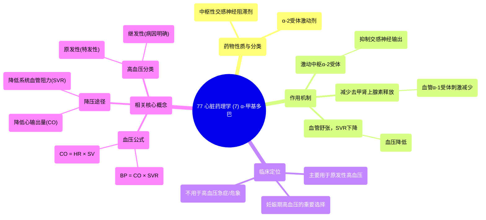

# 77 Cardiac Pharmacology (7) Methyldopa

  <video controls preload="metadata" playsinline>
    <source src="https://helly.s3.bitiful.net/心血管学科/%E4%B8%93%E8%BE%91%2018%EF%BC%9A%E5%BF%83%E5%86%85%E7%A7%91%E7%BB%88%E6%9E%81%E7%99%BE%E7%A7%91%E8%BE%9E%E5%85%B8%20%28The%20Cardiology%20Encyclopedia%29/77%20Cardiac%20Pharmacology%20%287%29%20Methyldopa.mp4" type="video/mp4">
    
您的浏览器不支持播放，请升级。

  </video>

::: tip ⚡️ 核心考点 (30s速读)
*   **核心考点**：α-甲基多巴是一种中枢性α-2受体激动剂，通过抑制中枢交感神经输出，降低外周血管阻力，从而降低血压。它不用于高血压急症。
*   **临床意义**：主要用于治疗妊娠期高血压，因其对胎儿相对安全。需注意其可能引起镇静、抑郁、肝损伤等副作用。
:::

## 🧠 深度精讲

*   **药物定位与机制**：α-甲基多巴属于中枢性交感神经阻滞剂。它通过激动中枢（特别是延髓）的α-2肾上腺素能受体，负反馈抑制交感神经系统的传出活动，减少外周交感神经末梢释放去甲肾上腺素。这导致血管平滑肌上的α-1受体受刺激减少，血管舒张，**系统血管阻力**下降，最终实现降压。
*   **降压治疗逻辑**：视频从血压的基本公式（血压 = 心输出量 × 系统血管阻力）出发，推导出降压的两大途径：**降低心输出量**（如使用β受体阻滞剂减慢心率）和**降低系统血管阻力**（如舒张血管）。α-甲基多巴正是通过后者起效。
*   **高血压分类与治疗原则**：
    *   **原发性高血压**：占大多数，病因不明（特发性），治疗以生活方式干预和药物控制为主。
    *   **继发性高血压**：由明确病因引起（如嗜铬细胞瘤、肾动脉狭窄、库欣综合征等），治疗关键在于去除病因。
    *   α-甲基多巴主要用于**原发性高血压**的长期管理，尤其是特定人群（如孕妇）。
*   **临床应用特点**：
    *   **非一线首选**：在现代高血压治疗中，通常不作为无并发症高血压的首选药物。
    *   **特殊人群用药**：在**妊娠期高血压**治疗中占有重要地位。
    *   **不用于急症**：起效相对较慢，不适用于需要快速降压的**高血压危象**或**高血压急症**。

## 📚 双语术语表 (Terminology)
| 英文术语 | 中文翻译 | 定义/解释 |
| :--- | :--- | :--- |
| Alpha-methyldopa | α-甲基多巴 | 一种中枢性交感神经阻滞剂，为α-2受体激动剂，用于治疗高血压。 |
| Centrally acting sympatholytic | 中枢性交感神经阻滞剂 | 作用于中枢神经系统以抑制交感神经活性的药物。 |
| Alpha-2 agonist | α-2受体激动剂 | 激活α-2肾上腺素能受体的药物，导致交感神经抑制。 |
| Systemic vascular resistance (SVR) | 系统血管阻力 | 体循环血管对血流的阻力，是决定血压的关键因素之一（后负荷）。 |
| Total peripheral resistance (TPR) | 总外周阻力 | SVR的旧称。 |
| Cardiac output (CO) | 心输出量 | 心脏每分钟泵出的血液总量，等于心率乘以每搏输出量。 |
| Preload | 前负荷 | 心脏收缩前（舒张末期）心室内的血容量或压力。 |
| Afterload | 后负荷 | 心脏收缩射血时需要克服的阻力，主要指系统血管阻力。 |
| Primary hypertension | 原发性高血压 | 病因不明的高血压，占高血压病例的大多数。 |
| Secondary hypertension | 继发性高血压 | 由其他疾病（如肾脏疾病、内分泌肿瘤）导致的高血压。 |
| Hypertensive urgency/emergency | 高血压急症/亚急症 | 血压严重升高伴或不伴靶器官急性损害，需紧急处理的情况。 |

## 🗺️ 知识图谱

