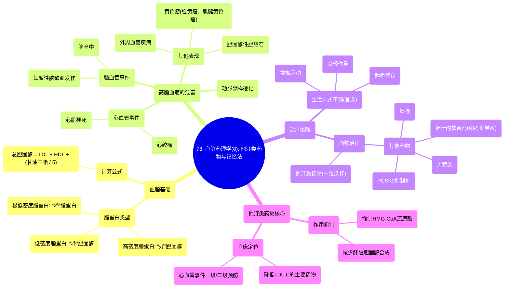

# 78 Cardiac Pharmacology (8) Statins, With a Mnemonic

  <video controls preload="metadata" playsinline>
    <source src="https://helly.s3.bitiful.net/心血管学科/%E4%B8%93%E8%BE%91%2018%EF%BC%9A%E5%BF%83%E5%86%85%E7%A7%91%E7%BB%88%E6%9E%81%E7%99%BE%E7%A7%91%E8%BE%9E%E5%85%B8%20%28The%20Cardiology%20Encyclopedia%29/78%20Cardiac%20Pharmacology%20%288%29%20Statins%2C%20With%20a%20Mnemonic.mp4" type="video/mp4">
    
您的浏览器不支持播放，请升级。

  </video>

::: tip ⚡️ 核心考点 (30s速读)
*   **核心考点**：他汀类药物是治疗高胆固醇血症（尤其是高LDL-C）的一线药物，通过抑制肝脏中的HMG-CoA还原酶来减少胆固醇合成。
*   **临床意义**：降低“坏”胆固醇（LDL），可有效预防动脉粥样硬化、心肌梗死和脑卒中等心血管事件。
:::

## 🧠 深度精讲

*   **血脂谱解读**：评估血脂时，关键看三个指标：低密度脂蛋白胆固醇（“坏”胆固醇）、高密度脂蛋白胆固醇（“好”胆固醇）和甘油三酯。总胆固醇的计算公式为：`总胆固醇 = LDL + HDL + (甘油三酯 / 5)`。LDL升高是动脉粥样硬化的主要危险因素。
*   **高脂血症的危害**：LDL-C过高会导致氧化、脂肪条纹形成，最终进展为动脉粥样硬化。这会引起心绞痛（心脏缺血）、心肌梗死（心脏梗死）、短暂性脑缺血发作（脑缺血）和脑卒中（脑梗死）。此外，还可能引起外周血管疾病、皮肤黄色瘤（如睑黄瘤、肌腱黄色瘤）和胆固醇性胆结石。
*   **治疗策略阶梯**：治疗高脂血症，首先进行生活方式干预（低脂饮食、运动、减重）。若效果不佳，则启动药物治疗。
*   **他汀类药物的作用机制**：他汀类药物作用于胆固醇合成的关键步骤。在肝脏中，乙酰辅酶A经过一系列反应生成HMG-CoA，再通过 **HMG-CoA还原酶** 催化为甲羟戊酸，进而合成胆固醇。他汀类药物正是通过竞争性抑制 **HMG-CoA还原酶** 来发挥降胆固醇作用的。
*   **病例分析思维**：面对一名血脂异常的患者（如LDL-C显著升高），无论其他指标如何，**他汀类药物通常是首选的起始治疗药物**。视频中的病例（总胆固醇253， LDL 198， 甘油三酯245）明确提示应起始他汀治疗。
*   **其他降脂药物**：除了他汀，还有贝特类（主要降甘油三酯）、胆汁酸螯合剂（如考来烯胺）、烟酸、PCSK9抑制剂（强效但昂贵）以及较新的苯培多酸等。它们作用于胆固醇代谢的不同环节。

## 📚 双语术语表 (Terminology)
| 英文术语 | 中文翻译 | 定义/解释 |
| :--- | :--- | :--- |
| LDL (Low-density lipoprotein) | 低密度脂蛋白 | “坏”胆固醇，是动脉粥样硬化的主要致病因子。 |
| HDL (High-density lipoprotein) | 高密度脂蛋白 | “好”胆固醇，有助于将外周胆固醇运回肝脏代谢，具有保护作用。 |
| VLDL (Very low-density lipoprotein) | 极低密度脂蛋白 | 主要由肝脏合成，富含甘油三酯，也是“坏”脂蛋白。 |
| Statins | 他汀类药物 | 一线降胆固醇药物，通过抑制HMG-CoA还原酶起作用。 |
| HMG-CoA Reductase | HMG-CoA还原酶 | 胆固醇合成途径中的限速酶，是他汀类药物的作用靶点。 |
| Atherosclerosis | 动脉粥样硬化 | 动脉壁内脂质积聚形成斑块，导致血管狭窄、硬化的疾病过程。 |
| Myocardial Infarction (MI) | 心肌梗死 | 俗称“心脏病发作”，因冠状动脉阻塞导致心肌缺血坏死。 |
| Stroke | 脑卒中 | 因脑部血液供应中断导致的脑组织损伤。 |
| TIA (Transient Ischemic Attack) | 短暂性脑缺血发作 | 俗称“小中风”，是短暂的、可逆的脑缺血发作。 |
| PVD (Peripheral Vascular Disease) | 外周血管疾病 | 心脏和大脑以外的血管发生动脉粥样硬化等病变。 |
| Xanthelasma | 睑黄瘤 | 眼睑皮肤出现的黄色脂质沉积斑块。 |
| Tendon Xanthoma | 肌腱黄色瘤 | 肌腱部位出现的脂质沉积结节。 |

## 🗺️ 知识图谱

