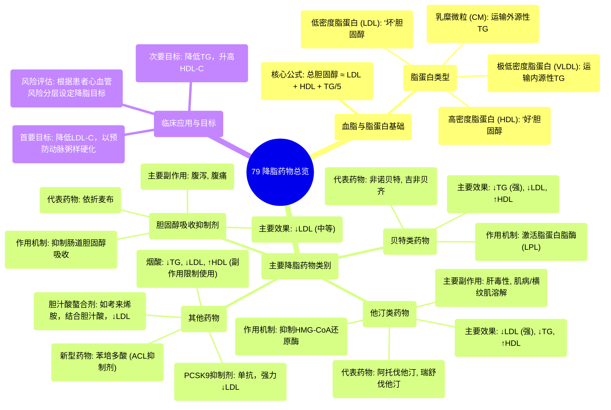

# 79 Lipid-Lowering Agents - Statin, Niacin, Fibrates, Cholestyramine,...etc - Pharmacology (Picmomic)

  <video controls preload="metadata" playsinline>
    <source src="https://helly.s3.bitiful.net/心血管学科/%E4%B8%93%E8%BE%91%2018%EF%BC%9A%E5%BF%83%E5%86%85%E7%A7%91%E7%BB%88%E6%9E%81%E7%99%BE%E7%A7%91%E8%BE%9E%E5%85%B8%20%28The%20Cardiology%20Encyclopedia%29/79%20Lipid-Lowering%20Agents%20-%20Statin%2C%20Niacin%2C%20Fibrates%2C%20Cholestyramine%2C...etc%20-%20Pharmacology%20%28Picmomic%29.mp4" type="video/mp4">
    
您的浏览器不支持播放，请升级。

  </video>

::: tip ⚡️ 核心考点 (30s速读)
*   **核心考点**：降脂药物通过不同机制降低“坏”胆固醇（LDL）和/或甘油三酯（TG），升高“好”胆固醇（HDL），以预防动脉粥样硬化、心肌梗死和中风。
*   **临床意义**：他汀类是基石药物，抑制胆固醇合成；贝特类主降TG；依折麦布抑制肠道吸收；PCSK9抑制剂强力降LDL。需关注肝毒性、肌病等副作用。
:::

## 🧠 深度精讲

*   **概念1：血脂与脂蛋白**：血脂（脂肪）在血液中以脂蛋白（脂肪+蛋白质）形式运输。主要类型有：乳糜微粒（CM，运输外源性甘油三酯）、极低密度脂蛋白（VLDL，运输内源性甘油三酯）、低密度脂蛋白（LDL，运输胆固醇至外周，是“坏”胆固醇）和高密度脂蛋白（HDL，将外周胆固醇运回肝脏代谢，是“好”胆固醇）。总胆固醇（TC）≈ LDL + HDL + TG/5。
*   **概念2：他汀类药物**：作用机制是**抑制HMG-CoA还原酶**，这是肝脏合成胆固醇的限速步骤。结果是：1) 直接减少肝脏胆固醇合成；2) 反馈性上调肝细胞LDL受体，加速清除血液中的LDL。主要降低LDL和TG，轻度升高HDL。是预防心脑血管事件的基石药物。主要副作用：肝毒性、肌肉毒性（肌痛、横纹肌溶解）。
*   **概念3：贝特类药物**：作用机制是**激活脂蛋白脂酶（LPL）**，加速富含甘油三酯的脂蛋白（如VLDL）的分解和清除。因此，**主要强力降低甘油三酯（TG）**，同时也能轻度降低LDL和升高HDL。常用于高甘油三酯血症。
*   **概念4：依折麦布**：作用机制是**选择性抑制小肠刷状缘对膳食和胆汁中胆固醇的吸收**。单用可中等程度降低LDL。常与他汀联用以增强降脂效果。副作用与肠道胆固醇吸收减少有关，如腹泻、脂肪泻。
*   **概念5：其他降脂药物**：
    *   **烟酸**：大剂量可降低TG、LDL，并显著升高HDL，但因其面部潮红、肝毒性等副作用，现已少用。
    *   **胆汁酸螯合剂（如考来烯胺）**：在肠道结合胆汁酸，阻断其肝肠循环，促使肝脏消耗更多胆固醇来合成胆汁酸，从而降低血胆固醇。主要降低LDL，可能升高TG。副作用为胃肠道不适、便秘。
    *   **PCSK9抑制剂**：单克隆抗体，通过抑制PCSK9蛋白，阻止其降解肝细胞表面的LDL受体，从而大幅增加LDL受体的数量，**强力降低LDL水平**。用于他汀控制不佳或不能耐受的患者。
    *   **苯培多酸**：新型药物，在肝脏转化为辅酶A衍生物，抑制ATP柠檬酸裂解酶（ACL），从而在胆固醇合成通路的更上游发挥作用，可有效降低LDL。

## 📚 双语术语表 (Terminology)
| 英文术语 | 中文翻译 | 定义/解释 |
| :--- | :--- | :--- |
| Lipid | 脂质 | 脂肪的总称。 |
| Lipoprotein | 脂蛋白 | 脂质与蛋白质结合形成的复合体，是血脂在血液中的运输形式。 |
| LDL (Low-Density Lipoprotein) | 低密度脂蛋白 | 将胆固醇从肝脏运送到外周组织的脂蛋白，其水平升高是动脉粥样硬化的主要危险因素，俗称“坏胆固醇”。 |
| HDL (High-Density Lipoprotein) | 高密度脂蛋白 | 将外周组织的胆固醇逆向转运回肝脏进行代谢的脂蛋白，具有抗动脉粥样硬化作用，俗称“好胆固醇”。 |
| VLDL (Very Low-Density Lipoprotein) | 极低密度脂蛋白 | 主要由肝脏合成，负责运输内源性甘油三酯。 |
| Triglycerides (TG) | 甘油三酯 | 血液中一种主要的脂肪形式，是能量的储存库。高水平与胰腺炎和心血管风险相关。 |
| Statins | 他汀类药物 | 通过抑制HMG-CoA还原酶来降低胆固醇合成的一类药物，是降脂治疗的基石。 |
| Fibrates | 贝特类药物 | 主要通过激活脂蛋白脂酶来降低甘油三酯水平的一类药物。 |
| Ezetimibe | 依折麦布 | 通过抑制小肠对胆固醇的吸收来降低血脂的药物。 |
| HMG-CoA Reductase | HMG-CoA还原酶 | 胆固醇生物合成途径中的限速酶，是他汀类药物的作用靶点。 |
| Rhabdomyolysis | 横纹肌溶解症 | 严重的肌肉损伤导致肌细胞内容物释放入血，可导致急性肾损伤，是他汀类药物罕见的严重副作用。 |
| Atherosclerosis | 动脉粥样硬化 | 动脉壁内脂质（主要是LDL）沉积形成斑块，导致血管狭窄、硬化的病理过程，是心脑血管疾病的基础。 |

## 🗺️ 知识图谱

