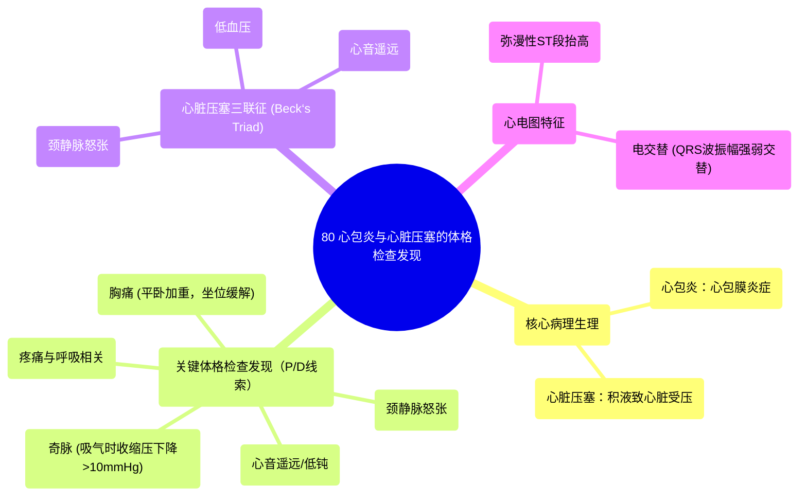

# 80 Pericarditis Tamponade physical findings

  <video controls preload="metadata" playsinline>
    <source src="https://helly.s3.bitiful.net/心血管学科/%E4%B8%93%E8%BE%91%2018%EF%BC%9A%E5%BF%83%E5%86%85%E7%A7%91%E7%BB%88%E6%9E%81%E7%99%BE%E7%A7%91%E8%BE%9E%E5%85%B8%20%28The%20Cardiology%20Encyclopedia%29/80%20Pericarditis%20Tamponade%20physical%20findings.mp4" type="video/mp4">
    
您的浏览器不支持播放，请升级。

  </video>

::: tip ⚡️ 核心考点 (30s速读)
*   **核心考点**：掌握心包炎与心脏压塞的典型体征，特别是“P”和“D”相关的发现，以及心脏压塞的贝克三联征。
*   **临床意义**：这些体征是快速识别潜在致命性心脏压塞的关键，有助于及时进行心包穿刺等紧急干预。
:::

## 🧠 深度精讲

*   **概念1：心包炎与心脏压塞的病理生理联系**
    心包炎是心包膜的炎症。当炎症导致心包腔内液体快速积聚（心包积液），使心腔内压力升高，妨碍心脏舒张期充盈时，即发展为**心脏压塞**，这是一种危及生命的急症。

*   **概念2：以“P”和“D”为线索的体格检查发现**
    视频中提到，提示心包受累的体征常与字母“P”或“D”有关：
    *   **心音遥远/低钝 (Distant/Muffled Heart Sounds)**：由于心包积液使声音传导介质增加，导致心音听起来遥远、微弱。
    *   **颈静脉怒张 (Jugular Venous Distension, JVD)**：心脏因外部液体压迫无法充分舒张，导致右心房压力增高，静脉回流受阻，表现为颈部静脉充盈。
    *   **奇脉 (Pulsus Paradoxus)**：吸气时收缩压下降超过10 mmHg。机制是：吸气时右心回流增加，但因心包受限，右室容积增大挤压室间隔向左移动，导致左室容积和每搏输出量减少，血压下降。
    *   **胸痛特点**：**平卧位加重，坐位前倾可缓解**。因平躺时发炎的心包被拉伸，而坐位时心脏重力后移，减轻了对心包的牵拉。
    *   **疼痛与呼吸相关 (Pain on Inspiration)**：吸气时胸膜扩张可能牵拉发炎的心包，引起或加重疼痛。

*   **概念3：心脏压塞的贝克三联征 (Beck‘s Triad)**
    这是急性心脏压塞的经典三联征，包括：**1. 颈静脉怒张**；**2. 动脉低血压**；**3. 心音遥远**。一旦出现，高度提示心脏压塞。

*   **概念4：心电图特征性表现**
    *   **弥漫性ST段抬高**：不同于心肌梗死（特定导联），心包炎的ST段抬高通常广泛存在于多个导联。
    *   **电交替 (Electrical Alternans)**：表现为QRS波群振幅强弱交替出现。原因是心脏在心包积液中“摆动”，导致其与心电图电极的距离周期性变化。

## 📚 双语术语表 (Terminology)
| 英文术语 | 中文翻译 | 定义/解释 |
| :--- | :--- | :--- |
| Pericarditis | 心包炎 | 心包膜（包裹心脏的囊）的炎症。 |
| Pericardial Tamponade / Cardiac Tamponade | 心脏压塞 | 心包腔内液体快速积聚，导致心脏受压、充盈受限的危及生命的状况。 |
| Distant / Muffled Heart Sounds | 心音遥远 / 心音低钝 | 由于心包积液导致心音传导减弱，听诊时心音微弱、遥远。 |
| Jugular Venous Distension (JVD) | 颈静脉怒张 | 颈部静脉异常充盈或搏动，提示右心房压力增高。 |
| Pulsus Paradoxus | 奇脉 | 吸气时收缩压较呼气时下降超过10 mmHg的现象。 |
| Beck‘s Triad | 贝克三联征 | 心脏压塞的三个典型体征：颈静脉怒张、低血压、心音遥远。 |
| Diffuse ST Elevation | 弥漫性ST段抬高 | 心电图上多个导联（非局限于某一血管分布区）出现ST段抬高，是心包炎的特征之一。 |
| Electrical Alternans | 电交替 | 心电图上QRS波群振幅出现强弱交替变化的节律，常见于大量心包积液。 |
| Pericardial Effusion | 心包积液 | 液体在心包腔内异常积聚。 |

## 🗺️ 知识图谱

