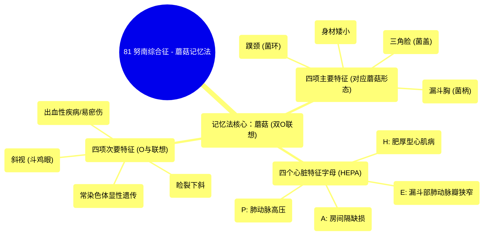

# 81 Noonan Syndrome - The Mushroom mnemonic

  <video controls preload="metadata" playsinline>
    <source src="https://helly.s3.bitiful.net/心血管学科/%E4%B8%93%E8%BE%91%2018%EF%BC%9A%E5%BF%83%E5%86%85%E7%A7%91%E7%BB%88%E6%9E%81%E7%99%BE%E7%A7%91%E8%BE%9E%E5%85%B8%20%28The%20Cardiology%20Encyclopedia%29/81%20Noonan%20Syndrome%20-%20The%20Mushroom%20mnemonic.mp4" type="video/mp4">
    
您的浏览器不支持播放，请升级。

  </video>

::: tip ⚡️ 核心考点 (30s速读)
*   **核心考点**：努南综合征是一种常染色体显性遗传病，其核心特征可概括为“蘑菇记忆法”，包括四项主要特征、四个心脏相关字母（HEPA）和四项次要特征。
*   **临床意义**：该记忆法通过“蘑菇”的形态（双O、矮、三角帽、柄）生动串联起努南综合征的关键临床表现，特别是其典型面容、身材和心脏缺陷，是快速识别和记忆该综合征的有效工具。
:::

## 🧠 深度精讲
*   **概念1：蘑菇记忆法的逻辑与结构**
    视频中介绍的“蘑菇记忆法”是记忆努南综合征临床表现的巧妙方法。其核心逻辑是利用“Noonan”和“Mushroom”两个单词中都包含两个“O”字母作为联想起点。整个记忆法被系统地分为三个“四”的部分，便于记忆：
    1.  **四项主要特征**：直接对应蘑菇的形态。
        *   **身材矮小**：蘑菇本身较矮。
        *   **三角脸**：对应蘑菇的菌盖（伞帽）呈三角形。
        *   **蹼颈**：对应蘑菇菌柄上的菌环。
        *   **漏斗胸**：对应蘑菇的菌柄（向内凹陷的形态）。
    2.  **四个字母 (HEPA)**：代表常见的心脏异常。
        *   **H**：肥厚型心肌病
        *   **E**：漏斗部肺动脉瓣狭窄
        *   **P**：肺动脉高压
        *   **A**：房间隔缺损
    3.  **四项次要特征**：通过“O”和相关联想记忆。
        *   **出血性疾病/易瘀伤**：联想为血液从蘑菇上流下。
        *   **睑裂下斜**：联想为眼睛的形态。
        *   **斜视（斗鸡眼）**：两个“O”代表双眼，但方向不一致（斜视）。
        *   **常染色体显性遗传**：疾病本身的遗传方式，由“Noonan”中的“O”来提示。

## 📚 双语术语表 (Terminology)
| 英文术语 | 中文翻译 | 定义/解释 |
| :--- | :--- | :--- |
| Noonan Syndrome | 努南综合征 | 一种常染色体显性遗传病，以特殊面容、身材矮小、先天性心脏病和多种发育异常为特征。 |
| Mnemonic | 记忆法/助记符 | 一种帮助记忆信息（如列表、概念）的技巧或模式。 |
| Short Stature | 身材矮小 | 身高明显低于同年龄、同性别、同种族人群的平均身高。 |
| Triangular Face | 三角脸 | 面部呈上宽下窄的三角形，前额宽，下颌尖小。 |
| Webbing of the Neck | 蹼颈 | 颈部两侧皮肤松弛、呈蹼状，使颈部看起来短而宽。 |
| Pectus Excavatum | 漏斗胸 | 胸骨下部向内凹陷的胸廓畸形。 |
| Hypertrophic Cardiomyopathy | 肥厚型心肌病 | 一种以心室壁异常增厚为特征的心肌病。 |
| Infundibular Pulmonic Stenosis | 漏斗部肺动脉瓣狭窄 | 右心室流出道（漏斗部）狭窄导致肺动脉血流受阻。 |
| Pulmonary Hypertension | 肺动脉高压 | 肺动脉压力异常升高的一种病理状态。 |
| Atrial Septal Defect | 房间隔缺损 | 左右心房之间的间隔存在缺损，导致血液分流。 |
| Bleeding Disorder | 出血性疾病 | 因凝血功能异常导致的易于出血或止血困难的疾病。 |
| Downward Slanting Palpebral Fissures | 睑裂下斜 | 双眼的外眼角位置低于内眼角，使眼睛呈“八”字形。 |
| Strabismus | 斜视 | 双眼不能同时注视同一目标，一眼视轴偏离。 |
| Autosomal Dominant | 常染色体显性遗传 | 位于常染色体上的显性致病基因引起的遗传方式，杂合子即可发病。 |

## 🗺️ 知识图谱

