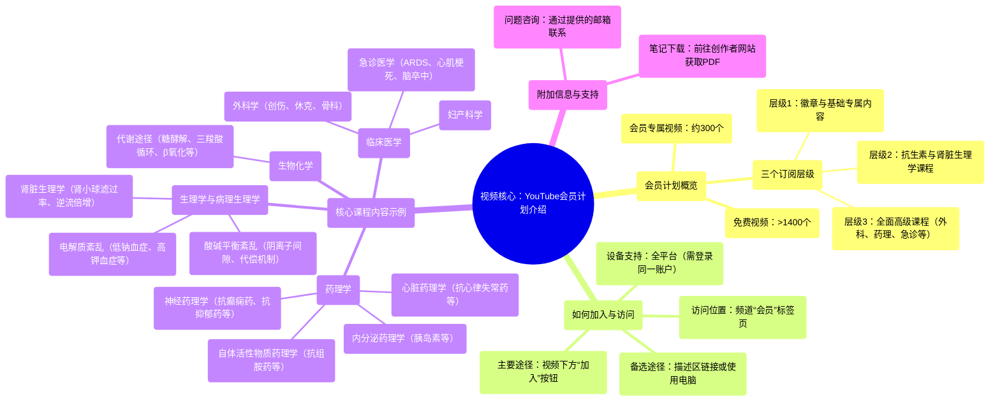

# 83 Do you want to (Join) my Youtube membership program Member-only videos!

  <video controls preload="metadata" playsinline>
    <source src="https://helly.s3.bitiful.net/心血管学科/%E4%B8%93%E8%BE%91%2018%EF%BC%9A%E5%BF%83%E5%86%85%E7%A7%91%E7%BB%88%E6%9E%81%E7%99%BE%E7%A7%91%E8%BE%9E%E5%85%B8%20%28The%20Cardiology%20Encyclopedia%29/83%20Do%20you%20want%20to%20%28Join%29%20my%20Youtube%20membership%20program%20Member-only%20videos%21.mp4" type="video/mp4">
    
您的浏览器不支持播放，请升级。

  </video>

::: tip ⚡️ 核心考点 (30s速读)
*   **核心考点**：了解如何加入Medicosis Perfectionatus的YouTube会员计划，以获取专属的高级医学教学视频。
*   **临床意义**：该会员计划提供了大量系统化、深入的医学课程（如药理学、生理学、病理学等），是医学生和医疗从业者高效学习、巩固核心知识的重要资源。
:::

## 🧠 深度精讲
*   **概念1：会员计划概览与价值**
    Medicosis Perfectionatus的YouTube频道提供了超过1400个免费视频，但另有约300个高质量视频为会员专属内容。会员计划分为三个层级，每个层级提供不同深度和广度的课程。第一层级提供基础专属内容和徽章；第二层级增加了抗生素、肾脏生理学等系统课程；第三层级则涵盖了从外科、急诊医学到药理学（心脏、神经、内分泌等）、酸碱平衡、电解质紊乱等几乎所有核心医学学科的深入讲解，是系统性学习的宝库。

*   **概念2：加入与访问方法**
    加入会员的主要方式是点击视频下方的“加入”按钮（位于订阅按钮旁）。若在移动设备上无法找到该按钮，可通过视频描述中的链接加入，或使用电脑端操作。成功加入后，使用同一账户登录，即可在YouTube应用或网站的任何设备上观看专属视频。所有会员专属内容都集中在频道主页的“会员”标签页内，方便查找。

*   **概念3：课程内容结构示例**
    视频以具体课程为例说明了内容的深度。例如，在第三层级中，学员可以获得包含图表和方程式的完整药代动力学/药效学课程、涵盖各种心律失常和休克管理的急诊医学课程、以及详细讲解酸碱平衡（如阴离子间隙、代偿机制）的系列视频。这些内容通常对应医学考试和临床实践中的高频考点。

## 📚 双语术语表 (Terminology)
| 英文术语 | 中文翻译 | 定义/解释 |
| :--- | :--- | :--- |
| Membership Program | 会员计划 | 创作者提供的付费订阅服务，订阅者可获得专属内容、徽章等福利。 |
| Premium Videos | 高级/专属视频 | 仅对付费会员开放观看的视频内容。 |
| Tier | 层级/等级 | 会员计划内不同的订阅级别，通常价格和权益逐级增加。 |
| Glomerular Filtration Rate (GFR) | 肾小球滤过率 | 评估肾脏滤过功能的关键指标。 |
| Countercurrent Mechanism | 逆流倍增机制 | 肾脏髓袢中浓缩尿液的重要生理机制。 |
| Anion Gap | 阴离子间隙 | 用于鉴别诊断代谢性酸中毒类型的血清电解质计算值。 |
| Pharmacokinetics | 药代动力学 | 研究机体对药物作用（吸收、分布、代谢、排泄）的学科。 |
| Pharmacodynamics | 药效学 | 研究药物对机体作用的学科。 |
| Diabetic Ketoacidosis (DKA) | 糖尿病酮症酸中毒 | 糖尿病的一种急性严重并发症。 |
| ARDS | 急性呼吸窘迫综合征 | 由多种原因导致的急性、进行性呼吸衰竭。 |
| Benzodiazepines | 苯二氮䓬类药物 | 一类常用的抗焦虑、镇静催眠药物。 |

## 🗺️ 知识图谱

