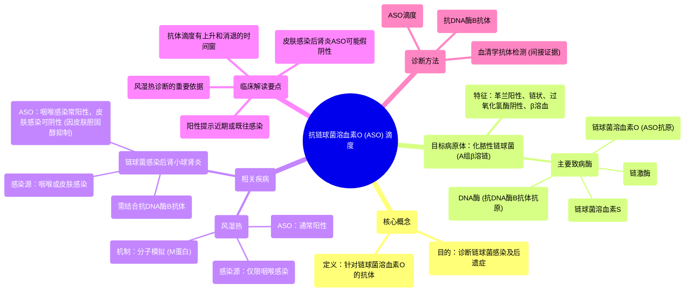

# 84 Antistreptolysin O (ASO) titer for Streptococcus pyogenes (Rheumatic Fever, APSGN) Nephro Labs

  <video controls preload="metadata" playsinline>
    <source src="https://helly.s3.bitiful.net/心血管学科/%E4%B8%93%E8%BE%91%2018%EF%BC%9A%E5%BF%83%E5%86%85%E7%A7%91%E7%BB%88%E6%9E%81%E7%99%BE%E7%A7%91%E8%BE%9E%E5%85%B8%20%28The%20Cardiology%20Encyclopedia%29/84%20Antistreptolysin%20O%20%28ASO%29%20titer%20for%20Streptococcus%20pyogenes%20%28Rheumatic%20Fever%2C%20APSGN%29%20Nephro%20Labs.mp4" type="video/mp4">
    
您的浏览器不支持播放，请升级。

  </video>

::: tip ⚡️ 核心考点 (30s速读)
*   **核心考点**：抗链球菌溶血素O（ASO）滴度是诊断A组β溶血性链球菌（化脓性链球菌）感染后并发症（如风湿热、链球菌感染后肾小球肾炎）的重要血清学指标。
*   **临床意义**：ASO阳性提示近期或既往链球菌感染。在风湿热中通常阳性；在链球菌感染后肾小球肾炎中，若感染源为皮肤（含胆固醇），ASO可能被抑制而呈阴性。
:::

## 🧠 深度精讲

*   **概念1：ASO是什么？**
    ASO（抗链球菌溶血素O抗体）是人体免疫系统针对化脓性链球菌产生的**链球菌溶血素O**（一种破坏红细胞的毒素/酶）所产生的抗体。检测血液中ASO的滴度（浓度），可用于辅助诊断链球菌感染及其相关疾病。

*   **概念2：为什么检测ASO？**
    直接培养分离链球菌有时困难（尤其在感染后期或已使用抗生素后）。ASO作为**间接证据**，通过检测机体产生的特异性抗体，来推断是否存在过链球菌感染。它是诊断风湿热和链球菌感染后肾小球肾炎的重要实验室依据之一。

*   **概念3：ASO结果的临床解读关键点**
    1.  **风湿热**：通常继发于**咽喉感染**。咽喉组织不含胆固醇，因此链球菌溶血素O活性不被抑制，机体能产生强抗体反应，故ASO滴度**通常显著升高**。
    2.  **链球菌感染后肾小球肾炎**：可继发于咽喉或**皮肤感染**。皮肤中含有大量胆固醇，能**不可逆地抑制**链球菌溶血素O的活性。因此，如果肾炎是由皮肤感染引起，患者可能未接触到此毒素，也就不会产生ASO抗体，导致检测结果**可能为阴性**。此时，需结合**抗DNA酶B抗体**等其他血清学指标进行诊断。
    3.  **时间窗**：抗体产生需要时间，通常在感染后1-3周滴度开始上升，3-6周达峰值，可持续数月。因此，单次阴性不能完全排除感染，需动态观察。

*   **概念4：化脓性链球菌的主要致病酶及对应抗体**
    *   **链球菌溶血素O**：溶血，帮助细菌突破血凝块，扩散感染 → 对应抗体：**ASO**。
    *   **链球菌溶血素S**：溶血。
    *   **链激酶**：溶解纤维蛋白，帮助扩散。
    *   **DNA酶**：分解脓液中的DNA，降低粘稠度，帮助扩散 → 对应抗体：**抗DNA酶B抗体**。
    在这些抗体中，**ASO**和**抗DNA酶B抗体**是临床最常用以诊断链球菌感染后并发症的血清学标志物。

## 📚 双语术语表 (Terminology)
| 英文术语 | 中文翻译 | 定义/解释 |
| :--- | :--- | :--- |
| **Antistreptolysin O (ASO) titer** | 抗链球菌溶血素O滴度 | 血清中抗链球菌溶血素O抗体的浓度，用于诊断链球菌感染。 |
| **Streptococcus pyogenes** | 化脓性链球菌 | A组β溶血性链球菌，引起咽炎、皮肤感染等多种疾病。 |
| **Group A Beta-Hemolytic Streptococci (GAS)** | A组β溶血性链球菌 | 化脓性链球菌的另一种称谓，在血琼脂平板上产生完全溶血环。 |
| **Streptolysin O** | 链球菌溶血素O | 化脓性链球菌产生的一种对氧敏感的溶血毒素，是ASO抗体对应的抗原。 |
| **Rheumatic Fever** | 风湿热 | 链球菌咽喉感染后可能发生的自身免疫性疾病，主要累及心脏、关节等。 |
| **Post-Streptococcal Glomerulonephritis (APSGN)** | 链球菌感染后肾小球肾炎 | 链球菌感染（咽部或皮肤）后发生的免疫复合物性肾小球肾炎。 |
| **Anti-DNase B antibody** | 抗DNA酶B抗体 | 针对链球菌DNA酶B的抗体，是诊断链球菌感染（尤其皮肤感染）的另一重要血清学指标。 |
| **Molecular Mimicry** | 分子模拟 | 病原体抗原与宿主自身抗原结构相似，导致免疫系统攻击自身组织，是风湿热等疾病的发病机制。 |
| **Jones Criteria** | 琼斯标准 | 诊断风湿热的一套临床标准，包括主要表现和次要表现。 |

## 🗺️ 知识图谱

