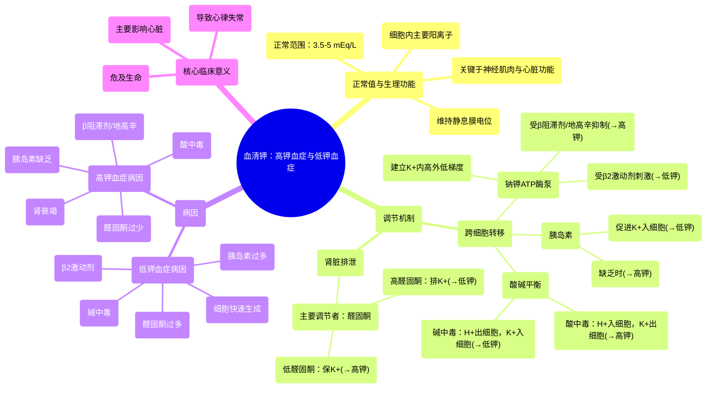

# 85 Serum Potassium - Hyperkalemia & Hypokalemia - Electrolytes Series

  <video controls preload="metadata" playsinline>
    <source src="https://helly.s3.bitiful.net/心血管学科/%E4%B8%93%E8%BE%91%2018%EF%BC%9A%E5%BF%83%E5%86%85%E7%A7%91%E7%BB%88%E6%9E%81%E7%99%BE%E7%A7%91%E8%BE%9E%E5%85%B8%20%28The%20Cardiology%20Encyclopedia%29/85%20Serum%20Potassium%20-%20Hyperkalemia%20%26%20Hypokalemia%20-%20Electrolytes%20Series.mp4" type="video/mp4">
    
您的浏览器不支持播放，请升级。

  </video>

::: tip ⚡️ 核心考点 (30s速读)
*   **核心考点**：血清钾正常范围为3.5-5 mEq/L。钾是维持细胞静息膜电位和可兴奋组织（心肌、神经、肌肉）功能的关键离子。其稳态受钠钾ATP酶、胰岛素、酸碱平衡及醛固酮等多种因素调节。
*   **临床意义**：钾稳态失衡（高钾血症/低钾血症）主要影响心脏，导致致命性心律失常。理解钾离子在细胞内外转移的机制（如酸中毒、胰岛素作用）及肾脏排泄的调节（醛固酮）是诊断和治疗的核心。
:::

## 🧠 深度精讲

*   **血清钾的正常范围与生理功能**：血清钾的正常浓度是 **3.5 至 5 毫当量每升 (mEq/L)**。钾是细胞内最主要的阳离子，其细胞内外浓度梯度（内高外低）主要由 **钠钾ATP酶** 维持。这个泵每消耗一个ATP，就将3个钠离子泵出细胞，同时将2个钾离子泵入细胞，从而建立了细胞内的负电位（静息膜电位）。钾离子对于维持这个电位至关重要，进而直接影响神经冲动的传导、肌肉（包括心肌）的收缩以及细胞的兴奋性。

*   **影响钾分布的关键因素（跨细胞转移）**：
    1.  **胰岛素**：胰岛素能促进钾离子进入细胞。因此，**胰岛素过多**（如胰岛素瘤、外源性胰岛素治疗）可导致 **低钾血症**；而 **胰岛素缺乏**（如未控制的1型糖尿病）则会导致 **高钾血症**。
    2.  **酸碱平衡**：**酸中毒**时，血液中氢离子（H+）增多。为了缓冲，H+会进入细胞，为了维持电中性，细胞内的钾离子会交换到细胞外，导致 **高钾血症**。反之，**碱中毒**时，H+从细胞内移出，钾离子进入细胞，导致 **低钾血症**。助记词：“碱中毒伴低钾（钾流失）”。
    3.  **β-肾上腺素能受体**：**β2受体激动剂**（如沙丁胺醇）能刺激钠钾ATP酶，促进钾进入细胞，引起 **低钾血症**。这一特性可用于紧急治疗高钾血症。相反，**β受体阻滞剂**会抑制该泵，可能导致 **高钾血症**。
    4.  **细胞更新**：任何导致细胞快速生成的情况（如白血病治疗后的肿瘤溶解综合征、再喂养综合征），都需要大量钾离子进入新细胞，可能引起 **低钾血症**。

*   **影响钾排泄的关键因素（肾脏调节）**：
    *   **醛固酮**：这是肾脏排钾的主要调节激素。醛固酮作用于肾远曲小管和集合管，促进 **钠的重吸收** 和 **钾的分泌**。
        *   **醛固酮增多**（如原发性醛固酮增多症/康恩综合征）：导致肾脏排钾和排氢离子增加，结果是 **低钾血症** 和 **代谢性碱中毒**。
        *   **醛固酮减少**（如Addison病）：导致肾脏排钾减少，结果是 **高钾血症**。

*   **临床联系与总结**：
    *   **心脏是首要靶点**：无论是高钾血症还是低钾血症，最危险的后果都是 **心律失常**，因为两者都会严重干扰心肌细胞的电活动。
    *   **诊断思路**：遇到血钾异常时，应系统性地从 **跨细胞转移**（胰岛素、酸碱状态、药物）和 **总钾平衡**（摄入、肾脏排泄——重点考虑醛固酮）两个层面去分析病因。

## 📚 双语术语表 (Terminology)
| 英文术语 | 中文翻译 | 定义/解释 |
| :--- | :--- | :--- |
| Serum Potassium | 血清钾 | 血液中（细胞外液）的钾离子浓度，正常值3.5-5 mEq/L。 |
| Hyperkalemia | 高钾血症 | 血清钾浓度 > 5 mEq/L。 |
| Hypokalemia | 低钾血症 | 血清钾浓度 < 3.5 mEq/L。 |
| Sodium-Potassium ATPase (Pump) | 钠钾ATP酶（泵） | 存在于所有细胞膜上的蛋白质，利用ATP能量将3个Na+泵出细胞，2个K+泵入细胞，建立膜电位。 |
| Aldosterone | 醛固酮 | 肾上腺皮质分泌的激素，主要作用是促进肾脏保钠排钾。 |
| Insulin | 胰岛素 | 胰腺分泌的激素，除调节血糖外，还能促进钾离子进入细胞。 |
| Acidosis / Acidemia | 酸中毒 / 酸血症 | 血液中H+浓度过高或pH值降低的状态，可导致钾离子移出细胞，引起高钾血症。 |
| Alkalosis / Alkalemia | 碱中毒 / 碱血症 | 血液中H+浓度过低或pH值升高的状态，可导致钾离子进入细胞，引起低钾血症。 |
| Beta-2 Agonists | β2受体激动剂 | 一类药物（如沙丁胺醇），能刺激β2受体，激活钠钾泵，导致低钾血症。 |
| Conn Syndrome | 康恩综合征 | 即原发性醛固酮增多症，因肾上腺腺瘤等导致醛固酮自主性分泌过多，表现为高血压、低钾血症和代谢性碱中毒。 |
| Resting Membrane Potential | 静息膜电位 | 细胞在静息状态下，细胞膜内外存在的电位差，通常内负外正，由离子浓度梯度（尤其是K+）维持。 |

## 🗺️ 知识图谱

