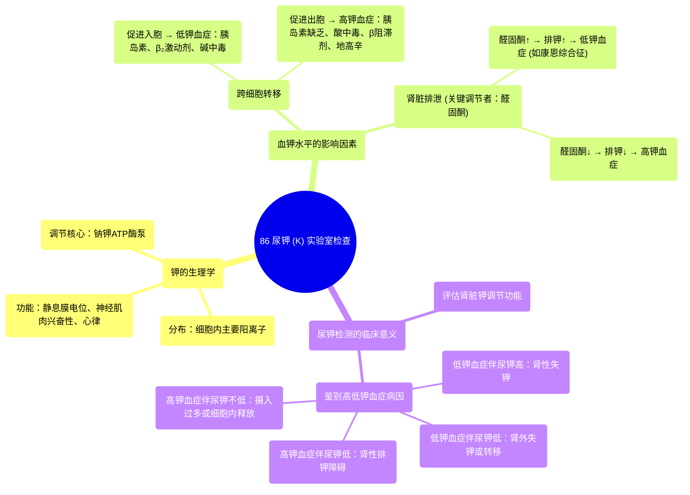

# 86 Urine Potassium (K) Urine Labs

  <video controls preload="metadata" playsinline>
    <source src="https://helly.s3.bitiful.net/心血管学科/%E4%B8%93%E8%BE%91%2018%EF%BC%9A%E5%BF%83%E5%86%85%E7%A7%91%E7%BB%88%E6%9E%81%E7%99%BE%E7%A7%91%E8%BE%9E%E5%85%B8%20%28The%20Cardiology%20Encyclopedia%29/86%20Urine%20Potassium%20%28K%29%20Urine%20Labs.mp4" type="video/mp4">
    
您的浏览器不支持播放，请升级。

  </video>

::: tip ⚡️ 核心考点 (30s速读)
*   **核心考点**：尿钾检测是评估体内钾代谢平衡、鉴别高低钾血症病因（特别是肾性与非肾性）的关键工具。
*   **临床意义**：通过分析尿钾排泄量，可以判断肾脏对钾的调节功能是否正常，从而定位问题根源（如醛固酮异常、肾小管疾病、药物影响等），指导临床治疗。
:::

## 🧠 深度精讲

*   **概念1：钾的生理分布与功能**
    钾是细胞内最主要的阳离子，其浓度在细胞内远高于细胞外（细胞内约150 mmol/L，细胞外液3.5-5.0 mmol/L）。这种浓度梯度主要由细胞膜上的**钠钾ATP酶泵**（Na⁺/K⁺-ATPase）维持，该泵每消耗1个ATP，可将3个钠离子泵出细胞，同时将2个钾离子泵入细胞，从而建立了细胞的静息膜电位（内负外正）。钾对于维持神经肌肉的兴奋性、心脏的正常节律以及细胞多种功能至关重要。

*   **概念2：影响血钾水平的因素**
    血钾水平受多种因素调节，理解这些因素有助于分析尿钾异常的病因：
    1.  **跨细胞转移**：钾在细胞内外的分布是动态的。**胰岛素**、**β₂受体激动剂**（如沙丁胺醇）和**碱中毒**能促进钾进入细胞，导致**低钾血症**；相反，**胰岛素缺乏**（如糖尿病酮症酸中毒）、**β受体阻滞剂**、**酸中毒**和**地高辛中毒**会抑制钾进入细胞或促使钾移出细胞，导致**高钾血症**。
    2.  **肾脏排泄**：肾脏是排钾的主要器官，其调节受**醛固酮**支配。醛固酮作用于肾远曲小管和集合管，促进钠的重吸收和钾、氢离子的分泌。因此，**醛固酮增多症**（如康恩综合征）会导致尿钾排泄增多和低钾血症；而**醛固酮减少症**（如Addison病）则会导致钾排泄减少和高钾血症。

*   **概念3：尿钾检测的临床应用**
    尿钾检测（通常以24小时尿钾排泄量或随机尿钾/肌酐比值表示）的核心价值在于**鉴别高低钾血症的病因**。
    *   **低钾血症时**：如果尿钾排泄量高（>20 mmol/L或24小时尿钾>25 mmol），提示肾脏失钾过多，病因可能为原发性醛固酮增多症、利尿剂使用、肾小管酸中毒等。如果尿钾排泄量低，则提示钾摄入不足、胃肠道丢失（腹泻、呕吐）或钾向细胞内转移。
    *   **高钾血症时**：如果尿钾排泄量低，提示肾脏排钾功能障碍，病因可能为肾功能衰竭、醛固酮减少症或使用保钾利尿剂。如果尿钾排泄量不低，则提示钾摄入过多或从细胞内大量释放（如横纹肌溶解、肿瘤溶解）。

## 📚 双语术语表 (Terminology)
| 英文术语 | 中文翻译 | 定义/解释 |
| :--- | :--- | :--- |
| Sodium Potassium Pump (Na⁺/K⁺-ATPase) | 钠钾泵（钠钾ATP酶） | 存在于所有细胞膜上的蛋白质，通过消耗ATP，主动将3个Na⁺泵出细胞，2个K⁺泵入细胞，维持细胞膜电位和离子梯度。 |
| Hypokalemia | 低钾血症 | 血清钾浓度低于3.5 mmol/L的状态。 |
| Hyperkalemia | 高钾血症 | 血清钾浓度高于5.0 mmol/L的状态。 |
| Aldosterone | 醛固酮 | 肾上腺皮质分泌的一种盐皮质激素，主要作用是促进肾脏远曲小管和集合管对Na⁺的重吸收，同时促进K⁺和H⁺的排泄。 |
| Primary Hyperaldosteronism (Conn‘s Syndrome) | 原发性醛固酮增多症（康恩综合征） | 由于肾上腺腺瘤或增生导致醛固酮自主性分泌过多，临床表现为高血压、低钾血症和代谢性碱中毒。 |
| Metabolic Alkalosis | 代谢性碱中毒 | 一种酸碱平衡紊乱，特征为血液中HCO₃⁻浓度原发性升高，pH值升高。常与低钾血症并存。 |
| Beta-2 Agonists | β₂受体激动剂 | 一类药物（如沙丁胺醇），能激活β₂肾上腺素能受体，常用于治疗哮喘，其副作用之一是刺激钠钾泵，导致低钾血症。 |
| Shift | （钾的）跨细胞转移 | 指钾离子在细胞内液和细胞外液之间的移动，是导致血钾浓度快速变化的重要原因，不涉及体内总钾量的改变。 |

## 🗺️ 知识图谱

