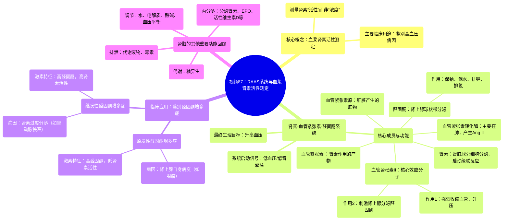

# 87 Renin-Angiotensin-Aldosterone System (RAAS) & Plasma Renin Activity Assay - Labs

  <video controls preload="metadata" playsinline>
    <source src="https://helly.s3.bitiful.net/心血管学科/%E4%B8%93%E8%BE%91%2018%EF%BC%9A%E5%BF%83%E5%86%85%E7%A7%91%E7%BB%88%E6%9E%81%E7%99%BE%E7%A7%91%E8%BE%9E%E5%85%B8%20%28The%20Cardiology%20Encyclopedia%29/87%20Renin-Angiotensin-Aldosterone%20System%20%28RAAS%29%20%26%20Plasma%20Renin%20Activity%20Assay%20-%20Labs.mp4" type="video/mp4">
    
您的浏览器不支持播放，请升级。

  </video>

::: tip ⚡️ 核心考点 (30s速读)
*   **核心考点**：血浆肾素活性测定用于区分原发性与继发性醛固酮增多症，是诊断高血压病因的关键检查。
*   **临床意义**：通过评估肾素-血管紧张素-醛固酮系统的功能状态，帮助定位高血压是源于肾上腺（原发性）还是肾脏等其他部位（继发性），从而指导精准治疗。
:::

## 🧠 深度精讲

*   **血浆肾素活性测定的目的**：该检查并非直接测量血液中肾素的“量”，而是测量其“活性”，即肾素将血管紧张素原转化为血管紧张素I的能力。其主要临床用途是鉴别高血压的病因，特别是区分“原发性醛固酮增多症”（肾上腺自身问题）和“继发性醛固酮增多症”（由肾素过度分泌驱动）。
*   **肾素-血管紧张素-醛固酮系统的核心功能**：这是一个关键的血压调节系统。
    1.  **起点**：肾脏的球旁细胞在感知到肾灌注压下降（如低血压）时，分泌**肾素**。
    2.  **级联反应**：肾素（一种酶）将肝脏产生的**血管紧张素原**（α2球蛋白）切割成**血管紧张素I**。
    3.  **关键转化**：血管紧张素I在肺部等部位的**血管紧张素转化酶**作用下，转化为**血管紧张素II**。
    4.  **双重作用**：血管紧张素II是核心效应分子，作用有二：①直接强烈收缩血管，增加外周阻力；②刺激肾上腺皮质球状带分泌**醛固酮**。
    5.  **醛固酮的作用**：作为盐皮质激素，醛固酮作用于肾脏，实现“保钠保水、排钾排氢”，从而增加血容量和心输出量。
    6.  **最终目标**：通过增加外周阻力和血容量，共同将降低的血压提升回正常水平。因此，**低血压是刺激肾素释放的主要信号**。
*   **原发性 vs. 继发性醛固酮增多症的鉴别思路**：
    *   **原发性**：问题始于肾上腺皮质（如腺瘤），自主性分泌过多醛固酮。高醛固酮导致钠水潴留、高血压，并反馈性抑制肾素分泌。因此，实验室特征为：**高醛固酮、低肾素活性**。
    *   **继发性**：问题始于肾素过度分泌（如肾动脉狭窄、肾素瘤）。高肾素驱动整个RAAS系统活化，导致血管紧张素II和醛固酮继发性升高。因此，实验室特征为：**高醛固酮、高肾素活性**。
    *   **血浆肾素活性测定**正是通过评估肾素在这一病理状态下的活性水平，成为鉴别诊断的关键。

## 📚 双语术语表 (Terminology)
| 英文术语 | 中文翻译 | 定义/解释 |
| :--- | :--- | :--- |
| Renin-Angiotensin-Aldosterone System (RAAS) | 肾素-血管紧张素-醛固酮系统 | 人体调节血压、血容量和电解质平衡的核心内分泌系统。 |
| Plasma Renin Activity (PRA) Assay | 血浆肾素活性测定 | 测量血液中肾素将其底物转化为产物的能力（活性），而非单纯浓度，用于高血压病因诊断。 |
| Renin | 肾素 | 由肾脏球旁细胞分泌的一种蛋白酶，可将血管紧张素原转化为血管紧张素I。 |
| Angiotensinogen | 血管紧张素原 | 主要由肝脏产生的α2球蛋白，是肾素作用的底物。 |
| Angiotensin I | 血管紧张素I | 肾素作用于血管紧张素原产生的十肽，生物活性较弱。 |
| Angiotensin Converting Enzyme (ACE) | 血管紧张素转化酶 | 主要存在于肺血管内皮细胞，能将血管紧张素I转化为具有高度活性的血管紧张素II。 |
| Angiotensin II | 血管紧张素II | RAAS系统的核心效应肽，具有强效缩血管和刺激醛固酮分泌的作用。 |
| Aldosterone | 醛固酮 | 由肾上腺皮质球状带分泌的盐皮质激素，主要作用是保钠排钾、调节水盐平衡。 |
| Primary Hyperaldosteronism (Conn‘s Syndrome) | 原发性醛固酮增多症（康恩综合征） | 因肾上腺皮质自身病变（如腺瘤）导致醛固酮自主性过度分泌的疾病。 |
| Secondary Hyperaldosteronism | 继发性醛固酮增多症 | 由于肾素分泌过多（如肾动脉狭窄），继发性地导致醛固酮水平升高的状态。 |
| Juxtaglomerular Cells | （肾小球）球旁细胞 | 位于肾小球入球小动脉壁上的特化细胞，是肾素的合成和分泌部位。 |
| Mineralocorticoid | 盐皮质激素 | 一类主要调节电解质（尤其是钠、钾）平衡的肾上腺皮质激素，如醛固酮。 |
| Zona Glomerulosa | （肾上腺皮质）球状带 | 肾上腺皮质的最外层，是合成和分泌醛固酮的部位。 |

## 🗺️ 知识图谱

