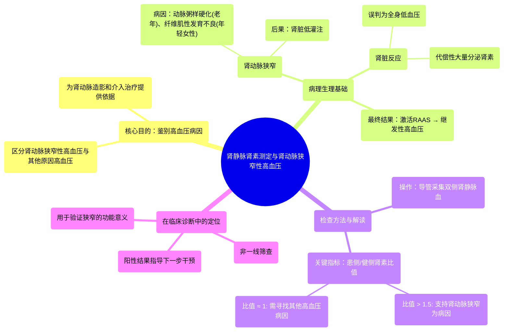

# 88 Renal vein renin assay - Hypertension and Renal artery stenosis - Nephrology

  <video controls preload="metadata" playsinline>
    <source src="https://helly.s3.bitiful.net/心血管学科/%E4%B8%93%E8%BE%91%2018%EF%BC%9A%E5%BF%83%E5%86%85%E7%A7%91%E7%BB%88%E6%9E%81%E7%99%BE%E7%A7%91%E8%BE%9E%E5%85%B8%20%28The%20Cardiology%20Encyclopedia%29/88%20Renal%20vein%20renin%20assay%20-%20Hypertension%20and%20Renal%20artery%20stenosis%20-%20Nephrology.mp4" type="video/mp4">
    
您的浏览器不支持播放，请升级。

  </video>

::: tip ⚡️ 核心考点 (30s速读)
*   **核心考点**：肾静脉肾素测定用于鉴别高血压是否由**肾动脉狭窄**引起。通过比较双侧肾静脉的肾素水平，若患侧与健侧比值>1.5，则支持诊断。
*   **临床意义**：该检查是诊断**肾血管性高血压**的关键功能学证据，能区分影像学发现的狭窄是否具有血流动力学意义，从而指导后续治疗（如是否需要血管造影或手术）。
:::

## 🧠 深度精讲

*   **概念1：肾静脉肾素测定的原理与目的**
    肾动脉狭窄时，患侧肾脏血流灌注减少，会误以为全身血压过低，从而代偿性地**大量分泌肾素**，试图通过肾素-血管紧张素-醛固酮系统来升高血压，导致继发性高血压。肾静脉肾素测定的核心目的，就是**直接测量并比较双侧肾脏分泌肾素的量**。如果患侧肾静脉中的肾素水平显著高于健侧，就证明该侧肾脏是“过度活跃”的肾素分泌源，从而证实其高血压是由该侧肾动脉狭窄引起的。

*   **概念2：检查方法与结果解读**
    1.  **操作方法**：在X线引导下，将导管分别置入**左肾静脉**和**右肾静脉**，直接抽取血液样本。
    2.  **测量与计算**：分别测定两个样本中的肾素浓度。
    3.  **关键比值**：计算**患侧肾素 / 健侧肾素**的比值。
        *   **比值 > 1.5**：具有诊断意义，表明患侧肾脏肾素分泌显著增多，支持肾动脉狭窄是高血压的病因。
        *   **比值 ≈ 1**：双侧肾素水平无显著差异，提示影像学上看到的狭窄可能不是当前高血压的主要原因，需要寻找其他病因。

*   **概念3：在诊断流程中的定位**
    肾静脉肾素测定并非一线筛查工具。通常，当患者存在难以控制的高血压、腹部血管杂音或影像学（如超声）提示肾动脉狭窄时，进行此项检查。它是一个**功能确认性检查**，用于回答“这个狭窄是否真的导致了高血压？”这个问题。阳性结果是进行有创的**肾动脉造影**和考虑血管成形术等介入治疗的重要依据。

## 📚 双语术语表 (Terminology)
| 英文术语 | 中文翻译 | 定义/解释 |
| :--- | :--- | :--- |
| Renal vein renin assay | 肾静脉肾素测定 | 通过导管分别采集双侧肾静脉血，测量并比较肾素水平，用于诊断肾血管性高血压的检查。 |
| Renal artery stenosis | 肾动脉狭窄 | 肾动脉管腔变窄，导致肾脏血流灌注减少。是继发性高血压的常见原因之一。 |
| Secondary hypertension | 继发性高血压 | 由特定疾病或病因（如肾动脉狭窄、原发性醛固酮增多症）引起的高血压。 |
| Renin | 肾素 | 由肾脏球旁细胞分泌的一种酶/激素，是肾素-血管紧张素-醛固酮系统的启动因子，核心功能是升高血压。 |
| Bruit (Bluit) | 血管杂音 | 血液流经狭窄血管时产生湍流所听到的异常声音。在肾动脉狭窄患者腹部有时可用听诊器闻及。 |
| Renin-angiotensin-aldosterone system (RAAS) | 肾素-血管紧张素-醛固酮系统 | 人体调节血压、血容量和电解质平衡的核心内分泌系统。肾素是其启动的关键。 |
| Fibromuscular dysplasia | 纤维肌性发育不良 | 一种非动脉粥样硬化性的血管疾病，常导致年轻女性肾动脉狭窄。 |
| Renal arteriography | 肾动脉造影 | 诊断肾动脉狭窄的“金标准”影像学检查，通过注入造影剂直接显示肾动脉形态，并可同时进行介入治疗。 |

## 🗺️ 知识图谱

