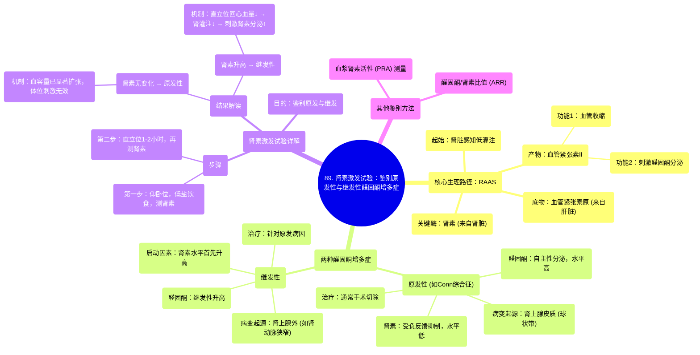

# 89 Renin Stimulation Test for Hyperaldosteronism - Primary Conn vs Secondary - Physiology Labs

  <video controls preload="metadata" playsinline>
    <source src="https://helly.s3.bitiful.net/心血管学科/%E4%B8%93%E8%BE%91%2018%EF%BC%9A%E5%BF%83%E5%86%85%E7%A7%91%E7%BB%88%E6%9E%81%E7%99%BE%E7%A7%91%E8%BE%9E%E5%85%B8%20%28The%20Cardiology%20Encyclopedia%29/89%20Renin%20Stimulation%20Test%20for%20Hyperaldosteronism%20-%20Primary%20Conn%20vs%20Secondary%20-%20Physiology%20Labs.mp4" type="video/mp4">
    
您的浏览器不支持播放，请升级。

  </video>

::: tip ⚡️ 核心考点 (30s速读)
*   **核心考点**：肾素激发试验通过比较患者仰卧位与直立位时的血浆肾素活性变化，来鉴别原发性与继发性醛固酮增多症。
*   **临床意义**：原发性醛固酮增多症（如Conn综合征）患者因醛固酮自主性分泌过多，肾素被抑制，体位改变无法有效刺激肾素分泌；而继发性醛固酮增多症患者肾素水平受血容量调节，体位改变（如站立）可刺激肾素分泌增加。
:::

## 🧠 深度精讲

*   **概念1：肾素-血管紧张素-醛固酮系统（RAAS）的生理与病理**
    *   **生理路径**：肾脏感知低灌注（如低血压）→ 分泌肾素 → 将肝脏产生的血管紧张素原转化为血管紧张素I → 转化为血管紧张素II → 产生两种效应：1) 血管收缩；2) 刺激肾上腺皮质球状带分泌醛固酮 → 醛固酮促进肾脏重吸收钠和水、排泄钾和氢离子 → 增加血容量和血压。
    *   **病理区分**：
        *   **原发性醛固酮增多症**：病变始于肾上腺皮质（肿瘤或增生），导致醛固酮自主性、过量分泌。高醛固酮通过负反馈抑制肾素分泌，因此肾素水平**低**。
        *   **继发性醛固酮增多症**：病变始于肾上腺之外（如肾动脉狭窄、心力衰竭等），导致肾素分泌**增加**，进而继发性地刺激醛固酮分泌增多。

*   **概念2：肾素激发试验的操作与解读**
    *   **操作步骤**：
        1.  **第一步（仰卧位）**：患者平卧，保持低盐饮食，测量基础血浆肾素活性。
        2.  **第二步（直立位）**：患者站立或坐直1-2小时（仍保持低盐饮食），再次测量血浆肾素活性。
    *   **结果解读**：
        *   **阳性（肾素无显著增加）**：提示**原发性醛固酮增多症**。因为患者血容量已因醛固酮过量而显著扩张，肾脏灌注充足，体位改变不足以有效刺激肾素分泌。
        *   **阳性（肾素显著增加）**：提示**继发性醛固酮增多症**。因为血容量扩张不严重，站立时回心血量减少导致肾脏灌注下降，从而刺激肾素分泌增加。

*   **概念3：鉴别诊断与治疗思路**
    *   **鉴别方法**：除了肾素激发试验，还可测量血浆肾素活性本身（原发性者低，继发性者高）或计算醛固酮/肾素比值（ARR）。
    *   **治疗原则**：
        *   **原发性**：通常为肾上腺腺瘤，首选手术治疗（肾上腺切除术）。
        *   **继发性**：需首先明确并治疗原发病因（如纠正肾动脉狭窄、治疗心衰等）。

## 📚 双语术语表 (Terminology)
| 英文术语 | 中文翻译 | 定义/解释 |
| :--- | :--- | :--- |
| Renin Stimulation Test | 肾素激发试验 | 通过改变体位（从卧到立）来评估肾素分泌反应，用于鉴别醛固酮增多症类型的试验。 |
| Primary Hyperaldosteronism (Conn Syndrome) | 原发性醛固酮增多症（康恩综合征） | 由于肾上腺皮质自身病变（如腺瘤或增生）导致醛固酮自主性分泌过多引起的疾病。 |
| Secondary Hyperaldosteronism | 继发性醛固酮增多症 | 由于肾上腺以外的原因（如肾动脉狭窄、心衰）导致肾素分泌增加，继而刺激醛固酮分泌过多的疾病。 |
| Plasma Renin Activity (PRA) | 血浆肾素活性 | 测量血液中肾素催化产生血管紧张素I的速率，是评估肾素系统活性的指标。 |
| Aldosterone | 醛固酮 | 由肾上腺皮质球状带分泌的激素，主要作用是保钠排钾、调节水盐平衡和血压。 |
| Renin-Angiotensin-Aldosterone System (RAAS) | 肾素-血管紧张素-醛固酮系统 | 机体调节血压、血容量和电解质平衡的关键激素系统。 |
| Zona Glomerulosa | 球状带 | 肾上腺皮质的最外层，是合成和分泌醛固酮的部位。 |
| Angiotensin II | 血管紧张素II | RAAS中的关键效应肽，具有强效缩血管和刺激醛固酮分泌的作用。 |

## 🗺️ 知识图谱

