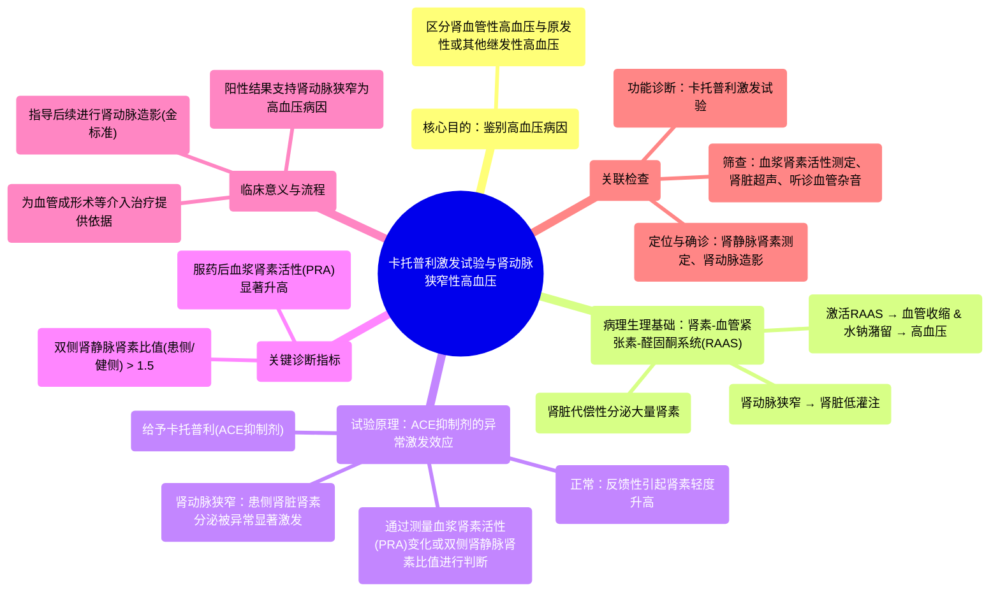

# 90 ACE Inhibitor Stimulation Test (Captopril Stimulation Test) - Renal Artery Stenosis - Hypertension

  <video controls preload="metadata" playsinline>
    <source src="https://helly.s3.bitiful.net/心血管学科/%E4%B8%93%E8%BE%91%2018%EF%BC%9A%E5%BF%83%E5%86%85%E7%A7%91%E7%BB%88%E6%9E%81%E7%99%BE%E7%A7%91%E8%BE%9E%E5%85%B8%20%28The%20Cardiology%20Encyclopedia%29/90%20ACE%20Inhibitor%20Stimulation%20Test%20%28Captopril%20Stimulation%20Test%29%20-%20Renal%20Artery%20Stenosis%20-%20Hypertension.mp4" type="video/mp4">
    
您的浏览器不支持播放，请升级。

  </video>

::: tip ⚡️ 核心考点 (30s速读)
*   **核心考点**：卡托普利激发试验（ACE抑制剂激发试验）用于鉴别诊断高血压的病因是否为肾动脉狭窄。其原理是，在肾动脉狭窄患者中，服用卡托普利后，狭窄侧肾脏的肾素分泌会受到异常“激发”，导致血浆肾素活性（PRA）显著升高。
*   **临床意义**：该试验是诊断肾血管性高血压（继发性高血压的一种）的重要功能学检查，有助于区分高血压是由肾动脉狭窄引起，还是由其他原因（如原发性高血压、原发性醛固酮增多症）引起，从而指导后续治疗（如血管成形术）。
:::

## 🧠 深度精讲

*   **概念1：试验目的与背景**
    本试验的核心目标是**鉴别高血压的病因**。当患者被怀疑患有肾动脉狭窄（RAS）时，影像学（如超声）可能发现动脉变窄，听诊可能闻及血管杂音（bruit），但这些发现并不能直接证明高血压就是由这个狭窄引起的。卡托普利激发试验作为一种功能学检查，通过观察药物干预后肾素-血管紧张素-醛固酮系统（RAAS）的反应，来验证狭窄是否在功能上导致了高血压。

*   **概念2：病理生理学基础**
    理解本试验的关键在于掌握肾动脉狭窄如何引发高血压（即肾血管性高血压）：
    1.  **狭窄导致低灌注**：肾动脉狭窄使流经肾脏的血流减少，肾脏“感知”为全身血压过低（尽管体循环血压可能已升高）。
    2.  **肾素异常分泌**：肾脏（特别是狭窄侧的肾脏）的球旁细胞会代偿性地**大量分泌肾素**，试图提升血压。
    3.  **RAAS系统激活**：肾素将肝脏产生的血管紧张素原转化为血管紧张素I，后者在肺内经血管紧张素转化酶（ACE）作用转化为血管紧张素II。
    4.  **血压升高**：血管紧张素II通过**强烈收缩血管**和**刺激肾上腺分泌醛固酮**（导致水钠潴留）两种机制，使血压升高。

*   **概念3：试验原理与操作**
    1.  **药物作用**：卡托普利是一种ACE抑制剂。正常情况下，它通过抑制血管紧张素II的生成来降低血压，并反馈性地引起肾素水平代偿性升高（因为负反馈被解除）。
    2.  **异常反应**：在单侧肾动脉狭窄患者中，狭窄侧肾脏的肾素分泌已处于被“过度驱动”的状态。服用卡托普利后，全身血压下降会进一步**强烈刺激**狭窄侧肾脏分泌肾素，而健侧肾脏的肾素分泌则可能被抑制。
    3.  **结果判读**：通过比较服药前后血浆肾素活性（PRA）的变化，或比较双侧肾静脉肾素水平（如结合肾静脉肾素测定），若出现**显著不对称的肾素分泌**（例如，患侧与健侧肾静脉肾素比值 > 1.5），则强烈支持高血压由该侧肾动脉狭窄引起。

*   **概念4：与其他检查的关系**
    *   **血浆肾素活性（PRA）测定**：是评估RAAS系统活性的基础检查，用于筛查继发性高血压（如原发性醛固酮增多症的鉴别）。
    *   **肾静脉肾素测定**：是诊断肾动脉狭窄的“金标准”之一，通过直接测量双侧肾静脉的肾素水平来定位病变侧别，但属于有创检查。
    *   **卡托普利激发试验**：常与PRA测定结合，作为无创或微创的功能性筛查和确认试验。阳性结果可为进一步行有创的**肾动脉造影**（诊断的金标准）和可能的血管介入治疗提供有力依据。

## 📚 双语术语表 (Terminology)
| 英文术语 | 中文翻译 | 定义/解释 |
| :--- | :--- | :--- |
| Captopril Stimulation Test | 卡托普利激发试验 | 通过给予ACE抑制剂卡托普利，观察血浆肾素活性变化，以诊断肾血管性高血压的功能学试验。 |
| Renal Artery Stenosis (RAS) | 肾动脉狭窄 | 一侧或双侧肾动脉主干或主要分支的狭窄，是导致继发性高血压的常见原因。 |
| Secondary Hypertension | 继发性高血压 | 由特定疾病或病因（如肾动脉狭窄、嗜铬细胞瘤等）引起的高血压。 |
| Renin | 肾素 | 由肾脏球旁细胞分泌的一种酶，是肾素-血管紧张素-醛固酮系统（RAAS）的启动因子。 |
| Plasma Renin Activity (PRA) | 血浆肾素活性 | 测量血浆中肾素将其底物转化为血管紧张素I的速率，是反映RAAS活性的指标。 |
| Renal Vein Renin Assay | 肾静脉肾素测定 | 通过导管分别采集双侧肾静脉血样测量肾素水平，用于定位诊断肾动脉狭窄。 |
| Angiotensin II | 血管紧张素II | RAAS系统中的关键效应肽，具有强效缩血管和刺激醛固酮分泌的作用。 |
| Aldosterone | 醛固酮 | 由肾上腺皮质球状带分泌的激素，主要作用是促进肾脏远曲小管和集合管对钠和水的重吸收。 |
| Bruit | 血管杂音 | 血液流经狭窄血管时产生湍流，用听诊器可在相应体表听到的吹风样或喷射样声音。 |
| Fibromuscular Dysplasia | 纤维肌性发育不良 | 一种非动脉粥样硬化性、非炎症性的血管疾病，是年轻女性肾动脉狭窄的常见原因。 |

## 🗺️ 知识图谱

