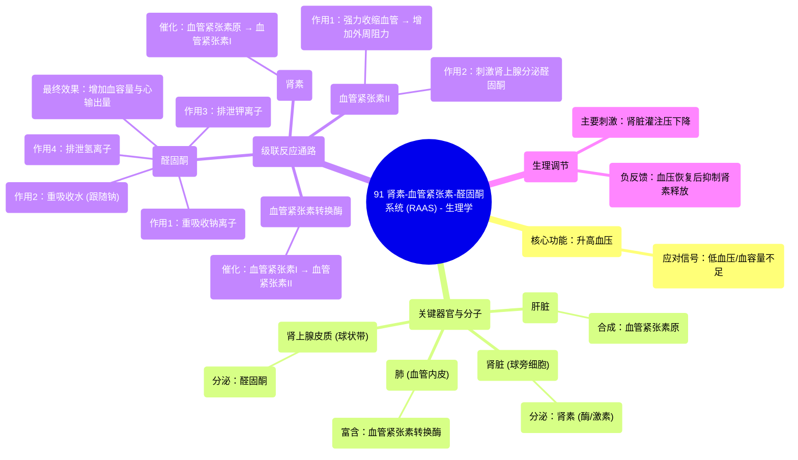

# 91 Renin Angiotensin Aldosterone System (RAAS) - Physiology

  <video controls preload="metadata" playsinline>
    <source src="https://helly.s3.bitiful.net/心血管学科/%E4%B8%93%E8%BE%91%2018%EF%BC%9A%E5%BF%83%E5%86%85%E7%A7%91%E7%BB%88%E6%9E%81%E7%99%BE%E7%A7%91%E8%BE%9E%E5%85%B8%20%28The%20Cardiology%20Encyclopedia%29/91%20Renin%20Angiotensin%20Aldosterone%20System%20%28RAAS%29%20-%20Physiology.mp4" type="video/mp4">
    
您的浏览器不支持播放，请升级。

  </video>

::: tip ⚡️ 核心考点 (30s速读)
*   **核心考点**：肾素-血管紧张素-醛固酮系统是人体调节血压和体液平衡的核心内分泌轴。其核心功能是**升高血压**，以应对低血压或血容量不足。
*   **临床意义**：RAAS过度激活是高血压、心力衰竭、肾脏疾病等的重要病理生理机制。血管紧张素转换酶抑制剂、血管紧张素II受体拮抗剂等药物通过阻断此系统发挥治疗作用。
:::

## 🧠 深度精讲

*   **系统总览**：肾素-血管紧张素-醛固酮系统是一个由肝脏、肾脏、肺和肾上腺皮质协同工作的激素级联反应系统。其核心启动信号是**低血压**，最终通过**血管收缩**和**水钠重吸收**两种机制来提升血压。
*   **关键组分与功能**：
    1.  **肾素**：由肾脏**球旁细胞**分泌。它既是**激素**（分泌入血），也是**酶**（催化反应）。其释放的主要刺激是肾脏灌注压下降（如低血压、血容量不足）。
    2.  **血管紧张素原**：由**肝脏**合成的α-2球蛋白，是RAAS的底物。
    3.  **血管紧张素转换酶**：主要存在于**肺**血管内皮，将血管紧张素I转化为具有活性的血管紧张素II。
    4.  **血管紧张素II**：系统的核心效应分子，具有两大作用：**①强烈收缩血管，增加外周阻力；②刺激肾上腺皮质球状带分泌醛固酮**。
    5.  **醛固酮**：由肾上腺皮质**球状带**分泌的**盐皮质激素**。其四大生理作用是：**重吸收钠离子、重吸收水、排泄钾离子、排泄氢离子**。通过增加细胞外液容量来提升血压。
*   **生理调节与意义**：当血压下降时，肾脏感知到灌注减少，球旁细胞释放肾素，从而启动整个RAAS。血管紧张素II的血管收缩作用直接、快速地升高血压；而醛固酮通过保钠保水，增加血容量和心输出量，从而更持久地维持血压。这是一个典型的负反馈调节系统，旨在将血压恢复至正常水平。

## 📚 双语术语表 (Terminology)
| 英文术语 | 中文翻译 | 定义/解释 |
| :--- | :--- | :--- |
| Renin | 肾素 | 由肾脏球旁细胞分泌的蛋白水解酶，可将血管紧张素原转化为血管紧张素I，是RAAS的启动关键。 |
| Angiotensinogen | 血管紧张素原 | 由肝脏合成的血浆蛋白（α-2球蛋白），是肾素的作用底物。 |
| Angiotensin Converting Enzyme (ACE) | 血管紧张素转换酶 | 主要存在于肺血管内皮的酶，能将血管紧张素I转化为具有高度活性的血管紧张素II。 |
| Angiotensin II | 血管紧张素II | RAAS的核心效应肽，能强力收缩血管并刺激醛固酮分泌。 |
| Aldosterone | 醛固酮 | 由肾上腺皮质球状带分泌的类固醇激素（盐皮质激素），主要功能是保钠排钾。 |
| Juxtaglomerular Cells | 球旁细胞 | 位于肾小球入球小动脉壁上的特化细胞，是肾素的合成与分泌部位。 |
| Zona Glomerulosa | 球状带 | 肾上腺皮质的最外层，是合成和分泌醛固酮的部位。 |
| Mineralocorticoid | 盐皮质激素 | 一类主要调节电解质（尤其是钠、钾）平衡的肾上腺皮质激素，醛固酮是其主要代表。 |

## 🗺️ 知识图谱

