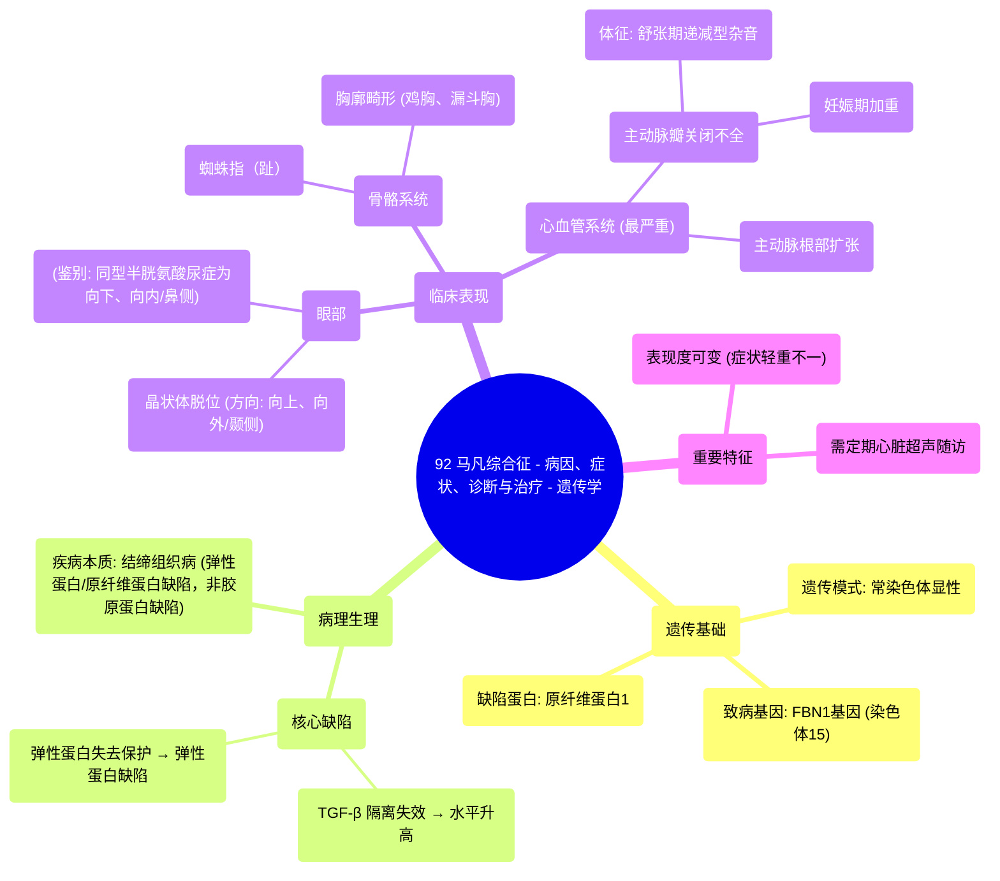

# 92 Marfan Syndrome - Causes, Symptoms, Diagnosis, and Treatment - Genetics

  <video controls preload="metadata" playsinline>
    <source src="https://helly.s3.bitiful.net/心血管学科/%E4%B8%93%E8%BE%91%2018%EF%BC%9A%E5%BF%83%E5%86%85%E7%A7%91%E7%BB%88%E6%9E%81%E7%99%BE%E7%A7%91%E8%BE%9E%E5%85%B8%20%28The%20Cardiology%20Encyclopedia%29/92%20Marfan%20Syndrome%20-%20Causes%2C%20Symptoms%2C%20Diagnosis%2C%20and%20Treatment%20-%20Genetics.mp4" type="video/mp4">
    
您的浏览器不支持播放，请升级。

  </video>

::: tip ⚡️ 核心考点 (30s速读)
*   **核心考点**：马凡综合征是一种常染色体显性遗传的结缔组织病，由15号染色体上的FBN1基因突变导致原纤维蛋白1缺陷，进而引起转化生长因子β水平升高和弹性蛋白受损。
*   **临床意义**：典型表现为蜘蛛指（趾）、晶状体向上向外脱位、主动脉根部扩张（可致主动脉瓣关闭不全）。需与同型半胱氨酸尿症（晶状体向下向内脱位）鉴别。妊娠会加重心血管负担，需定期超声心动图监测。
:::

## 🧠 深度精讲

*   **遗传模式与分子机制**：马凡综合征以常染色体显性方式遗传，父母一方患病，子女有50%的患病风险。致病基因位于15号染色体，编码**原纤维蛋白1**。该蛋白有两个关键功能：一是隔离（抑制）**转化生长因子β**；二是覆盖并保护弹性蛋白。基因突变导致原纤维蛋白1功能丧失，造成TGF-β水平失控性升高和弹性蛋白缺陷，从而引发全身结缔组织病变。
*   **主要临床表现**：
    1.  **骨骼系统**：特征性的**蜘蛛指（趾）**，以及胸廓畸形（如鸡胸、漏斗胸）。
    2.  **眼部**：**晶状体脱位**，典型方向是**向上和向外**（颞侧）。这与同型半胱氨酸尿症的晶状体**向下和向内**（鼻侧）脱位正好相反，是重要的鉴别点。
    3.  **心血管系统**：最严重且危及生命的并发症是**主动脉根部扩张**。扩张导致主动脉瓣瓣叶对合不良，引起**主动脉瓣关闭不全**（血液舒张期反流回左心室），听诊可闻及舒张期递减型杂音。妊娠期血容量增加会加重心脏负担，使病情恶化。
*   **重要概念辨析**：
    *   **表现度可变**：即使携带相同突变，不同患者的症状严重程度（从轻微到严重）也可能差异很大。
    *   **疾病本质**：马凡综合征是**弹性蛋白**和**原纤维蛋白**缺陷，**而非胶原蛋白缺陷**。胶原蛋白缺陷见于成骨不全症、埃勒斯-当洛斯综合征等疾病。

## 📚 双语术语表 (Terminology)
| 英文术语 | 中文翻译 | 定义/解释 |
| :--- | :--- | :--- |
| Marfan Syndrome | 马凡综合征 | 一种常染色体显性遗传的结缔组织疾病，主要累及骨骼、眼和心血管系统。 |
| Autosomal Dominant | 常染色体显性遗传 | 一种遗传方式，只需从父母一方继承一个突变基因即可患病。 |
| FBN1 Gene | FBN1基因 | 位于15号染色体，编码原纤维蛋白1的基因。该基因突变是马凡综合征的主要病因。 |
| Fibrillin 1 | 原纤维蛋白1 | 一种细胞外基质蛋白，功能包括隔离TGF-β和保护弹性蛋白。 |
| TGF-β (Transforming Growth Factor Beta) | 转化生长因子β | 一种细胞因子。在马凡综合征中，由于原纤维蛋白1缺陷，其活性不受控制地升高，导致组织异常。 |
| Elastin | 弹性蛋白 | 结缔组织中赋予组织弹性的蛋白质。在马凡综合征中因失去原纤维蛋白1的保护而受损。 |
| Arachnodactyly | 蜘蛛指（趾） | 手指和脚趾异常细长，状如蜘蛛足，是马凡综合征的典型体征。 |
| Lens Subluxation/Dislocation | 晶状体半脱位/脱位 | 晶状体离开其正常位置。马凡综合征典型为向上、向外（颞侧）脱位。 |
| Aortic Root Dilatation | 主动脉根部扩张 | 主动脉起始部病理性增宽，是马凡综合征最危险的心血管并发症，可导致主动脉瓣关闭不全或主动脉夹层。 |
| Aortic Regurgitation/Insufficiency | 主动脉瓣关闭不全/反流 | 主动脉瓣无法完全闭合，导致舒张期血液从主动脉反流回左心室。 |
| Variable Expressivity | 表现度可变 | 指携带相同基因突变的个体，其疾病症状的严重程度存在差异。 |

## 🗺️ 知识图谱

