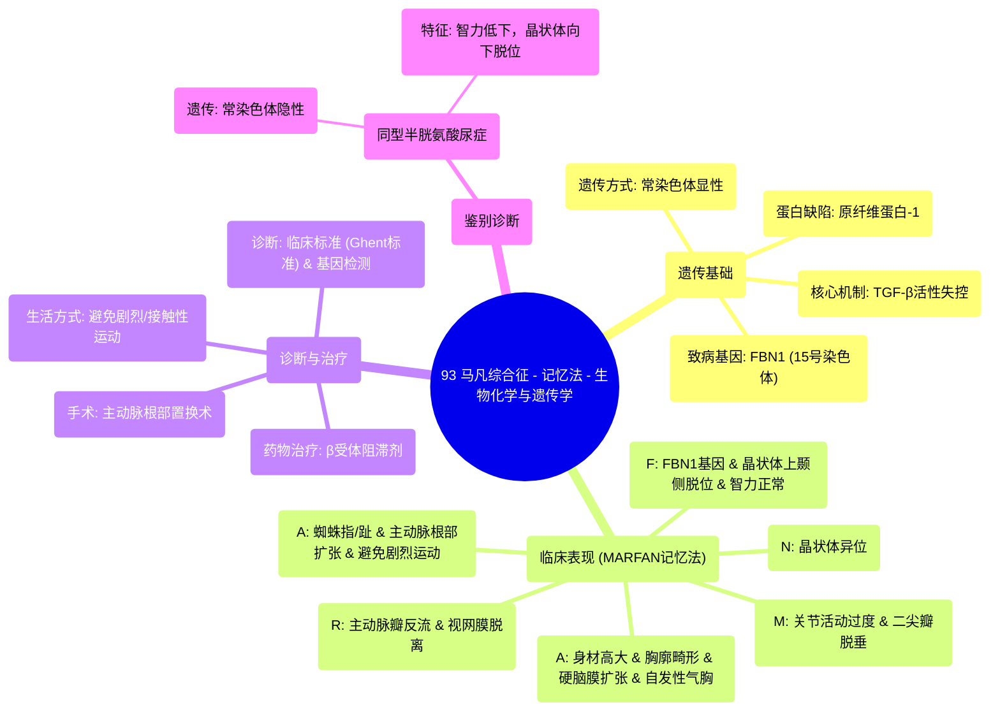

# 93 Marfan Syndrome - with a Mnemonic - Biochemistry and Genetics

  <video controls preload="metadata" playsinline>
    <source src="https://helly.s3.bitiful.net/心血管学科/%E4%B8%93%E8%BE%91%2018%EF%BC%9A%E5%BF%83%E5%86%85%E7%A7%91%E7%BB%88%E6%9E%81%E7%99%BE%E7%A7%91%E8%BE%9E%E5%85%B8%20%28The%20Cardiology%20Encyclopedia%29/93%20Marfan%20Syndrome%20-%20with%20a%20Mnemonic%20-%20Biochemistry%20and%20Genetics.mp4" type="video/mp4">
    
您的浏览器不支持播放，请升级。

  </video>

::: tip ⚡️ 核心考点 (30s速读)
*   **核心考点**：马凡综合征是一种常染色体显性遗传的结缔组织病，由15号染色体上的FBN1基因突变导致原纤维蛋白-1缺陷，进而引起转化生长因子-β（TGF-β）活性失控。
*   **临床意义**：典型表现为身材高大、四肢细长、晶状体向上颞侧脱位、主动脉根部扩张/夹层、二尖瓣脱垂。需避免剧烈运动，可使用β受体阻滞剂降低心血管风险。
:::

## 🧠 深度精讲

*   **遗传与分子机制**：马凡综合征是**常染色体显性遗传**病，具有**可变表现度**。致病基因位于**15号染色体**，名为**FBN1**。该基因编码**原纤维蛋白-1**，其主要功能之一是**隔离转化生长因子-β（TGF-β）**。当原纤维蛋白-1缺陷时，TGF-β活性失控，血清中TGF-β水平升高，导致全身结缔组织异常。
*   **临床表现（记忆法：MARFAN）**：
    *   **M**：**关节活动过度**；**二尖瓣脱垂**（可产生收缩期杂音）。
    *   **A**：**蜘蛛指/趾**；**主动脉根部扩张**（导致主动脉瓣反流，产生舒张期递减型杂音，常伴脉压增宽）；**避免剧烈运动**。
    *   **R**：**主动脉瓣反流杂音**；**视网膜脱离**。
    *   **F**：**FBN1基因突变**（15号染色体）；**原纤维蛋白-1缺陷**；**TGF-β升高**；**晶状体向上、颞侧脱位**（脱位方向形似字母“F”）；**智力正常**。
    *   **A**：**身材高大**；**鸡胸/漏斗胸**；**多发疝**；**硬脑膜扩张**；**肺尖肺大泡/自发性气胸**；**近视**。
    *   **N**：**晶状体异位**（即晶状体脱位/半脱位）。
*   **诊断与治疗**：诊断基于临床特征（Ghent标准）和基因检测。治疗核心是**心血管监测与管理**，包括定期心脏超声检查、使用**β受体阻滞剂**以减缓主动脉扩张、避免**举重和接触性运动**。严重主动脉根部扩张或夹层需手术干预。
*   **鉴别诊断**：需与**同型半胱氨酸尿症**鉴别，后者也可有晶状体脱位和骨骼异常，但通常伴有**智力低下**，且晶状体脱位方向多为**向下**，为常染色体隐性遗传。

## 📚 双语术语表 (Terminology)
| 英文术语 | 中文翻译 | 定义/解释 |
| :--- | :--- | :--- |
| Marfan Syndrome | 马凡综合征 | 一种常染色体显性遗传的结缔组织病，主要累及骨骼、眼和心血管系统。 |
| Autosomal Dominant | 常染色体显性遗传 | 一种遗传方式，只要从父母一方继承一个突变基因即可患病。 |
| FBN1 Gene | FBN1基因 | 位于15号染色体，编码原纤维蛋白-1的基因，其突变是马凡综合征的病因。 |
| Fibrillin-1 | 原纤维蛋白-1 | 细胞外基质微纤维的主要成分，对结缔组织弹性和TGF-β信号调节至关重要。 |
| TGF-beta | 转化生长因子-β | 一种细胞因子，其活性在马凡综合征中因原纤维蛋白-1缺陷而失控，导致组织异常。 |
| Ectopia Lentis | 晶状体异位 | 晶状体脱离其正常位置，在马凡综合征中典型为向上、颞侧脱位。 |
| Aortic Root Dilatation | 主动脉根部扩张 | 主动脉起始部病理性增宽，是马凡综合征最常见且危险的心血管表现，可导致反流、夹层或破裂。 |
| Aortic Dissection | 主动脉夹层 | 主动脉壁内膜撕裂，血液进入动脉壁中层形成剥离性血肿，是危及生命的急症。 |
| Mitral Valve Prolapse | 二尖瓣脱垂 | 二尖瓣瓣叶在收缩期向左心房膨出，常伴反流，在马凡综合征中常见。 |
| Arachnodactyly | 蜘蛛指/趾 | 手指和脚趾异常细长，形似蜘蛛足。 |
| Pectus Excavatum / Carinatum | 漏斗胸 / 鸡胸 | 胸骨向内凹陷或向外凸起的畸形。 |
| Dural Ectasia | 硬脑膜扩张 | 脊髓硬脊膜囊的扩张，常见于腰骶部。 |
| Beta-blockers | β受体阻滞剂 | 一类药物，用于马凡综合征患者以降低心率、心肌收缩力，从而减缓主动脉扩张进程。 |
| Variable Expressivity | 可变表现度 | 指携带相同致病基因的个体，其临床表现的严重程度和类型存在差异。 |

## 🗺️ 知识图谱

