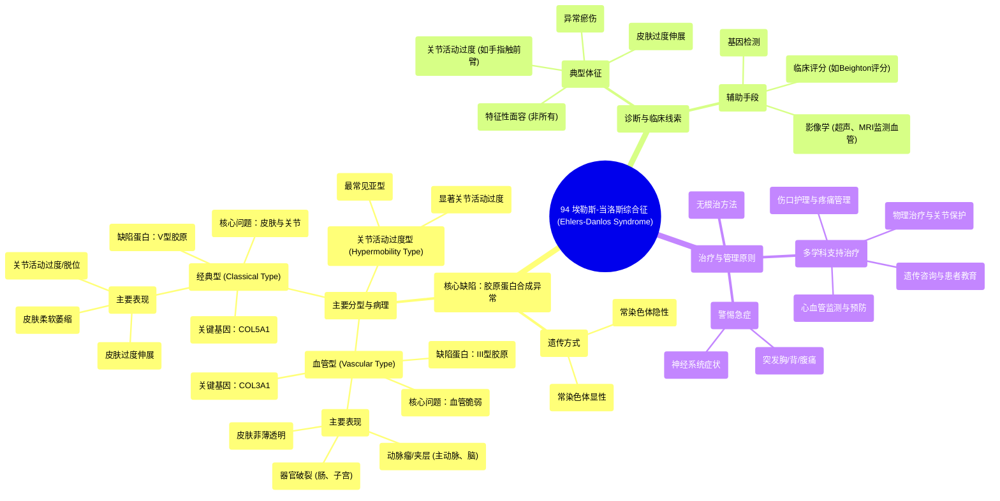

# 94 Ehlers-Danlos Syndrome - Causes, Symptoms, Diagnosis, and Treatment - Biochemistry & Genetics

  <video controls preload="metadata" playsinline>
    <source src="https://helly.s3.bitiful.net/心血管学科/%E4%B8%93%E8%BE%91%2018%EF%BC%9A%E5%BF%83%E5%86%85%E7%A7%91%E7%BB%88%E6%9E%81%E7%99%BE%E7%A7%91%E8%BE%9E%E5%85%B8%20%28The%20Cardiology%20Encyclopedia%29/94%20Ehlers-Danlos%20Syndrome%20-%20Causes%2C%20Symptoms%2C%20Diagnosis%2C%20and%20Treatment%20-%20Biochemistry%20%26%20Genetics.mp4" type="video/mp4">
    
您的浏览器不支持播放，请升级。

  </video>

::: tip ⚡️ 核心考点 (30s速读)
*   **核心考点**：埃勒斯-当洛斯综合征是一种遗传性结缔组织病，核心缺陷在于**胶原蛋白合成异常**。根据缺陷的胶原蛋白类型不同，主要分为**血管型（III型胶原缺陷）**、**经典型（V型胶原缺陷）** 和**关节活动过度型**。
*   **临床意义**：患者表现为皮肤过度伸展、关节活动过度、血管脆弱（易致动脉瘤、夹层、器官破裂）。诊断依赖临床体征和基因检测，治疗以支持和对症为主，需警惕血管并发症等急症。
:::

## 🧠 深度精讲

*   **概念1：疾病本质与遗传基础**
    埃勒斯-当洛斯综合征是一组遗传性结缔组织疾病的总称，其根本病理在于**胶原蛋白的合成、加工或结构存在缺陷**。胶原蛋白是构成骨骼、软骨、肌腱、韧带、皮肤和血管壁等结缔组织的主要蛋白质，其缺陷导致这些组织脆弱、弹性异常。该病遗传方式多样，包括**常染色体显性**和**常染色体隐性**遗传。

*   **概念2：主要分型与病理联系**
    根据缺陷的胶原蛋白类型和临床表现，EDS有众多亚型，视频重点介绍了三种：
    1.  **血管型**：缺陷在于**III型胶原蛋白**。III型胶原主要存在于血管、肠道和子宫等空腔脏器的管壁中。因此，此型患者主要表现为**血管脆弱**，易发生主动脉根部扩张、主动脉瓣关闭不全、动脉瘤（如脑部“浆果状”动脉瘤）、动脉夹层（如颈内动脉、胸主动脉夹层，属急症）、自发性肠道或妊娠子宫破裂。皮肤常非薄、半透明，可见皮下静脉。
    2.  **经典型**：缺陷在于**V型胶原蛋白**。V型胶原分布于皮肤、肌腱等多种组织。此型患者典型表现为**皮肤过度伸展**（可被大幅拉伸）、皮肤柔软如天鹅绒、萎缩变薄，以及**关节活动过度**（如手指可过度背伸触及前臂）、易脱位。
    3.  **关节活动过度型**：是最常见的亚型，具体分子缺陷多样，主要表现为显著的**关节活动过度**和相关的关节疼痛、不稳，皮肤表现可能较轻。

*   **概念3：诊断线索与鉴别**
    诊断主要基于特征性的临床表现（皮肤过度伸展、关节活动过度、异常瘀伤、血管并发症家族史等）和基因检测（如检测 *COL3A1*, *COL5A1* 等基因）。需要与**马凡综合征**（弹性蛋白缺陷，也涉及主动脉病变）、**维生素C缺乏症（坏血病）**（影响胶原蛋白羟化）等其他结缔组织病或获得性疾病相鉴别。

*   **概念4：治疗与管理原则**
    目前尚无根治方法，治疗为**多学科支持和对症治疗**。核心在于：**预防并发症**（如避免剧烈运动、对抗性运动以减少关节损伤；定期心脏超声监测主动脉；怀孕需在高危产科严密监护）、**处理症状**（物理治疗增强关节稳定性、止痛、处理伤口愈合不良）、以及**患者教育**（认识疾病、识别急症征象如突发胸痛、腹痛）。

## 📚 双语术语表 (Terminology)
| 英文术语 | 中文翻译 | 定义/解释 |
| :--- | :--- | :--- |
| Ehlers-Danlos Syndrome (EDS) | 埃勒斯-当洛斯综合征 | 一组遗传性结缔组织疾病，以胶原蛋白合成缺陷为特征，导致皮肤、关节、血管等异常。 |
| Collagen | 胶原蛋白 | 构成结缔组织（如皮肤、骨骼、血管）的主要结构蛋白，提供强度和弹性。 |
| Type 3 Collagen | III型胶原蛋白 | 主要存在于血管、空腔脏器壁的胶原类型，其缺陷导致血管型EDS。 |
| Type 5 Collagen | V型胶原蛋白 | 分布于皮肤、肌腱等组织的胶原类型，其缺陷导致经典型EDS。 |
| Autosomal Dominant | 常染色体显性遗传 | 一种遗传模式，只需从父母一方继承一个缺陷基因拷贝即可患病。 |
| Autosomal Recessive | 常染色体隐性遗传 | 一种遗传模式，需要从父母双方各继承一个缺陷基因拷贝才会患病。 |
| Aortic Root Dilatation | 主动脉根部扩张 | 主动脉起始部分异常增宽，可导致主动脉瓣关闭不全，是血管型EDS的常见并发症。 |
| Aortic Dissection | 主动脉夹层 | 主动脉壁内膜撕裂，血液流入血管壁中层形成夹层，是危及生命的急症。 |
| Aneurysm | 动脉瘤 | 血管壁局部异常膨出，如脑动脉瘤（浆果状动脉瘤）。 |
| Joint Hypermobility | 关节活动过度 | 关节活动范围异常增大，超过正常生理限度，是EDS的典型体征。 |
| Hyperextensible Skin | 皮肤过度伸展 | 皮肤可被异常拉伸，松开后回缩，是EDS的特征性表现。 |
| COL5A1 Gene | COL5A1 基因 | 编码V型胶原蛋白α1链的基因，其突变与经典型EDS相关。 |
| COL3A1 Gene | COL3A1 基因 | 编码III型胶原蛋白α1链的基因，其突变与血管型EDS相关。 |

## 🗺️ 知识图谱

