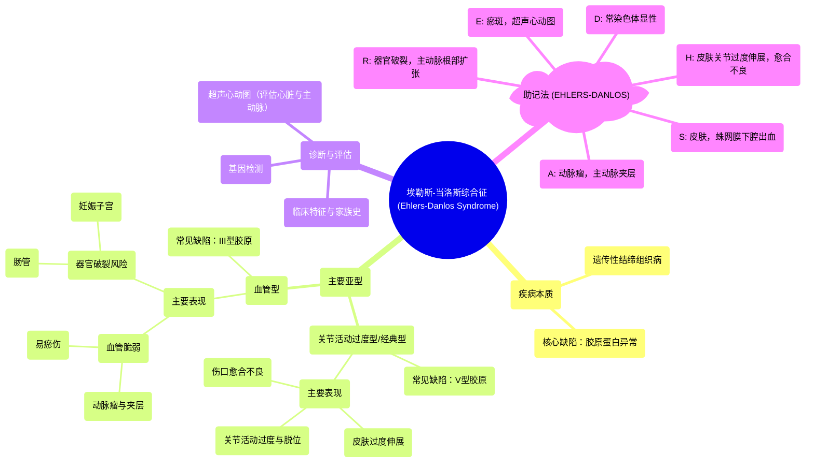

# 95 Ehlers-Danlos Syndrome - with a Mnemonic

  <video controls preload="metadata" playsinline>
    <source src="https://helly.s3.bitiful.net/心血管学科/%E4%B8%93%E8%BE%91%2018%EF%BC%9A%E5%BF%83%E5%86%85%E7%A7%91%E7%BB%88%E6%9E%81%E7%99%BE%E7%A7%91%E8%BE%9E%E5%85%B8%20%28The%20Cardiology%20Encyclopedia%29/95%20Ehlers-Danlos%20Syndrome%20-%20with%20a%20Mnemonic.mp4" type="video/mp4">
    
您的浏览器不支持播放，请升级。

  </video>

::: tip ⚡️ 核心考点 (30s速读)
*   **核心考点**：埃勒斯-当洛斯综合征是一种遗传性结缔组织病，核心缺陷在于**胶原蛋白合成或结构异常**。最常见的亚型是**关节活动过度型**和**血管型**。
*   **临床意义**：血管型（III型胶原缺陷）可导致致命性血管并发症（如主动脉夹层、动脉瘤破裂）；关节活动过度型（V型胶原缺陷）则以皮肤过度伸展、关节不稳定和慢性疼痛为特征。诊断需结合临床特征、家族史及基因检测。
:::

## 🧠 深度精讲

*   **概念1：疾病本质与遗传模式**
    埃勒斯-当洛斯综合征是一组异质性的遗传性疾病，根本问题在于**胶原蛋白**的合成、加工或结构存在缺陷。胶原蛋白是人体最重要的结构蛋白，为皮肤、血管、骨骼、韧带等组织提供强度和弹性。该病有多种亚型，最常见的遗传模式是**常染色体显性遗传**，但也有常染色体隐性遗传的类型。

*   **概念2：关键亚型与对应缺陷**
    视频重点介绍了两种最常见且重要的亚型：
    1.  **关节活动过度型/经典型**：通常与**V型胶原**缺陷有关。主要影响**皮肤和关节**。典型表现为：皮肤**过度伸展**（像天鹅绒般柔软、薄而透明、易显静脉）、**伤口愈合不良**形成“卷烟纸”样瘢痕、**关节活动过度**（如手指可过度背屈触及前臂）及易脱位。
    2.  **血管型**：与**III型胶原**缺陷有关。III型胶原是血管、空腔脏器的主要成分。因此，此型以**血管和器官脆弱**为特征，风险极高。表现为：易**瘀伤**、**动脉瘤**（主动脉、脑动脉）、**动脉夹层**（颈动脉、主动脉）、**自发性空腔脏器破裂**（如肠、妊娠子宫）以及**主动脉根部扩张伴主动脉瓣反流**。

*   **概念3：助记法解析 (EHLERS-DANLOS)**
    视频提供的助记法有助于记忆核心临床表现：
    *   **E**: 瘀斑 (Ecchymosis)，超声心动图 (Echocardiogram)（用于评估心脏瓣膜及主动脉病变）。
    *   **H**: 皮肤过度伸展 (Hyper-extensible skin)，关节活动过度 (Hyper-mobility)，伤口愈合不良 (poor Healing)。
    *   **R**: 器官破裂 (Rupture of organs)，主动脉根部扩张 (Root dilation)。
    *   **D**: 常染色体显性遗传 (autosomal Dominant)。
    *   **A**: 动脉瘤 (Aneurysms)，主动脉夹层 (Aortic dissection)。
    *   **N**: （助记法中未明确对应，通常关联疾病名称本身）。
    *   **L**: （助记法中未明确对应）。
    *   **O**: （助记法中未明确对应）。
    *   **S**: 皮肤 (Skin)，蛛网膜下腔出血 (Subarachnoid hemorrhage)（继发于脑动脉瘤破裂）。

*   **概念4：鉴别与关联**
    需与**马凡综合征**（原纤维蛋白-1基因缺陷，主要影响弹性纤维，特征为身材高大、蜘蛛指趾、晶状体脱位、主动脉根部扩张）相鉴别。两者均有主动脉病变风险，但病因和部分特征不同。EDS更突出皮肤关节症状。

## 📚 双语术语表 (Terminology)
| 英文术语 | 中文翻译 | 定义/解释 |
| :--- | :--- | :--- |
| Ehlers-Danlos Syndrome (EDS) | 埃勒斯-当洛斯综合征 | 一组遗传性结缔组织疾病，主要由于胶原蛋白合成或结构异常引起。 |
| Collagen | 胶原蛋白 | 人体内含量最丰富的结构蛋白，为结缔组织提供强度和支撑。 |
| Type III Collagen | III型胶原蛋白 | 主要分布于血管、空腔脏器及皮肤真皮层的胶原蛋白类型，其缺陷导致血管型EDS。 |
| Type V Collagen | V型胶原蛋白 | 与I型胶原共分布，调节纤维直径，其缺陷与经典型/关节活动过度型EDS相关。 |
| Hyperextensibility | 过度伸展性 | 皮肤能被过度拉伸且回缩性良好，是EDS的典型体征。 |
| Hypermobility | 关节活动过度 | 关节的活动范围超过正常生理限度，常导致关节不稳和脱位。 |
| Aortic Dissection | 主动脉夹层 | 主动脉壁内膜撕裂，血液流入动脉壁中层形成夹层，是血管型EDS的危重并发症。 |
| Aortic Aneurysm | 主动脉瘤 | 主动脉局部异常扩张，管壁变薄，有破裂风险。 |
| Mitral Valve Prolapse (MVP) | 二尖瓣脱垂 | 二尖瓣瓣叶在收缩期脱入左心房，可伴反流，在EDS患者中发生率增高。 |
| Autosomal Dominant | 常染色体显性遗传 | 一种遗传方式，只要从父母一方获得一个致病基因拷贝即可患病。 |
| Ecchymosis | 瘀斑 | 皮下出血形成的较大面积瘀伤，在血管型EDS中常见。 |

## 🗺️ 知识图谱

