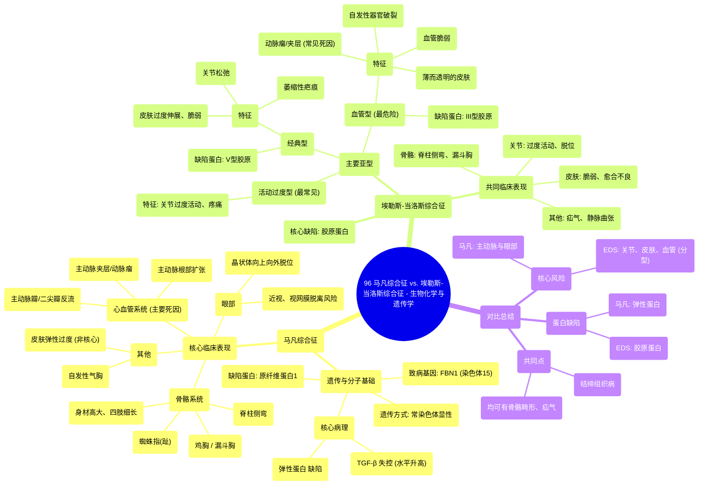

# 96 Marfan Syndrome vs. Ehlers-Danlos Syndrome - Biochemistry and Genetics

  <video controls preload="metadata" playsinline>
    <source src="https://helly.s3.bitiful.net/心血管学科/%E4%B8%93%E8%BE%91%2018%EF%BC%9A%E5%BF%83%E5%86%85%E7%A7%91%E7%BB%88%E6%9E%81%E7%99%BE%E7%A7%91%E8%BE%9E%E5%85%B8%20%28The%20Cardiology%20Encyclopedia%29/96%20Marfan%20Syndrome%20vs.%20Ehlers-Danlos%20Syndrome%20-%20Biochemistry%20and%20Genetics.mp4" type="video/mp4">
    
您的浏览器不支持播放，请升级。

  </video>

::: tip ⚡️ 核心考点 (30s速读)
*   **核心考点**：马凡综合征是**弹性蛋白**缺陷病，由**FBN1**基因突变导致，核心病理是**TGF-β**失控和弹性蛋白受损。埃勒斯-当洛斯综合征是**胶原蛋白**缺陷病，有多种亚型，最常见的是**活动过度型**和**血管型**。
*   **临床意义**：两者均影响结缔组织，但受累系统侧重不同。马凡综合征以**心血管**（主动脉根部扩张、夹层）和**眼部**（晶状体脱位）并发症为致命风险。埃勒斯-当洛斯综合征以**关节过度活动**、**皮肤脆弱**和**血管型**的**自发性动脉/器官破裂**为突出表现。
:::

## 🧠 深度精讲

*   **马凡综合征**：这是一种常染色体显性遗传病，具有表现度可变性。其根本缺陷位于**15号染色体**上的**FBN1**基因，导致**原纤维蛋白1**功能失常。该蛋白有两个关键作用：1) 隔离并抑制**转化生长因子-β**；2) 包裹和保护**弹性蛋白**。因此，马凡综合征患者体内TGF-β水平升高，弹性蛋白也受损，属于**弹性蛋白缺陷病**。临床表现包括：身材高大、四肢细长、鸡胸或漏斗胸、脊柱侧弯、**晶状体向上向外脱位**、主动脉根部扩张/夹层/瓣膜反流、二尖瓣脱垂、自发性气胸等。

*   **埃勒斯-当洛斯综合征**：这是一组以**胶原蛋白合成或组装缺陷**为根本原因的遗传性结缔组织病，遗传方式多样。其亚型繁多，重点掌握三种：
    1.  **活动过度型**：最常见，主要表现为全身关节过度活动、慢性疼痛，但皮肤表现可能不典型。
    2.  **经典型**：主要由**V型胶原蛋白**缺陷引起。典型特征为**皮肤过度伸展**（像天鹅绒般柔软）、脆弱易留疤、关节松弛。
    3.  **血管型**：最危险，由**III型胶原蛋白**缺陷引起。III型胶原是血管壁的主要成分，因此患者表现为**血管脆弱**，易发生动脉瘤（主动脉、脑动脉）、动脉夹层、自发性器官（如肠、妊娠子宫）破裂，皮肤薄而透明可见静脉。**主动脉夹层是埃勒斯-当洛斯综合征最常见的死因**。

*   **核心对比**：马凡综合征是**弹性蛋白**问题，核心并发症在**主动脉和晶状体**；埃勒斯-当洛斯综合征是**胶原蛋白**问题，核心表现因亚型而异，涉及**皮肤、关节和血管**。两者均可出现脊柱侧弯、漏斗胸、疝气等共同表现，但病理基础不同。

## 📚 双语术语表 (Terminology)
| 英文术语 | 中文翻译 | 定义/解释 |
| :--- | :--- | :--- |
| Marfan Syndrome | 马凡综合征 | 常染色体显性遗传的结缔组织病，因FBN1基因突变导致原纤维蛋白1缺陷，进而引起弹性蛋白和TGF-β调控异常。 |
| Ehlers-Danlos Syndrome (EDS) | 埃勒斯-当洛斯综合征 | 一组主要因胶原蛋白合成或结构缺陷导致的遗传性结缔组织病，以皮肤过度伸展、关节过度活动和血管脆弱等为特征。 |
| FBN1 | 原纤维蛋白1基因 | 位于15号染色体，编码原纤维蛋白1。其突变是马凡综合征的病因。 |
| Fibrillin 1 | 原纤维蛋白1 | 一种细胞外基质糖蛋白，负责隔离TGF-β并保护弹性蛋白纤维。 |
| TGF-beta | 转化生长因子-β | 一种细胞因子。在马凡综合征中，由于原纤维蛋白1缺陷，TGF-β活性失控，参与疾病发生。 |
| Elastin | 弹性蛋白 | 赋予组织弹性的蛋白质。马凡综合征中其功能受损。 |
| Collagen | 胶原蛋白 | 细胞外基质的主要结构蛋白，提供强度和支撑。埃勒斯-当洛斯综合征的核心缺陷蛋白。 |
| Autosomal Dominant | 常染色体显性遗传 | 一种遗传方式，只需从父母一方继承一个突变基因即可患病。 |
| Variable Expressivity | 表现度可变性 | 指携带相同突变基因的个体，其疾病症状的严重程度和类型存在差异。 |
| Lens Subluxation/Dislocation | 晶状体半脱位/脱位 | 晶状体偏离其正常位置。马凡综合征典型表现为**向上、向外（颞侧）**脱位。 |
| Aortic Root Dilatation | 主动脉根部扩张 | 主动脉起始部分异常增宽，是马凡综合征的主要心血管风险，可导致夹层或破裂。 |
| Aortic Dissection | 主动脉夹层 | 主动脉壁内膜撕裂，血液流入动脉壁中层形成夹层。是马凡综合征和血管型EDS的急症和常见死因。 |
| Mitral Valve Prolapse | 二尖瓣脱垂 | 心脏二尖瓣在收缩期向左心房膨出，可导致反流。常见于马凡综合征。 |
| Hypermobility | 关节过度活动 | 关节活动范围超过正常限度。是EDS（尤其是活动过度型）的核心特征。 |
| Vascular Type EDS | 血管型埃勒斯-当洛斯综合征 | EDS的一种危险亚型，由III型胶原蛋白缺陷引起，以动脉瘤、夹层和器官自发性破裂为特征。 |
| Type 3 Collagen | III型胶原蛋白 | 主要存在于血管、肠道和子宫等中空器官的胶原蛋白。其缺陷导致血管型EDS。 |
| Type 5 Collagen | V型胶原蛋白 | 与I型胶原共同存在，调节纤维直径。其缺陷导致经典型EDS。 |

## 🗺️ 知识图谱

