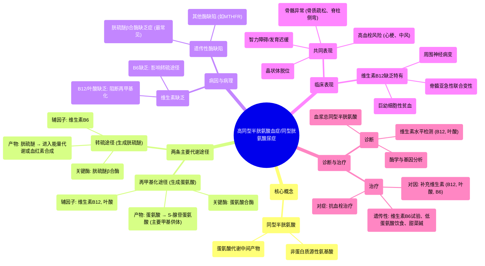

# 97 Homocystinemia (Homocystinuria) - Causes, Symptoms, Diagnosis, Treatment - Biochemistry & Genetics

  <video controls preload="metadata" playsinline>
    <source src="https://helly.s3.bitiful.net/心血管学科/%E4%B8%93%E8%BE%91%2018%EF%BC%9A%E5%BF%83%E5%86%85%E7%A7%91%E7%BB%88%E6%9E%81%E7%99%BE%E7%A7%91%E8%BE%9E%E5%85%B8%20%28The%20Cardiology%20Encyclopedia%29/97%20Homocystinemia%20%28Homocystinuria%29%20-%20Causes%2C%20Symptoms%2C%20Diagnosis%2C%20Treatment%20-%20Biochemistry%20%26%20Genetics.mp4" type="video/mp4">
    
您的浏览器不支持播放，请升级。

  </video>

::: tip ⚡️ 核心考点 (30s速读)
*   **核心考点**：同型半胱氨酸是一种非蛋白质源性氨基酸，其代谢依赖于维生素B12、叶酸和维生素B6。代谢通路受阻会导致其在血液（高同型半胱氨酸血症）或尿液（同型胱氨酸尿症）中积聚。
*   **临床意义**：高同型半胱氨酸血症是心血管疾病、血栓形成、智力障碍、晶状体脱位和骨骼异常的独立危险因素。其病因包括维生素缺乏（B12、叶酸、B6）和遗传性酶缺陷（如胱硫醚β合酶缺乏症）。
:::

## 🧠 深度精讲

*   **同型半胱氨酸是什么？**
    同型半胱氨酸是一种**非蛋白质源性氨基酸**，这意味着它不由遗传密码直接编码，也不会被直接整合到蛋白质合成中。它是蛋氨酸代谢过程中的一个关键中间产物。

*   **同型半胱氨酸的两条主要代谢途径：**
    1.  **再甲基化途径（生成蛋氨酸）**：
        *   **关键酶**：**蛋氨酸合酶**（也称为同型半胱氨酸甲基转移酶）。
        *   **辅助因子**：需要**维生素B12**作为辅酶，并从**5-甲基四氢叶酸（活性叶酸）** 获得甲基基团。
        *   **产物**：生成**蛋氨酸**。蛋氨酸可进一步转化为**S-腺苷蛋氨酸**，这是体内最重要的甲基供体，参与DNA、RNA、蛋白质和神经递质的甲基化修饰。
    2.  **转硫途径（生成胱硫醚）**：
        *   **关键酶**：**胱硫醚β合酶**。
        *   **辅助因子**：需要**维生素B6**作为辅酶。
        *   **底物**：同型半胱氨酸与丝氨酸结合。
        *   **产物**：生成**胱硫醚**，后者可进一步代谢为α-酮丁酸、丙酰辅酶A，最终进入三羧酸循环产生能量，或用于合成**血红素**。

*   **病理生理与临床表现：**
    *   **维生素B12或叶酸缺乏**：会阻断再甲基化途径。导致同型半胱氨酸堆积（高同型半胱氨酸血症），同时蛋氨酸和S-腺苷蛋氨酸生成减少。
        *   **影响DNA合成**：叶酸代谢受阻直接影响细胞分裂与复制，可导致巨幼细胞性贫血、全血细胞减少。
        *   **影响髓鞘合成**：维生素B12缺乏还会影响甲基丙二酰辅酶A变位酶的功能，导致甲基丙二酸堆积和琥珀酰辅酶A生成减少，后者对髓鞘合成和能量供应至关重要，可引起**脊髓亚急性联合变性**（表现为共济失调、振动觉和本体感觉丧失）、周围神经病变甚至痴呆。
    *   **胱硫醚β合酶缺乏（经典同型胱氨酸尿症）**：会阻断转硫途径。这是最常见的遗传性病因，导致同型半胱氨酸和蛋氨酸在血液中显著升高。
        *   **临床表现**：智力发育迟缓/倒退、晶状体脱位（常向下）、骨质疏松/脊柱侧弯等骨骼异常、血栓栓塞性疾病（心梗、中风、深静脉血栓）风险极高。

*   **诊断与治疗思路：**
    *   **诊断**：检测血浆总同型半胱氨酸水平是主要手段。需结合血维生素B12、叶酸水平、尿同型胱氨酸、特定酶活性测定及基因检测进行病因分型。
    *   **治疗**：
        *   **对因治疗**：如为维生素缺乏，则补充相应维生素（B12、叶酸、B6）。
        *   **遗传性病例**：大剂量维生素B6（吡哆醇）对部分胱硫醚β合酶缺乏患者有效；无效者需采用低蛋氨酸饮食并补充甜菜碱（促进替代的再甲基化途径）。
        *   **对症与预防**：针对血栓风险，可能需使用抗血小板或抗凝药物。

## 📚 双语术语表 (Terminology)
| 英文术语 | 中文翻译 | 定义/解释 |
| :--- | :--- | :--- |
| Homocysteine | 同型半胱氨酸 | 一种含硫的非蛋白质源性氨基酸，是蛋氨酸代谢的中间产物。 |
| Homocystinemia | 高同型半胱氨酸血症 | 指血液中同型半胱氨酸水平异常升高。 |
| Homocystinuria | 同型胱氨酸尿症 | 指尿液中排出大量同型胱氨酸（同型半胱氨酸的二硫化物形式）。 |
| Proteogenic amino acid | 蛋白质源性氨基酸 | 由遗传密码编码，能直接参与蛋白质合成的氨基酸（通常为20种）。 |
| Non-proteogenic amino acid | 非蛋白质源性氨基酸 | 不由遗传密码直接编码，不直接参与蛋白质合成，常作为代谢中间体。 |
| Methionine synthase | 蛋氨酸合酶 | 催化同型半胱氨酸接受甲基生成蛋氨酸的酶，需维生素B12作为辅因子。 |
| Homocysteine methyltransferase | 同型半胱氨酸甲基转移酶 | 蛋氨酸合酶的别名。 |
| Cystathionine β-synthase | 胱硫醚β合酶 | 催化同型半胱氨酸与丝氨酸结合生成胱硫醚的酶，需维生素B6作为辅因子。 |
| S-adenosylmethionine (SAM) | S-腺苷蛋氨酸 | 体内最重要的甲基供体，由蛋氨酸活化生成，参与多种甲基化反应。 |
| Subacute combined degeneration | 脊髓亚急性联合变性 | 由于维生素B12缺乏导致的脊髓后索和侧索变性，表现为深感觉障碍和运动失调。 |
| Methylmalonyl-CoA mutase | 甲基丙二酰辅酶A变位酶 | 催化甲基丙二酰辅酶A转变为琥珀酰辅酶A的酶，需维生素B12作为辅因子。 |

## 🗺️ 知识图谱

