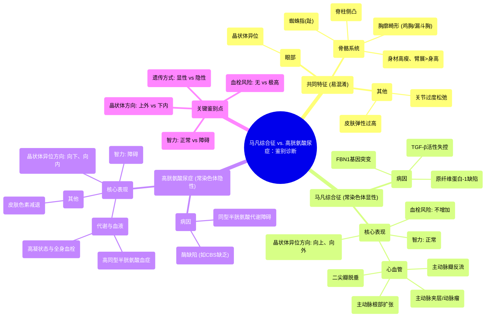

# 98 Marfan Syndrome vs. Homocystinemia - Biochemistry & Genetics

  <video controls preload="metadata" playsinline>
    <source src="https://helly.s3.bitiful.net/心血管学科/%E4%B8%93%E8%BE%91%2018%EF%BC%9A%E5%BF%83%E5%86%85%E7%A7%91%E7%BB%88%E6%9E%81%E7%99%BE%E7%A7%91%E8%BE%9E%E5%85%B8%20%28The%20Cardiology%20Encyclopedia%29/98%20Marfan%20Syndrome%20vs.%20Homocystinemia%20-%20Biochemistry%20%26%20Genetics.mp4" type="video/mp4">
    
您的浏览器不支持播放，请升级。

  </video>

::: tip ⚡️ 核心考点 (30s速读)
*   **核心考点**：马凡综合征与高胱氨酸尿症（同型半胱氨酸血症）在临床表现上高度相似（如蜘蛛指、晶状体异位、胸廓畸形），但**遗传方式、智力水平和血栓风险**是关键的鉴别诊断依据。
*   **临床意义**：准确区分至关重要。马凡综合征患者需重点监测主动脉病变，预防主动脉夹层；高胱氨酸尿症患者则需管理高同型半胱氨酸血症，以预防全身性血栓事件。
:::

## 🧠 深度精讲

*   **马凡综合征**
    *   **遗传与病因**：常染色体显性遗传。由**15号染色体上的FBN1基因**突变导致**原纤维蛋白-1**缺陷。该蛋白功能丧失导致**转化生长因子-β**活性失控，并影响弹性蛋白，引发结缔组织病变。
    *   **核心特征**：
        1.  **心血管系统**：主动脉根部扩张、主动脉瓣反流、主动脉夹层/动脉瘤（源于囊性中层坏死）、二尖瓣脱垂。
        2.  **眼部**：晶状体异位（典型为**向上、向外/颞侧**移位），可导致近视、视网膜脱离。
        3.  **骨骼系统**：身材高瘦、蜘蛛指（趾）、臂展大于身高、下半身长于上半身、胸廓畸形（鸡胸或漏斗胸）、脊柱侧凸、关节过度松弛。
        4.  **其他**：硬脊膜扩张、自发性气胸风险增加。**智力正常**。

*   **高胱氨酸尿症/高同型半胱氨酸血症**
    *   **遗传与病因**：常染色体隐性遗传。主要由**胱硫醚β-合酶**缺乏引起，也可由甲硫氨酸合酶或亚甲基四氢叶酸还原酶缺陷导致。导致血液和尿液中同型半胱氨酸异常升高。
    *   **核心特征**：
        1.  **血栓形成**：同型半胱氨酸是强效血栓形成因子，可导致动静脉血栓（如心肌梗死、脑卒中、深静脉血栓），构成高凝状态的一部分。
        2.  **眼部**：晶状体异位（典型为**向下、向内/鼻侧**移位）。
        3.  **骨骼系统**：呈现“马凡样”体型（高瘦、蜘蛛指、胸廓畸形等）。
        4.  **其他**：**智力障碍/发育迟缓**。皮肤色素减退（肤色白皙）。

*   **关键鉴别点总结**
    | 特征 | 马凡综合征 | 高胱氨酸尿症 |
    | :--- | :--- | :--- |
    | **遗传方式** | 常染色体显性 | 常染色体隐性 |
    | **智力** | 正常 | 障碍 |
    | **血栓风险** | 不增加（主动脉病变为结构问题） | **显著增加**（核心特征） |
    | **晶状体异位方向** | **向上、向外**（颞侧） | **向下、向内**（鼻侧） |
    | **主要并发症** | 主动脉夹层、瓣膜反流 | 全身性血栓事件 |
    | **病因** | 结构蛋白（原纤维蛋白-1）缺陷 | 酶缺陷（胱硫醚β-合酶等） |

## 📚 双语术语表 (Terminology)
| 英文术语 | 中文翻译 | 定义/解释 |
| :--- | :--- | :--- |
| Marfan Syndrome | 马凡综合征 | 常染色体显性遗传的结缔组织病，由FBN1基因突变导致原纤维蛋白-1缺陷引起。 |
| Homocystinuria / Homocystinemia | 高胱氨酸尿症 / 高同型半胱氨酸血症 | 常染色体隐性遗传的代谢病，因酶缺陷导致同型半胱氨酸在血/尿中蓄积。 |
| FBN1 gene | FBN1基因 | 编码原纤维蛋白-1的基因，其突变是马凡综合征的主要病因。 |
| Fibrillin-1 | 原纤维蛋白-1 | 细胞外基质微纤维的主要成分，对TGF-β活性有调节作用。 |
| TGF-beta | 转化生长因子-β | 一种细胞因子，其活性失控参与马凡综合征的发病。 |
| Cystathionine Beta-Synthase (CBS) | 胱硫醚β-合酶 | 同型半胱氨酸代谢途径中的关键酶，其缺乏是高胱氨酸尿症最常见原因。 |
| Autosomal Dominant (AD) | 常染色体显性遗传 | 单个等位基因突变即可致病的遗传方式。 |
| Autosomal Recessive (AR) | 常染色体隐性遗传 | 一对等位基因均突变才致病的遗传方式。 |
| Arachnodactyly | 蜘蛛指（趾） | 手指和脚趾异常细长，似蜘蛛足。 |
| Lens Subluxation/Dislocation | 晶状体半脱位/脱位 | 晶状体偏离其正常解剖位置。 |
| Aortic Root Dilatation | 主动脉根部扩张 | 主动脉起始部病理性增宽，是马凡综合征的特征性心血管病变。 |
| Aortic Dissection | 主动脉夹层 | 主动脉壁内膜撕裂，血液进入动脉壁中层形成剥离性血肿的危重急症。 |
| Cystic Medial Necrosis | 囊性中层坏死 | 主动脉中层弹性纤维退行性变、坏死，形成囊性空隙，是主动脉夹层的病理基础。 |
| Hypercoagulability | 高凝状态 | 血液易于形成血栓的病理状态。 |
| Pectus Carinatum | 鸡胸 | 胸骨向前突出畸形。 |
| Pectus Excavatum | 漏斗胸 | 胸骨向内凹陷畸形。 |
| Intellectual Disability | 智力障碍 | 在发育时期出现的智力功能和适应性行为显著受限。 |

## 🗺️ 知识图谱

